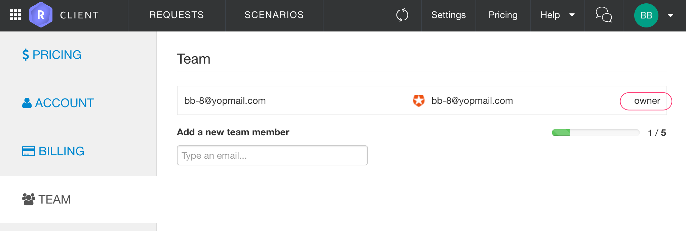
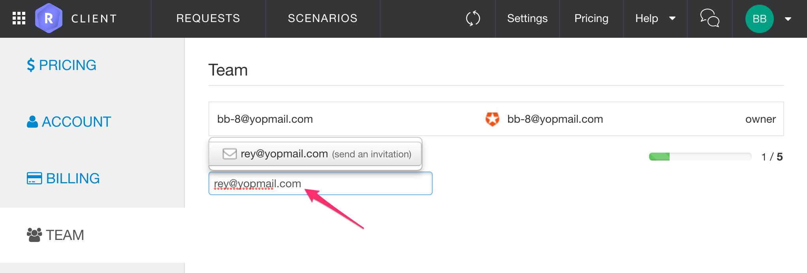
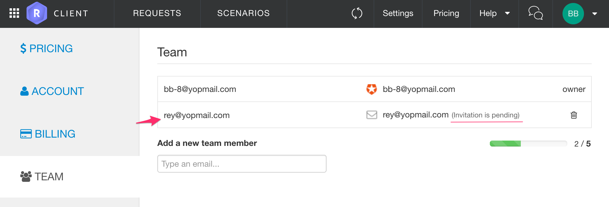
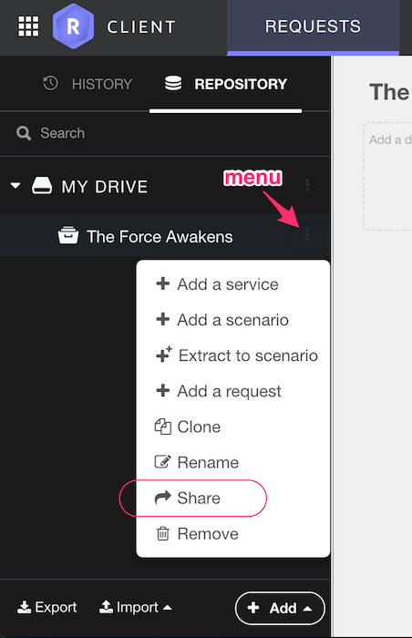
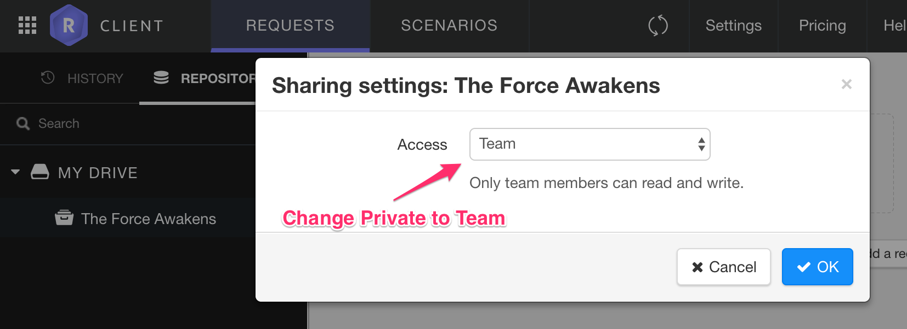
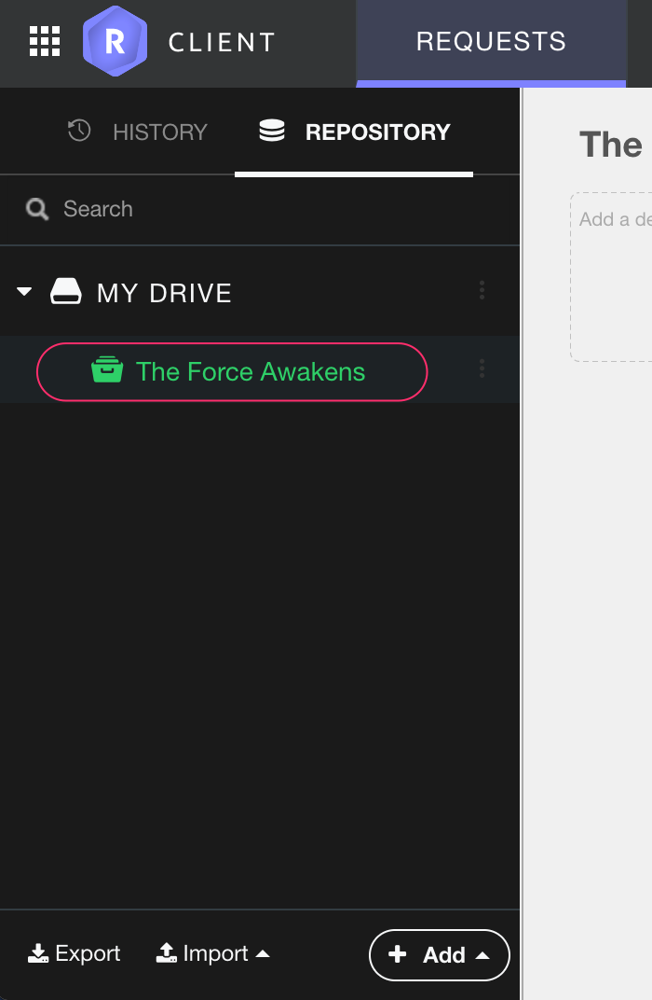
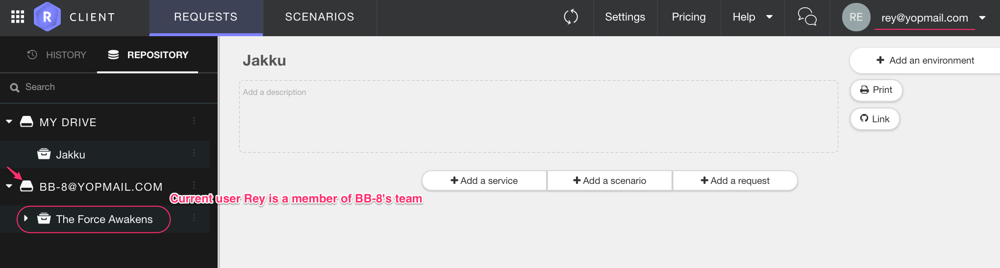
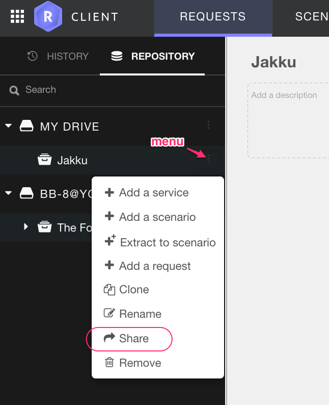
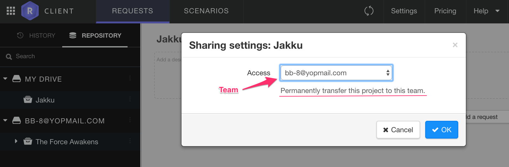

# Managing your team

As a Restlet user, you'll have one team assigned to your account. 
You are a team owner. 
This team will be used across Restlet Client, Restlet Studio, and Restlet Cloud.

To access your team, open the Team menu from the profile drop-down menu in the header bar.

(Only you appear in the team)

To add people to your team, search for them by email. Then, they will be invited to join your team.
 
 

(A new member in your team)

 

Now, let's share a project with your team. In your repository, click on a project's menu to use the *Share* action. 

Then, you'll have to set the project's visibility to Team.

Once a project is shared with your team members, it is displayed as green.
 

 
From now on, your team members will see your project appear in their repositories, e.g.

# As a team member, I want to share a project

As a team member, you can see to which teams you belong to in the repository view.

The team owner shares projects with you but you can also share projects with the team.

In your repository, click on a project's menu to use the *Share* action.

Then, you'll have to set the project's visibility to Team.

# Editing a shared project

