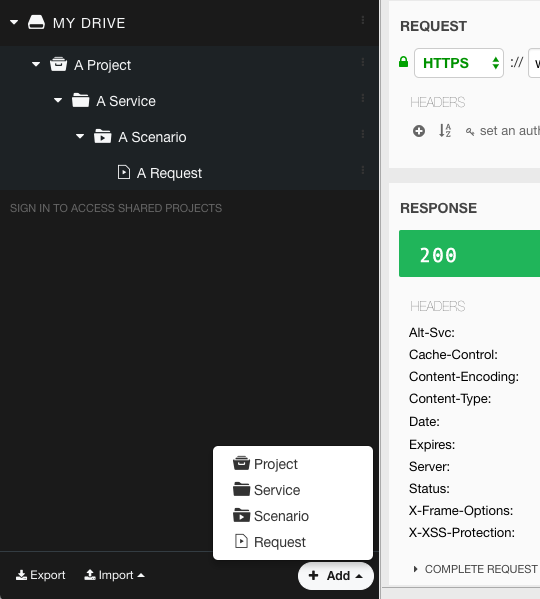
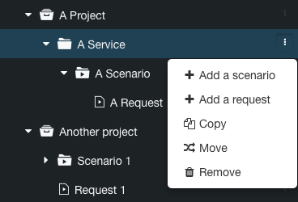
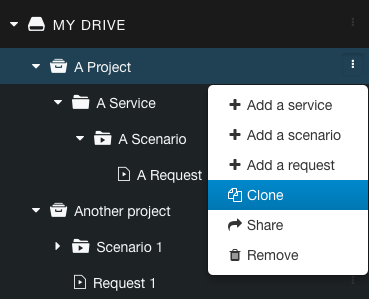
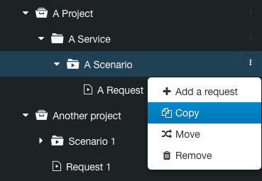

# Description

Restlet Client allows you to build projects inside your drive.
The different items you can save in your drive follow this pattern:

Start by creating a project at the root level of your drive. Put your scenarios and requests inside. If you need another level of hierarchy, use services.

>**Note:**   
A project can contain services, scenarios and requests  
A service can only contain scenarios and requests  
A [scenario](../run-tests/scenarios "scenario") can only contain requests.

# Create a new item

From the **Repository** tab, click on **+Add** at the bottom of the left-panel and select the item you want to create.

>**Note:**  A project can only be created at the root of your Drive.

You can also use the **contextual menu** (the three little dots) to add items inside a particular container:

# Clone an item

Instead of starting an item (project, service, scenario or request) from scratch, you can clone an item from your Drive.

To clone a project, click on the contextual menu on the right of the line and select **Clone**.

To clone a service, a scenario or a request, click on the contextual menu and select **Copy**. You'll have the ability to choose the location where to store the cloned item.

