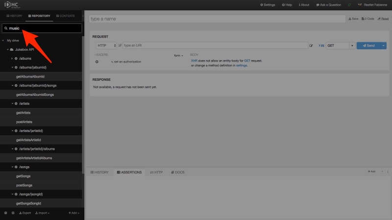
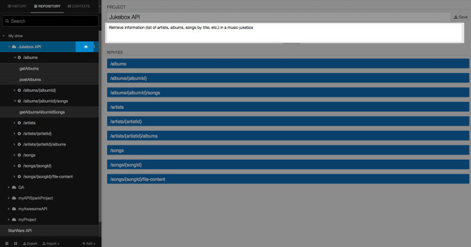

Restlet Client provides you with a **Search** field that  allows you to search items you saved in your drive from the **Repository** tab.

The Search is performed in your items (projects, services, scenarios & requests) name and description.

To access the description of an item, click on the corresponding eye icon <i class="fa fa-eye"></i> in the left panel. The description displays underneath the item name in the main panel.

>**Note:** The Search returns exact matches only and is case insensitive.

To display all the items of your drive again, empty the Search field.
