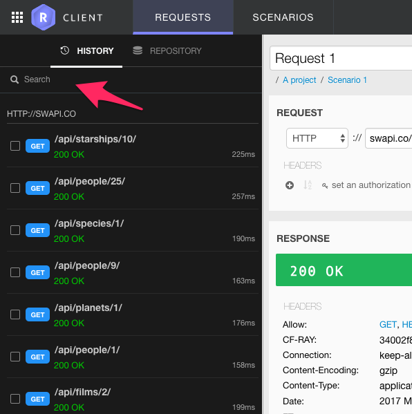
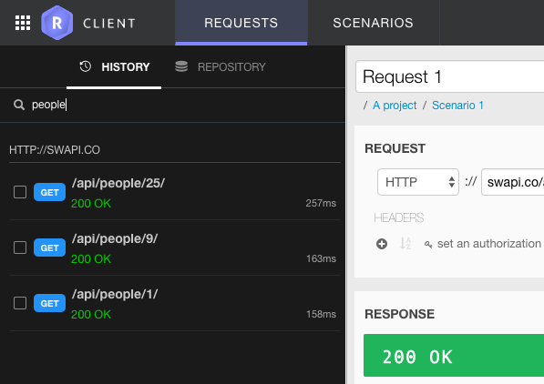
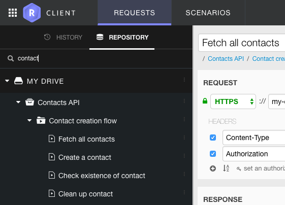

Restlet Client provides you with a **Search** field that allows you to search items in your history as well as in your repository.

In your history, the Search is performed on the HTTP method, URL of your requests and on the status of your responses.

In the repository, the Search is performed on your item names (projects, services, scenarios & requests).

>**Note:** The Search returns exact matches only and is case insensitive.

To display all the items of your drive again, empty the Search field.
