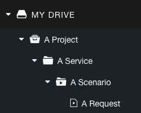
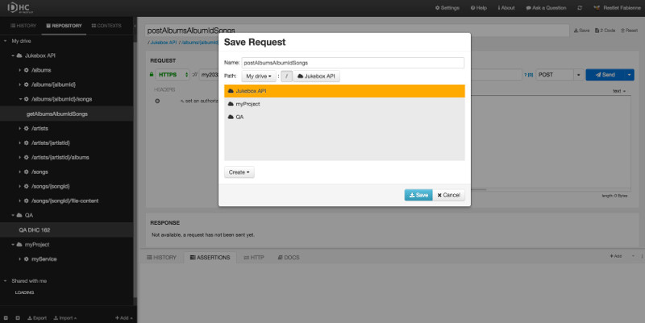
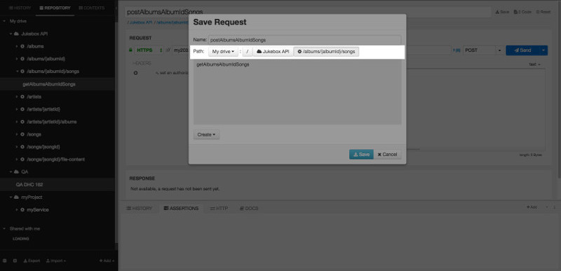
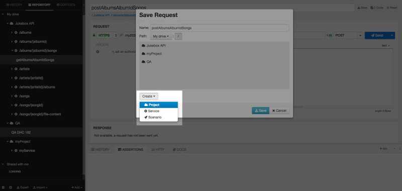
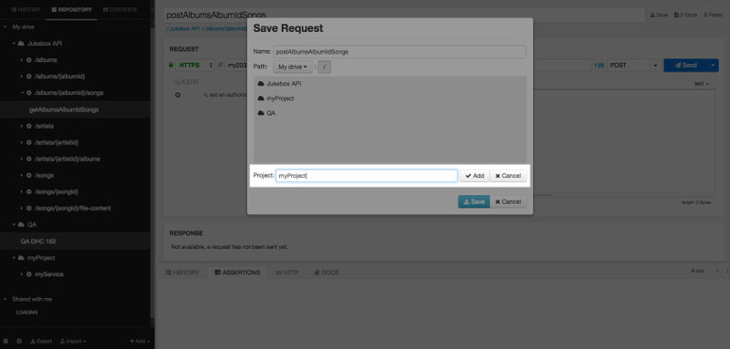
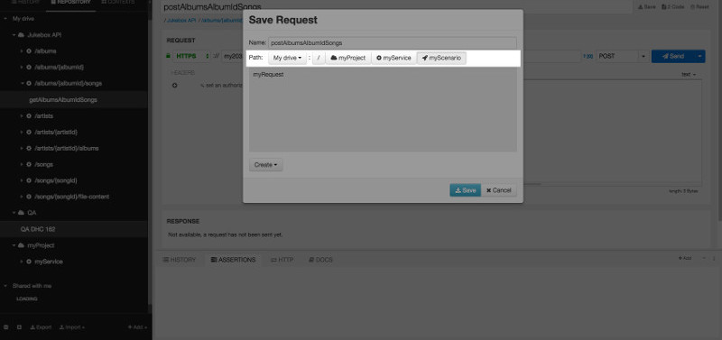

Of course you can define one-shot requests, but another interesting approach consists of reusing and even sharing them.

# Description

Restlet Client allows you to build projects inside your drive.
The different items you can save in your drive follow this pattern:

Start by creating a project at the root level of your drive. Put your scenarios and requests inside. If you need another level of hierarchy, use services.

>**Note:**   
A project can contain services, scenarios and requests  
A service can only contain scenarios and requests  
A [scenario](../run-tests/scenarios "scenario") can only contain requests.

# Save your requests inside projects

Once a request is created and named, Restlet Client lets you save it.  
You can classify your requests inside structured projects (folders) and services (subfolders).

To save your request inside a project:

Create your request.
Enter a name in the input field on top of the screen.
Click **Save** on the right of this field.  

## Save your request in an existing project

Select **My drive** in the **Path** drop-down menu.
Select the appropriate project (and possibly the service) in which you want to save your request and click **Save**.

>**Note:** The **Path** displays as you browse through your drive and it is clickable.

## Save your request in a new project

Select **My drive** in the **Path** drop-down menu.
Click **Create** and select **Project**.

Enter a name for your **Project** and click **Add**.

>**Note:** You can then just as well add a Service and a Scenario inside that project.

Click **Save** to add the request in your new project.
