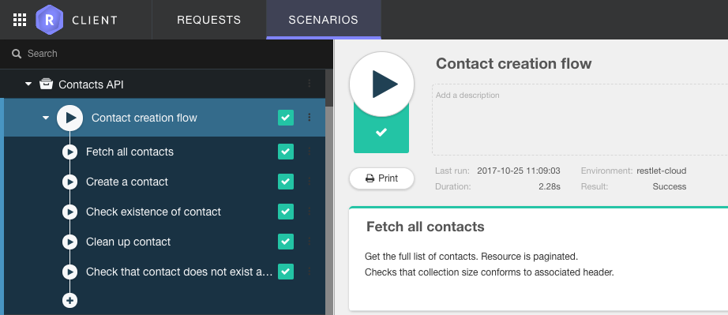
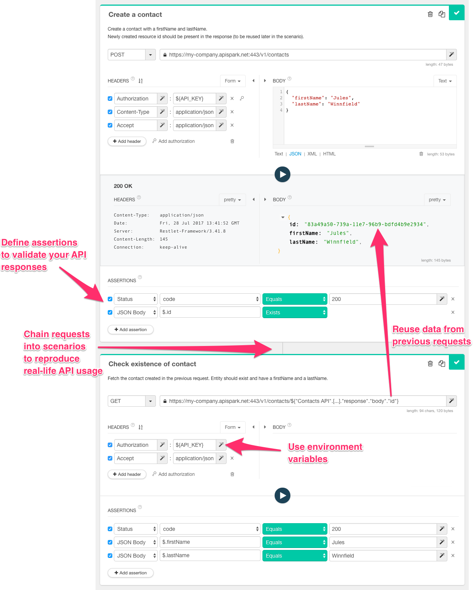

Sending a single request is good, but as you move forward in your API testing journey, you would probably want to send a sequence of requests in one go. We've got you covered on that front.
Any request container (project, service, scenario) in your repository can be run in the `Scenarios` Tab (also called `Scenarios Perspective`). Just click on the play button!

<!-- IN SCREENSHOT: HEADER | SP_TREE | SP_CONTAINER -->

> The `Scenarios Perspective` has been designed to help with API tests creation and execution. Additionally to the ability to run any request container, this perspective offers an auto-save mechanism. Any change will automatically be saved and shared with your team.

## Global overview of a scenario
 
Among all kinds of request containers, the scenario is the one that deserves focus. 

A scenario is an [ordered set of requests](#request-order) that allows to emulate a real-life usage of an API.
Combined with [validation feature](validate-http-responses), it helps you ensure that the behavior is stable over time and complies with rules.

The following diagram summarizes these characteristics. It presents a chain of two requests inside a scenario, where the URI of the second request depends on the other thanks to [expressions](./make-your-requests-and-assertions-dynamic/expressions).
Both requests leverage assertions in order to check the related response. They also relies on [environment variables](./make-your-requests-and-assertions-dynamic/environments) in order to parameterize parts of their definition. 

<!-- IN SCREENSHOT: REQUEST_EDITOR | SP_RESPONSE | SP_ASSERTIONS -->

### Request order

Especially if you are performing tests, you might want to send your requests in a specific order. If it is your case,
then all you need to do is create a scenario. Requests in scenarios can be reordered to your wishes. Projects and
services which will run your requests in alphabetical order of their names.

### Validation

If you have tried running a scenario, you may have noticed green/yellow/red labels indicating its
success/warning/failure to run.
This is computed for each request from the status code or via [HTTP response validation](./validate-http-responses).
Then the request container is tagged as success if all its children were successful. 

Note that scenarios should be functionally atomic as unlike other containers, they will stop as soon as a child request fails.

## Manage your scenarios

Restlet Client provides a set of features to help you create and update your scenarios faster.

* From history: select requests in the history then click on '<i class="fa fa-database" aria-hidden="true"></i> Save 
to repository'. [Learn more](../debug-discover/history#save-requests-to-drive).

* From HAR: click on `Import > Import HAR 1.2` and let the app guide you. HAR can be exported from Chrome DevTools 
in the Network tab by right-clicking the history and selecting `Save as HAR with content` so you can play with your 
API with Chrome then import the corresponding scenario in Restlet Client! Learn more in the dedicated tutorial: [Build an API test for your Web application](../../tutorials/test-web-api)

* Add existing requests (into a container): if you have already saved API requests and want to create multiple scenarios from the same 
requests, you can click on the contextual menu next to the scenario's name and select `Add existing requests`. You can
select some requests in your repository that will be copied to your scenario.

* Extract to scenario (from a container): this method is exactly the same as the previous one except that here you start from the 
container of your request collection and create a new scenario from its requests. Open the contextual menu next to
your service/project and click on `Extract to scenario` to create a new scenario with copies of the requests you'll 
select from the container.
