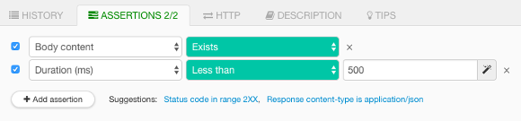

Restlet Client allows you to test the behavior of your APIs.

This is achieved by using Assertions to verify that a certain part of an HTTP response matches your expectations. You can define assertions against the following response characteristics:

* Status code
* Headers
* Body length
* Duration
* Status message
* JSON body: use this if the response returns a JSON body. You can then use [__JSON path__](./json-path) to verify a
specific sub-part of the response body.
* XML body: use this if the response returns an XML body. You can then use [__Xpath__](./xpath) to verify a specific
sub-part of the response body.
* Body content: use this if you want to assert something on the body. The body will be considered as a simple string.

Assertions are validated in real-time, meaning that they are re-evaluated when you run the request and when you update them.

<!-- IN SCREENSHOT: RP_ASSERTIONS -->

Assertions leverage operators in order to compare values, check their existence or inclusion of certain values

Here are some examples:

* "Status code" equals 200
* "Duration (ms)" less than 200
* "Body content" exists
* The element located at JSON path "$.id" in the "JSON body" equals 12345

Feel free to have a look at the [__full operators list__](./assertions).

## Unleash the full power of API testing

Assertions are a solid base to test your API but you'll soon find out that you need them to be __dynamic__.

Dynamic assertions allow you to test that the header `Content-type` of the response is equal to the header `Accept` of
the request for example.

You can create dynamic assertions with [__expressions__](../make-your-requests-and-assertions-dynamic/expressions).
