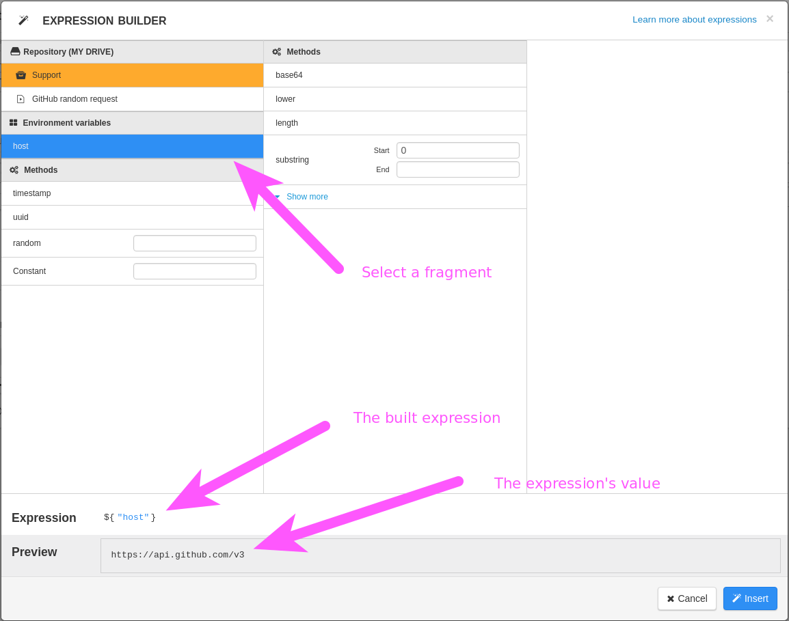

Expressions are structured strings that are parsed and evaluated by Restlet Client.
You can use them in all those places:

* Request URL
* Headers (name and value)
* Query parameters (name and value)
* Form parameters (name and value)
* Request body (of type text)
* Assertions values

Expressions allow you to:

* [Reference environment variables by name](./environments)
* [Reference other request elements by name](./reuse-request-or-response-parts)
* [Manipulate your data](./functions)

## Usage example

A request with URL `https://${"host"}` and an environment containing a variable `host: perdu.com` will be sent to
`https://perdu.com`.

## How do I know what the request will look like once launched ?

* In the `Requests` perspective: the evaluated request is displayed in the bottom-pane - tab `HTTP`
* In the `Scenario` perspective: click on `Request preview` in the main pane

## How should I craft expressions ?

We have got you covered of course. In every field where expressions are supported, you will find a button with the icon
<i class="fa fa-magic" aria-hidden="true"></i>. Click on it to open the __Expression builder__. You can create your
expressions from there in a few clicks and see the evaluated expression in real-time.

<!-- IN SCREENSHOT: MODAL_EXPRESSION_BUILDER -->

> Note: The expression will be added where you placed your cursor before clicking the magic wand icon
<i class="fa fa-magic" aria-hidden="true"></i>. If the cursor was _inside_ an expression, the expression builder
will open in edition mode and you can modify the said expression.
