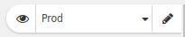

An environment is a set of variables that you can use to parameterize your requests.

## Example

If you want to test your API on different environments (production, staging...), Restlet Client's environments
will prove useful.

If my production environment is hosted on `perdu.com` and my staging environment is hosted on `staging.perdu.com`.

I can:

* create a request with the following URL: `https://${"host"}/api/my-resource`
* create two environments `prod` and `staging`
* add a variable named `host` in them with the appropriate value

When I send the request if the selected environment is:

* `prod`: the evaluated URL will be `https://perdu.com/api/my-resource`
* `staging`: the evaluated URL will be `https://staging.perdu.com/api/my-resource`.

## Create and edit an environment

Environments are available at the top-right of your screen, the current environment's name is always displayed so you can verify it at a glance.

You can use the <i class="fa fa-eye" aria-hidden="true"></i> button to view the current environment variables.

You can use the <i class="fa fa-pencil" aria-hidden="true"></i> to edit/delete environments and environment variables.

## JSON variables

In addition to simple text variables, Restlet Client supports JSON variables. Just add a valid JSON in your variables value and retrieve its sub-elements via standard expressions.

Example: add a variable `server` to your current environment with value `{"host": "perdu.com", "port": "456"}`.

You can now create a request with a URL set to `https://${"server"."host"}:${"server"."port"}`, which will be evaluated to `https://perdu.com:456`.

## Going further

Expressions can do more, if you haven't read it yet, have a look at [this page](./expressions) to learn more.
