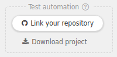

Now that you know how to test your API with Restlet Client, you probably wonder how you could automate the process. Restlet has got you covered, all your tests are exportable and runnable from a command line interface (CLI) with our Maven plugin!

Restlet Client allows you to use exported tests as an input for our Maven plugin which generates standard JUnit/Surefire reports and allows you to configure custom URLs that will get notified before or/and after a test is completed.

## Prerequisites

The only things you will need are to install the
<a href="http://www.oracle.com/technetwork/java/javase/downloads/index.html" target="_blank">
latest Java JDK <i class="fa fa-external-link" style="font-size: 12px" aria-hidden="true"></i>
</a>
and <a href="http://maven.apache.org/" target="_blank">
Maven <i class="fa fa-external-link" style="font-size: 12px" aria-hidden="true"></i>
</a>.

## Get started in seconds

The quickest way to launch tests from scratch is to include them inside a project. Then you can just open the project
you want to test and click on the button `Download project` in the test automation box.

<!-- IN SCREENSHOT: SP_CONTAINER -->

You can now download the auto-generated pom and the project.

<!-- IN SCREENSHOT: MODAL_AUTOMATION -->

Put them in the same folder, open a terminal in this folder and launch `mvn clean test -DlicenseKey=<your license key>`.

### Find your license key

You can find the license key in your account page if you have or belong to a team.

<!-- IN SCREENSHOT: ACCOUNT_LICENSE -->

## Get full control over your tests

### Hand-pick the requests to run

The maven plugin takes a JSON configuration file as a parameter and runs it. That configuration file really is just an
export of your repository or a subset of it.

If you want to run a specific set of requests in your test, you can use the export feature and check the boxes that
match the requests/scenarios etc... you want to run.

<!-- IN SCREENSHOT: SP_TREE -->

Place the downloaded JSON in the same folder as the pom.xml and make sure the pom.xml references that that JSON file
(more information on that below).

### Create your custom test configuration

If you want to benefit from the webhooks and/or customize the tests run more, you can configure the pom yourself.

Here is an example pom.xml, we will detail all the configurable options below.

<pre class="language-xml">
<code class="language-xml">
&lt;project xmlns=&quot;http://maven.apache.org/POM/4.0.0&quot; xmlns:xsi=&quot;http://www.w3.org/2001/XMLSchema-instance&quot; xsi:schemaLocation=&quot;http://maven.apache.org/POM/4.0.0 http://maven.apache.org/xsd/maven-4.0.0.xsd&quot;&gt;
    &lt;modelVersion&gt;4.0.0&lt;/modelVersion&gt;

    &lt;groupId&gt;com.example&lt;/groupId&gt;
    &lt;artifactId&gt;my-star-wars-api-test&lt;/artifactId&gt;
    &lt;version&gt;1.2.3&lt;/version&gt;

    &lt;build&gt;
        &lt;plugins&gt;
            &lt;plugin&gt;
                &lt;!-- The Restlet maven plugin --&gt;
                &lt;groupId&gt;com.restlet.client&lt;/groupId&gt;
                &lt;artifactId&gt;maven-plugin&lt;/artifactId&gt;
                &lt;version&gt;2.18.0&lt;/version&gt;
                &lt;executions&gt;
                    &lt;execution&gt;
                        &lt;phase&gt;test&lt;/phase&gt;
                        &lt;goals&gt;
                            &lt;goal&gt;test&lt;/goal&gt;
                        &lt;/goals&gt;

                        &lt;!-- The configuration goes there --&gt;
                        &lt;configuration&gt;
                            &lt;file&gt;/path/to/json/configuration/file.json&lt;/file&gt;
                            &lt;licenseKey&gt;${myLicenseKey}&lt;/licenseKey&gt;
                        &lt;/configuration&gt;
                    &lt;/execution&gt;
                &lt;/executions&gt;
            &lt;/plugin&gt;
        &lt;/plugins&gt;
    &lt;/build&gt;

    &lt;!-- The repository were the Restlet maven plugin is hosted --&gt;
    &lt;pluginRepositories&gt;
        &lt;pluginRepository&gt;
            &lt;id&gt;nexus-public&lt;/id&gt;
            &lt;name&gt;Nexus Release Repository&lt;/name&gt;
            &lt;url&gt;http://maven.restlet.com&lt;/url&gt;
        &lt;/pluginRepository&gt;
    &lt;/pluginRepositories&gt;
&lt;/project&gt;
</code>
</pre>

### Pom configuration

The following attributes can be added to the pom to tweak the plugin's behavior.
They can be added two different ways:
* in the configuration tag of the pom, see example above with the attribute file
* passed to the plugin via JVM arguments. If the attribute is defined with a value `${attributeName}` in the pom, then
you can pass it a value when running the mvn command via a JVM plugin. In the case of the licenseKey in the pom above,
you can pass it like so: `mvn clean test -DmyLicenseKey=X25RyICNyBnZRxvGsf9XLZYVHGj168xTy/EApfWHt8qnMTfarfLudZzFik`

> Note: You should privilege the second option for sensitive information like the license key so that it never gets
committed along with the pom to a public place by mistake.

### Pom attributes

Here is the full list of available customization options.

| Name | Type | Mandatory | Default | Description
| ---- | ---- | --------- | ------- | -----------
| **file** | File | Yes | X | File path pointing to the Restlet Client export file from the pom's location
| **selectedEnvironment** | String | No | X | The name of the environment to be used (make sure it was exported to the JSON file). Learn more about environments [here](../test/make-your-requests-and-assertions-dynamic/environments)
| **licenseKey** | String | Yes | X | A valid license key (see [Find your license key](#find-your-license-key))
| **stopOnFailure** | boolean | No | false | Stops processing build if an error/failure occurs
| **httpClientTimeoutInMs** | Integer | No | 60000 | Time before HTTP time-out in milliseconds
| **variables** | Properties | No | X | Custom variables see [Custom variables](#override-environment-variables)
| **xhrEmulation** | boolean | No | true | Mimics the Chrome extension behaviour by adding the headers the browser automatically adds like accept-*
| **followRedirects** | String | No | NONE | Indicates whether or not the Maven plugin should follow the redirections as it is possible through the Chrome extension settings in the browser. Possible values are *NONE* or *ALL*
| **beforeTest** | URL | No | X | URL where to send a notification before a test starts
| **afterTest** | URL | No | X | URL where to send a notification after a test is completed
| **begin** | URL | No | X | URL where to send a notification before the first test is executed
| **end** | URL | No | X | URL where to send a notification after the last test is executed
| **useMavenProxies** | boolean | No | false | Indicates whether the proxy configured in ~/.m2/settings.xml should be used for your test's HTTP calls or not

See the full configuration example below:

<pre class="language-xml">
<code class="language-xml">
&lt;configuration&gt;
    &lt;file&gt;/path/to/json/configuration/file.json&lt;/file&gt;
    &lt;selectedEnvironment&gt;QA&lt;/selectedEnvironment&gt;
    &lt;licenseKey&gt;${myLicenseKey}&lt;/licenseKey&gt;
    &lt;stopOnFailure&gt;true&lt;/stopOnFailure&gt;
    &lt;httpClientTimeoutInMs&gt;30000&lt;/httpClientTimeoutInMs&gt;
    &lt;xhrEmulation&gt;false&lt;/xhrEmulation&gt;
    &lt;followRedirects&gt;ALL&lt;/followRedirects&gt;
    &lt;beforeTest&gt;https://my-ci-api.com/api1/notifications&lt;/beforeTest&gt;
    &lt;afterTest&gt;https://my-ci-api.com/api1/notifications&lt;/afterTest&gt;
&lt;/configuration&gt;
</code>
</pre>

### Override environment variables

You can override an environment variable by adding a `variables` tag in the plugin's configuration.

Let's say your API you must run your API on a different port on a specific machine. Even though the environment is set
to `443` via an environment variable `host`, you will have to make it run on port on `1337`. You can do that simply by
overriding the environment variable `port` as shown below.

<pre class="language-xml">
<code class="language-xml">
&lt;configuration&gt;
    &lt;file&gt;test.json&lt;/file&gt;
    &lt;selectedEnvironment&gt;localhost&lt;/selectedEnvironment&gt;
    &lt;variables&gt;
        &lt;!-- The variable port&apos;s value will be overwritten to 1337 --&gt;
        &lt;property&gt;
            &lt;name&gt;port&lt;/name&gt;
            &lt;value&gt;1337&lt;/value&gt;
        &lt;/property&gt;
    &lt;/variables&gt;
&lt;/configuration&gt;
</code>
</pre>

### Use a proxy

Your API may be accessible only through a proxy. In this case, Restlet provides you with simple ways to configure a
proxy for all HTTP calls made by our maven plugin.

#### Use the system proxy configuration

If the proxy is configured system-wide on the test computer, then just launch the plugin with a simple:

<pre class="language-markup"><code class="language-markup">mvn test -Djava.net.useSystemProxies=true</code></pre>

Please note that this argument is available **on recent Windows systems and on Gnome 2.x systems**,
for more information refer to the official
<a href="https://docs.oracle.com/javase/8/docs/api/java/net/doc-files/net-properties.html" target="_blank">Oracle documentation <i class="fa fa-external-link" style="font-size: 12px" aria-hidden="true"></i></a>.

#### Use the maven proxy configuration

The Maven plugin can reuse the Maven's installation proxy configuration, **defined in your settings.xml**, simply
by using the following configuration:

<pre class="language-markup">
<code class="language-markup">
&lt;configuration&gt;
    &lt;file&gt;/test.json&lt;/file&gt;
    &lt;useMavenProxies&gt;true&lt;/useMavenProxies&gt;
&lt;/configuration&gt;
</code>
</pre>

**Please note that for now, the nonProxyHosts attribute is not supported.**

More information about Maven proxy configuration can be found on the dedicated <a href="https://maven.apache.org/guides/mini/guide-proxies.html" target="_blank">documentation <i class="fa fa-external-link" style="font-size: 12px" aria-hidden="true"></i></a>.

#### JVM proxy configuration

The proxy configuration can also be configured at runtime using the standard JVM arguments.
For the official documentation on JVM networking arguments, please refer to <a href="https://docs.oracle.com/javase/8/docs/api/java/net/doc-files/net-properties.html" target="_blank">Oracle Networking Properties <i class="fa fa-external-link" style="font-size: 12px" aria-hidden="true"></i></a>.

Beware that JVM proxy configuration will be applied to *all* the JVM which will impact all the requests performed even
by other Maven plugins and/or targets.

##### HTTP proxy configuration

If your proxy is using the `http` protocol then the following arguments are available:

| Name | Default | Description
| ---- | ------- | -----------
| **http.proxyHost** | "" | The hostname, or address, of the proxy server
| **http.proxyPort** | 80 | The port number of the proxy server
| **http.proxyUser** | "" | If the proxy used basic authentication, the authentication's username
| **http.proxyPassword** | "" | If the proxy used basic authentication, the authentication's password
| **http.nonProxyHosts** | localhost&#124;127.*&#124;[::1] | **[Not supported]** Indicates the hosts that should be accessed without going through the proxy

Given the previous arguments, the maven plugin can be used:

<pre class="language-markup"><code class="language-markup">mvn test -Dhttp.proxyHost=192.168.1.127</code></pre>

##### HTTPS proxy configuration

If your proxy is using the `https` protocol then the following arguments are available:

| Name | Default | Description
| ---- | ------- | -----------
| **https.proxyHost** | "" | The hostname, or address, of the proxy server
| **https.proxyPort** | 443 | The port number of the proxy server
| **http.proxyUser** | "" | If the proxy used basic authentication, the authentication's username
| **http.proxyPassword** | "" | If the proxy used basic authentication, the authentication's password
| **http.nonProxyHosts** | localhost&#124;127.*&#124;[::1] | **[Not supported]** Indicates the hosts that should be accessed without going through the proxy

Given the previous arguments, the maven plugin can be used:

<pre class="language-markup"><code class="language-markup">mvn test -Dhttps.proxyHost=192.168.1.127</code></pre>

## Notifications format

### Before/After test notifications

You can make the maven plugin send notifications to a URL of your choice before and/or after each test.
If you configure the parameters `beforeTest` and `afterTest` in the pom (see [pom attributes section](#pom-attributes)),
a `POST` request is sent to the URL you specified in the configuration at the beginning and end of each test.

The request's body will look like this:

<pre>
<code class="language-json">
{
  &quot;name&quot;: [test name],
  &quot;event&quot;: [BeforeTest|AfterTest],
  &quot;result&quot;: [Ok|Failure|Error] &amp;Tab;&amp;lt;- present only if event=afterTest
}
</code>
</pre>

### Begin/End notifications

You can make the maven plugin send notifications to a URL of your choice when it starts and ends.
If you configure the parameters `before` and `after` in the pom (see [pom attributes section](#pom-attributes)),
a `POST` request is sent to the URL you specified in the configuration when the plugin execution starts and ends.

The request's body will look like this:

<pre>
<code class="language-json">
{
  &quot;event&quot;: [Begin|End]
}
</code>
</pre>
