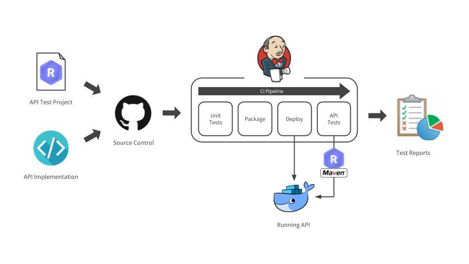
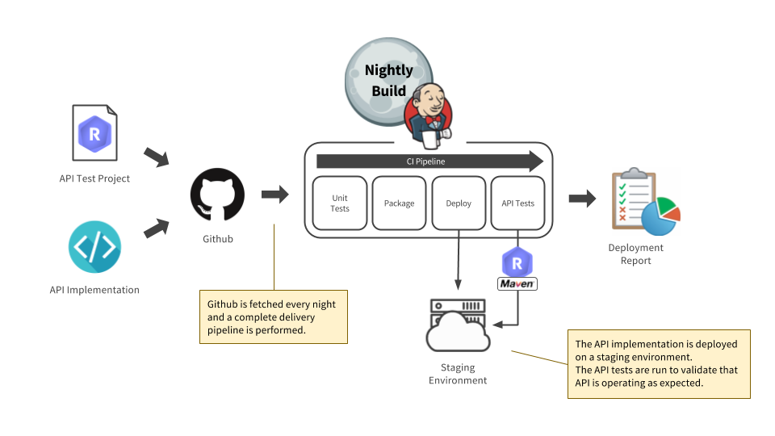
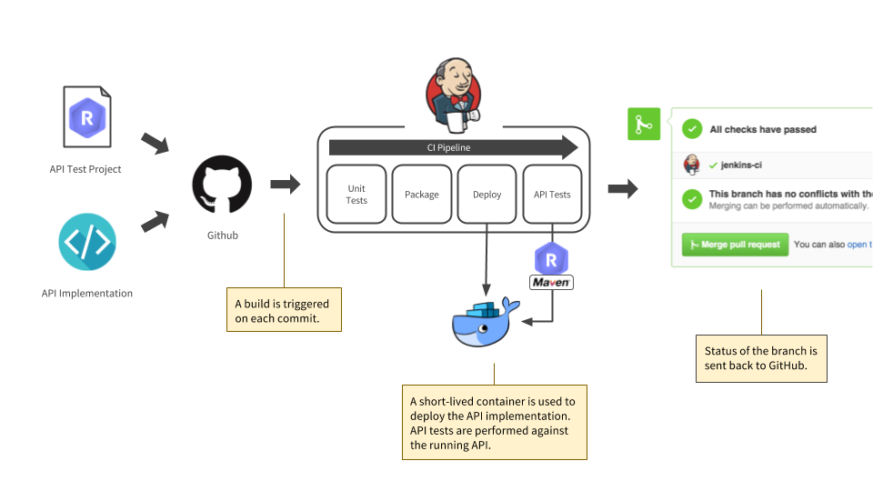

You probably want to run your tests automatically on a Continuous Integration (CI) environment. Good news, our CLI test runner integrates well
with most CI solutions, all you need is the
<a href="http://www.oracle.com/technetwork/java/javase/downloads/index.html" target="_blank">
latest Java JDK <i class="fa fa-external-link" aria-hidden="true"></i>
</a>
and
<a href="http://maven.apache.org/" target="_blank">
Maven <i class="fa fa-external-link" aria-hidden="true"></i>
</a> installed on your CI machine.

Check in our CI/CD solution list to see if yours integrates well with Restlet Client or influence your choice of
a solution:

|CI/CD solution|Maven integration level|Comments|
|---|---|---|
|Jenkins|★★★|Natively supported, optional <a href="https://plugins.jenkins.io/maven-plugin" target="_blank">Maven integration plugin <i class="fa fa-external-link" aria-hidden="true"></i></a>|
|Travis CI|★★★|Natively supported|
|CircleCI|★★★|Natively supported|
|Teamcity|★★★|Natively supported|
|Bamboo|★★★|Natively supported|
|Bitbucket Pipelines|★★★|Natively supported|
|Codeship|★★★|Natively supported|
|Semafore CI|★★★|Natively supported|
|Team Foundation Server|★★★|Natively supported|
|Shippable|★★★|Natively supported|
|Wercker|★★☆|Via a Docker image|
|Drone IO|★★☆|Via a Docker image|
|CodeFresh|★★☆|Via a Docker image|
|Gitlab CI|★☆☆|Via low-level configuration|
|GoCD|★☆☆|Via low-level configuration|
|AppVeyor|☆☆☆|Not supported|
|PHP CI|☆☆☆|Not supported|

Other CI/CD solution may work, the list above is only the list we have in our radar. If you have another working
solution please <a href="mailto:support@restlet.com?subject=Could%20you%20try%20this%20CI%2FCD%20solution%3F">contact us</a>
so we can update this page.

## CI workflow

Your API tests should follow the following flow:

You should build your API from the sources, then run unit tests, deploy it and finally run integration tests against it
using Restlet Client.

Technically, there are two main ways to do so which we will explain and comment below. If you want more precise
instructions on how to configure your CI builds, have a look at our tutorials on <a href="" target="_blank">Travis CI <i class="fa fa-external-link" aria-hidden="true"></i></a> and <a href="" target="_blank">CircleCI <i class="fa fa-external-link" aria-hidden="true"></i></a>.
They should get you started in no time.

## Basic workflow: test your main branch once a day

If you choose to test your API on a static environment, you can run the test on demand or schedule your job to run
nightly. This solution is easy to implement and does the job but note that:

* only one test can run at a time
* the data in your API gets "polluted" when running a test and you must clean it before running another test or they
won't run in the same conditions
* anybody with access to that environment can request the API while the test is running, which can result in
hard-to-debug test failures

If you are testing on a staging environment, you can create a CRON task that runs once a night and make it:

* pull the API code and test file from GitHub
* build and test your API code
* deploy it to your environment
* run your API tests against it with our maven plugin
* get your test reports

Once the job exists, you should be able to run it on-demand too.

## Advanced workflow: check your API is OK on each commit

A more advanced solution is to deploy your API in a container for each job run. That allows you to:

* test multiple branches at the same time
* work in a compartmentalized environment, only the test can mess with it
* test every commit

If you are testing your API in containers, you can create a task that runs each time the source control is updated and
make it:

* build and unit tests the API code
* deploy it in a container
* run your API tests against it with our maven plugin
* get your test reports
