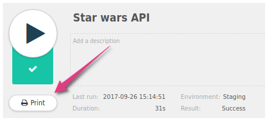
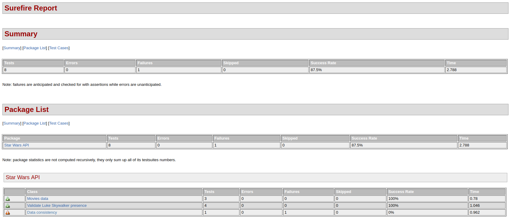

When running your API tests, you may want to preserve a trace of their results. That's why Restlet provides a few
ways to generate printable test reports - in HTML or PDF.

## From the Google Chrome Extension

When you have run a project/service/scenario in Restlet Client, you just need to open it and click on the button
`Print`.

<!-- IN SCREENSHOT: SP_CONTAINER -->

If you don't want to print it, you can just export it in PDF format by changing the printer.

<!-- IN SCREENSHOT: NOTHING_IMPORTANT -->

The generated report will look like this:

<!-- IN SCREENSHOT: PRINT_REPORT -->

## From the Command Line Interface

You can generate HTML reports directly from the command line using surefire with the following commands:

<pre class="language-shell">
<code class="language-shell">
# Runs the API tests
mvn clean test

# Creates a nicely formatted Surefire Test Report in HTML format
# without running the tests as they have been run already
mvn surefire-report:report-only

# The Site Plugin is used to generate a site for the project. The generated
# site also includes the project&apos;s reports that were configured in the POM
mvn site -DgenerateReports=false
</code>
</pre>

The generated output displays a summary of all the test results at the top followed by a detailed view.

<!-- IN SCREENSHOT: NOTHING_IMPORTANT -->

<!-- IN SCREENSHOT: NOTHING_IMPORTANT -->

## From Continuous Integration platforms

Our CLI tool generates test reports in XML, in the standard JUnit / Surefire format. This means any CI tool (Bamboo, TeamCity, etc.) or quality reporting tool (SonarQube, Allure, etc.) that is compatible with this standard format can produce reports for your Restlet Client API tests.

Here is what test reports will look like in Jenkins, but other CI platforms should have similar capabilities.

Detailed view on a particular build:

<!-- IN SCREENSHOT: NOTHING_IMPORTANT -->

History of test results:

<!-- IN SCREENSHOT: NOTHING_IMPORTANT -->

History of test execution duration:

<!-- IN SCREENSHOT: NOTHING_IMPORTANT -->

