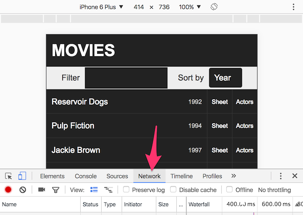
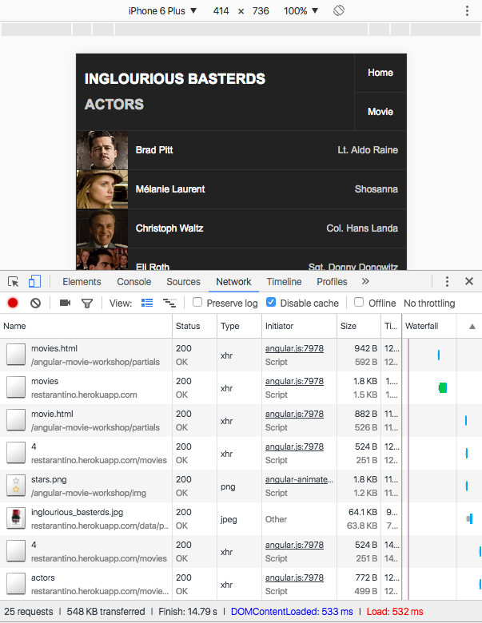
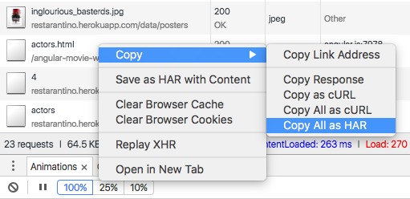
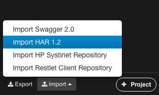
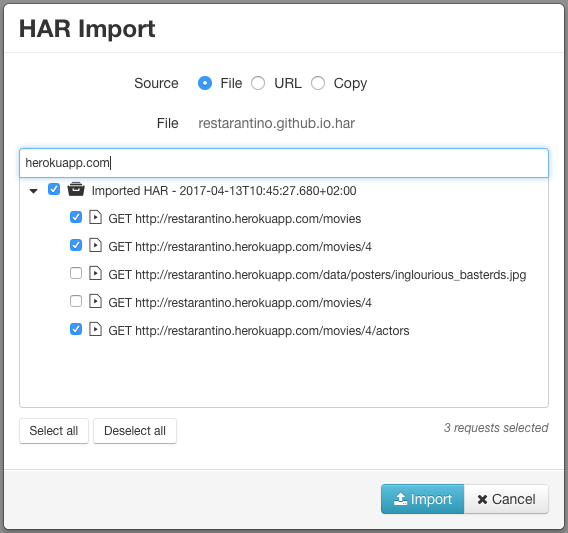
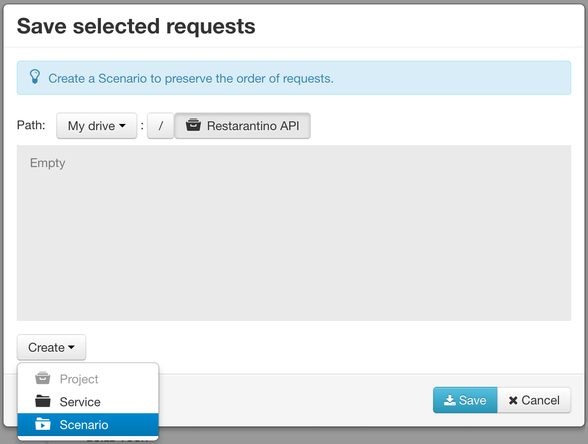
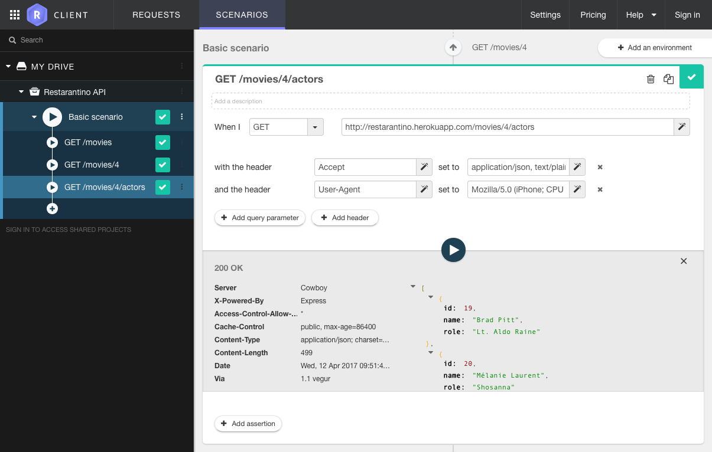
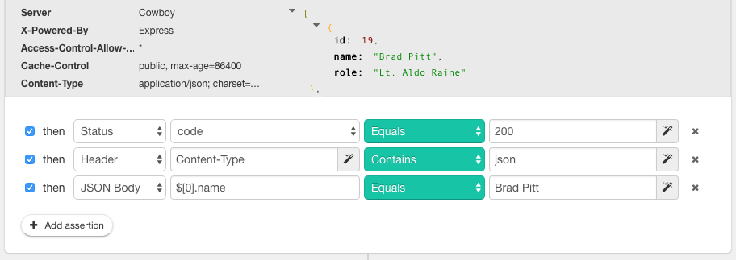

# Introduction

In this tutorial, we will see how to build an API test from an existing web application. We simply need a browser and Restlet Client. The [HAR file format](https://en.wikipedia.org/wiki/.har) will be used as a bridge between the two.

A web app is usually composed of a frontend and a backend. The backend exposes a REST API which is used by the frontend to consume data. 

When developing new features on a web app, backend developers want to make sure they don't break existing APIs. Frontend developers, on their side, want a reliable API to build their UI layer on. This way they can focus on what really matters: designing a good user experience.
 
This is where API tests bring value. API tests help developement teams to ensure they don't break the API contract when doing changes in the application code.

So, let's build an API test that will ensure our API contract won't be broken by accident!

# Fire your favorite browser's developer tools

The first step is to open your web app in your favorite browser. Then open the browser's developer tools and select the Network tab.

> Note: This tutorial is illustrated by screenshots of a web and mobile app that allows users to browse Quentin Tarantino's filmography.

# Use your web app!

The idea here is to use your web app, reproducing a user's sequence of actions. Your webapp’s frontend will call the backend API as you navigate through the different screens. You can see requests being sent in the browser’s Network tab.

# Extract network interaction as HAR

Save or Copy all these network exchanges in HAR format. HAR (HTTP Archive) is a JSON-based archive file aimed at storing a web browser’s network interaction.

# Import HAR into Restlet Client

Open Restlet Client, switch to Scenarios tab and import your HAR.

In the HAR import dialog, upload your .har file and select the requests to be included in your API test. Filtering capabilities can be used to hide requests that does not target the backend API you want to test (such as images, CSS, Javascript...).

Next step is to save this sequence of requests into a Scenario. This can be done by using the "Create" menu at the bottom of the save dialog.

> In Restlet Client, a Scenario is an ordered sequence of requests that closely emulates real-life usage of the API. And that's exactly what we need for testing our web API!

Great! You now have an Scenario that reproduce your interaction with the web API. You can run it and see requests being sent by Restlet Client.

# Add assertions to your scenario

The final step to build a Test Scenario is to add assertions to requests that compose your scenario. Assertions will ensure your API is behaving as expected.

A good starting point is to check the response status code (for example we usually expect a 200 status code for a GET request). 

You can then go further by creating assertions on response headers and body. Head over to the user guide to [learn more about assertions](https://restlet.com/documentation/client/user-guide/perform-requests/assertions/overview).

---

Congratulations, you've made it through this tutorial! You have built a first test scenario for your web API.

If you have questions or suggestions, feel free to contact us via the in-app messaging located at the bottom right of your screen.