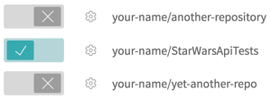
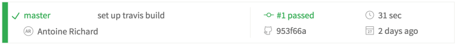
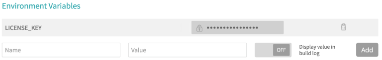
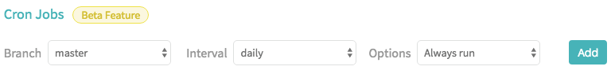
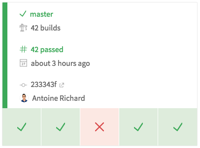

<!-- IN SCREENSHOT: NOTHING_IMPORTANT -->

 

This tutorial assumes you know how to launch Restlet Client tests from CLI. If you don't know, please have a look at
[the documentation](../user-guide/automate/run-tests-from-cli) first.

Now let's run our API tests on Travis CI! Travis CI is a popular tool helping development teams to continuously
building and delivering apps with confidence. It’s free for open-source projects. Just login with your Github account
and you’re set.

## Running your scenarios on Travis CI

First thing to do in order to run your scenario on Travis CI is to push it to a Github repository. Make sure you push
the 2 test files:

* the JSON file containing your scenario
* the pom.xml configuration file

> Note: Restlet Client now has a GitHub integration to help you push your tests files to GitHub in a whim.
You can learn more about this feature [here](../user-guide/automate/push-to-github).

Second step is to go to your <a href="https://travis-ci.org/profile" target="_blank">
profile page <i class="fa fa-external-link" aria-hidden="true"></i>
</a> on travis-ci.org, find your Github repository and switch it on:

<!-- IN SCREENSHOT: NOTHING_IMPORTANT -->

The third and final step is to create a .travis.yml file for Travis configuration. Let’s start with a simple
configuration:

<pre class="language-yaml">
  <code class="language-yaml">
language: java
jdk: oraclejdk8
install: true # skipping the default Travis install step
script:
- mvn test
  </code>
</pre>

After pushing your .travis.yml file to your Github repository, you should see the build running on Travis-CI:

<!-- IN SCREENSHOT: NOTHING_IMPORTANT -->

From now on, each time you push to your Github repository, a build will be triggered on Travis CI, and will run your
test scenarios!

## Setting up your license key

Test scenario automation through Maven is a paying feature, so you’ll be asked to enter your license key. Your license
key is private to you and should not be published on a Github repository.
A simple way to securely manage your key is to add it as an environment variable in
<a href="https://docs.travis-ci.com/user/environment-variables/#Defining-Variables-in-Repository-Settings" target="_blank">
Travis CI settings <i class="fa fa-external-link" aria-hidden="true"></i>
</a>:

<!-- IN SCREENSHOT: NOTHING_IMPORTANT -->

You can find your license key on the Restlet Client billing page. You’ll then be able to access your key in your build
script and pass it to Maven:

<pre class="language-yaml">
  <code class="language-yaml">
script:
- mvn test -Dlicense_key=$LICENSE_KEY
  </code>
</pre>

This argument can then be used in your pom.xml configuration:

<pre class="language-xml">
  <code class="language-xml">
&lt;licenseKey&gt;${license_key}&lt;/licenseKey&gt;
  </code>
</pre>

See an example of <a href="https://github.com/antoine-richard/StarWarsApiTests/blob/master/.travis.yml" target="_blank">
.travis.yml <i class="fa fa-external-link" aria-hidden="true"></i>
</a> and <a href="https://github.com/antoine-richard/StarWarsApiTests/blob/master/pom.xml" target="_blank">
pom.xml <i class="fa fa-external-link" aria-hidden="true"></i>
</a> files.

Another valid option would be to store it as an
<a href="https://docs.travis-ci.com/user/encryption-keys" target="_blank">
encrypted string <i class="fa fa-external-link" aria-hidden="true"></i>
</a> in your `.travis.yml` file.

## Automating scenario execution in Travis CI

Travis CI offers the ability to <a href="https://docs.travis-ci.com/user/cron-jobs/" target="_blank">
schedule job executions <i class="fa fa-external-link" aria-hidden="true"></i>
</a>. It can be very practical if your team is doing nightly
deployment. That way you’ll be ensuring that the latest version of your API, deployed each night on a staging
environment, does not break your API contract.

<!-- IN SCREENSHOT: NOTHING_IMPORTANT -->

<!-- IN SCREENSHOT: NOTHING_IMPORTANT -->

Another approach is to fire your API tests after each successful deployment of your API. See Travis CI documentation on
<a href="https://docs.travis-ci.com/user/customizing-the-build" target="_blank">
how to customize the build <i class="fa fa-external-link" aria-hidden="true"></i>
</a> and
<a href="https://docs.travis-ci.com/user/deployment/heroku/#Running-commands-before-and-after-deploy" target="_blank">
run commands after deploying <i class="fa fa-external-link" aria-hidden="true"></i>
</a>. 

It’s also good to know that you can trigger a Travis build
by <a href="https://docs.travis-ci.com/user/triggering-builds" target="_blank">
calling the Travis API <i class="fa fa-external-link" aria-hidden="true"></i>
</a>.
