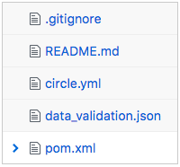
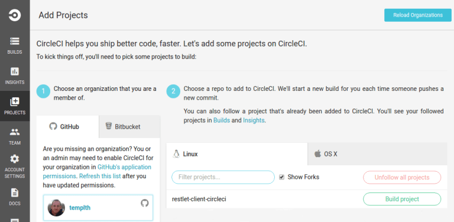
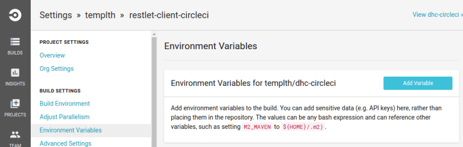
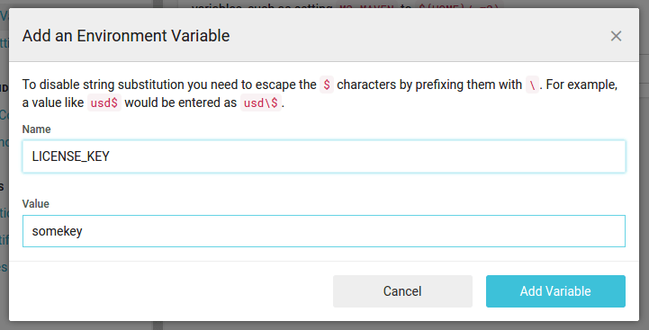
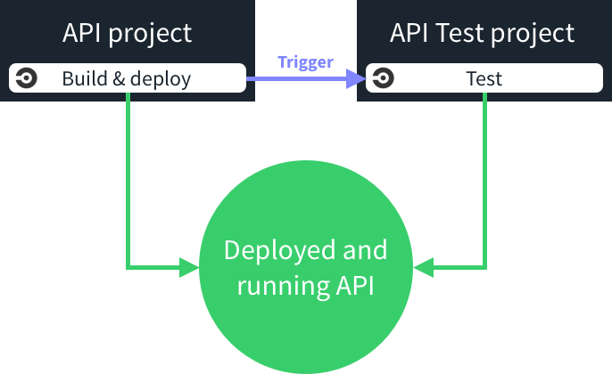

This tutorial assumes you know how to launch Restlet Client tests from CLI. If you don't know, please have a look at
[the documentation](../user-guide/automate/run-tests-from-cli) first.

Now let's run our API tests on Circle CI! Circle CI is a modern continuous integration and delivery platform. It allows
projects to tackle both continuous testing and deployment easily. Your first execution container is given for free, so
just login with your Github account and you’re set.

## Running your scenarios on Circle CI

First thing to do in order to run your scenario on Circle CI is to push it to a Github repository. Make sure you push
the 2 test files:

* the JSON file containing your scenario
* the pom.xml configuration file

> Note: Restlet Client now has a GitHub integration to help you push your tests files to GitHub in a whim.
You can learn more about this feature [here](../user-guide/automate/push-to-github).

Second step is to enable this project through the Circle CI console in the “Projects” tab. Select the Github user or
organization the project belongs to and click on “Build project”:

To use the defaults in Circle CI, nothing more is necessary. The platform will detect the project kind and execute
tests if any.

To provide a specific Circle CI configuration into our project, simply add a circle.yml file at the root of your
repository. We define here the JVM we want to use and the command to execute to run tests.

<pre class="language-yaml">
  <code class="language-yaml">
machine:
  java:
    version: openjdk8
test:
  override:
    - mvn test
  </code>
</pre>

## Setting up your license key

Test scenario automation through Maven is a premium feature, so you’ll be asked to enter your license key. Your license
key is only for you and should not be published on a Github repository.

A simple way to securely manage your key is to add it as an environment variable in the project settings within Circle
CI:

Simply add it using the “Add Variable” button:

To use this environment variable, just update the command to start tests within the previous `circle.yml` file, as
described below:

<pre class="language-yaml">
  <code class="language-yaml">
machine:
  java:
    version: openjdk8
test:
  override:
    - mvn test -Dlicense_key=$LICENSE_KEY
  </code>
</pre>

The `license_key` property can then be used in your pom.xml:

<pre class="language-xml">
  <code class="language-xml">
&lt;licenseKey&gt;${license_key}&lt;/licenseKey&gt;
  </code>
</pre>

See an example of
<a href="https://github.com/antoine-richard/restlet-client-circleci/blob/master/circle.yml" target="_blank">
circle.yml <i class="fa fa-external-link" aria-hidden="true"></i>
</a> and <a href="https://github.com/antoine-richard/restlet-client-circleci/blob/master/pom.xml" target="_blank">
pom.xml <i class="fa fa-external-link" aria-hidden="true"></i>
</a> files.

## Automating scenario execution in Circle CI

As a team developing an Web API, we would like to run our API Tests each time the Web API project is built and
deployed successfully.

To do so with Circle CI, we’ll have two builds: one responsible for building and deploying the actual Web API, the
other one responsible for the testing the deployed API. We’ll configure the first build so that it will trigger the
second one after each successful deployment.

The following figure provides an overview of this approach:

To trigger the execution of test scenarios after the Web API is successfully deployed,  we need to leverage the
__deployment__ part of Circle CI configuration and add a second command after the actual deployment.
The second command is a call to the Circle CI API which will trigger the API test execution.

Here is an example of such configuration (with a deployment on Heroku):

<pre class="language-yaml">
  <code class="language-yaml">
deployment:
  trigger:
    branch: master
    commands:
      - git push git@heroku.com:myapp.git $CIRCLE_SHA1:master
      - curl -v -X POST https://circleci.com/api/v1/project/templth/restlet-client-circleci/tree/master?circle-token=$CIRCLE_TOKEN
  </code>
</pre>

This way, each time we’ll push a change, the API will be built, deployed and tested thanks to Circle CI and Restlet
Client Test Scenarios!
