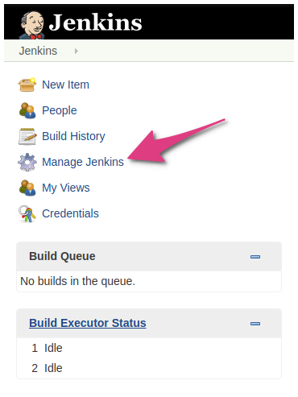
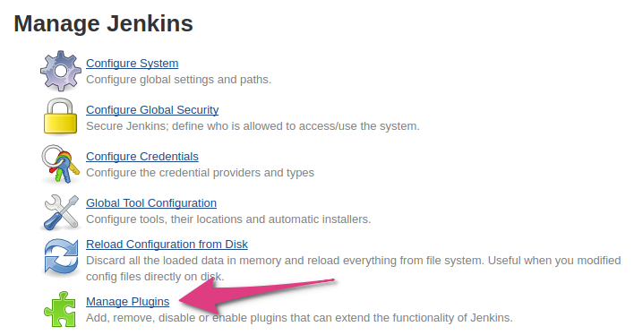
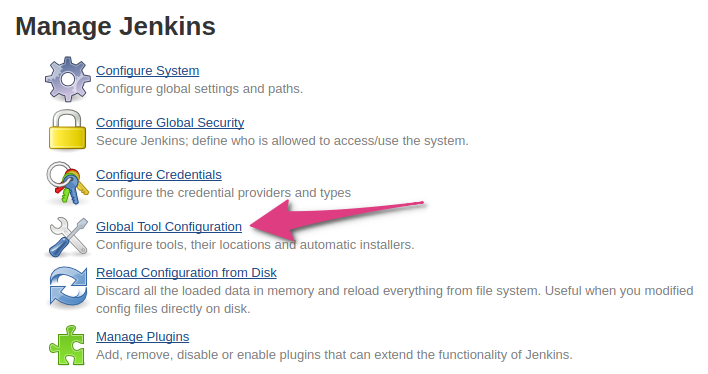
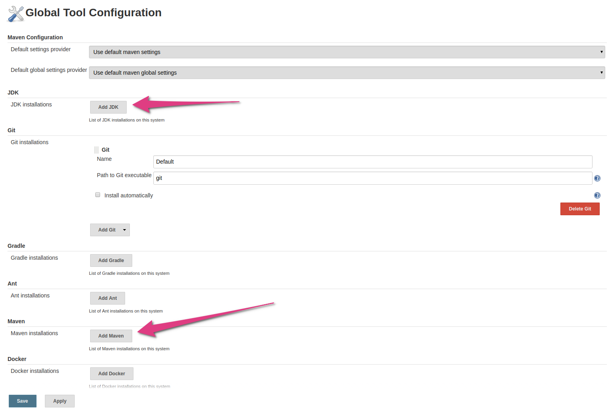
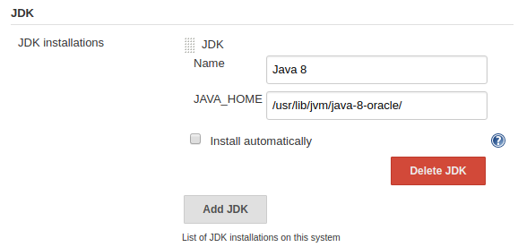
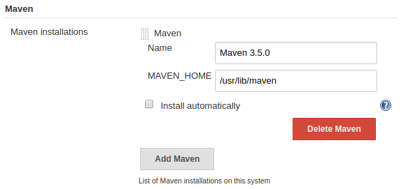

This tutorial assumes you know how to launch Restlet Client tests from CLI. If you don't know, please have a look at
[the documentation](../user-guide/automate/run-tests-from-cli) first.

Now let's run our API tests on Jenkins!
<!-- TODO: Jenkins description, let's explain we use Jenkins 2 and why ? -->

## Running your scenarios on Jenkins

First thing to do in order to run your scenario on Jenkins is to push it to a Github repository. Make sure you push
the 2 test files:

* the JSON file containing your scenario
* the pom.xml configuration file

> Note: Restlet Client now has a GitHub integration to help you push your tests files to GitHub in a whim.
You can learn more about this feature [here](../user-guide/automate/push-to-github).

### Maven plugin installation

You will need to install the Maven plugin, which does not come in the standard plugins. To do so, open
`Manage Jenkins > Manage plugins`.

In this page, select the tab `Available` then search for the pipeline maven plugin as described below:

### Setup the JDK and Maven

You will need to configure Jenkins so that it knows where to find the JDK and Maven. To do so, open
`Manage Jenkins > Global tool configuration`:

In this screen, you will have two sections for JDK and Maven configuration.

You just have to put the path to your JDK and Maven installation in the inputs. If you don't have a JDK or Maven
installed on your machine, Jenkins will guide you to install it easily and quickly.

> Note: the name you set for your Maven installation will be re-used later on. Copy it somewhere so you don't have to
come back to the configuration page.

