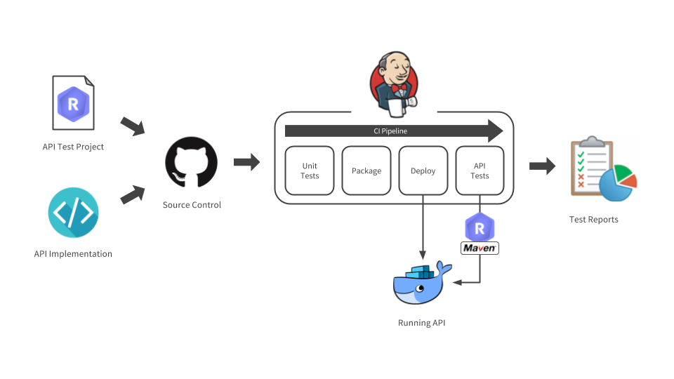

<!-- IN SCREENSHOT: NOTHING_IMPORTANT -->

 

This tutorial assumes you know how to launch Restlet Client tests from CLI. If you don't know, please have a look at
[the documentation](../user-guide/automate/run-tests-from-cli) first.

Now let's run our API tests on Jenkins! Jenkins is a largely adopted open-source continuous integration and delivery
platform. It is highly configurable, thus adapts well to any workflow. The community is huge and there is a multitude
of plugins for all sorts of use cases. Jenkins comes for free and you can easily install it on your infrastructure.

First thing to do in order to run your scenario on Jenkins is to push it to a Github repository. Make sure you push
the 2 test files:

* the JSON file containing your scenario
* the pom.xml configuration file

> Note: Restlet Client now has a GitHub integration to help you push your tests files to GitHub in a whim.
You can learn more about this feature [here](../user-guide/automate/push-to-github).

## Configuring Jenkins

Jenkins is a highly extensible system and most things are done via plugins. That's why there's a bit of configuration
to do on Jenkins before you can run your tests.

### Plugins installation

You will need to install the __Pipeline Maven Integration plugin__ and the __Junit Attachments Plugin__,
which don't come in the standard plugins. To do so, open `Manage Jenkins > Manage plugins`.

In this page, select the tab `Available` then search for the plugins using the search bar as described below:

<!-- IN SCREENSHOT: NOTHING_IMPORTANT -->

### Setup the JDK and Maven

You will need to configure Jenkins so that it knows where to find the JDK and Maven. To do so, open
`Manage Jenkins > Global tool configuration`:

In this screen, you will have two sections for JDK and Maven configuration, click on `Add JDK` and `Add Maven` and
just let Jenkins guide you for the installation.

> Note: the name you set for your Maven installation will be re-used later on. Copy it somewhere so you don't have to
come back to the configuration page.

### Store the Restlet Client license and other credentials

Some information is too sensitive to be pushed on a repository. For this type of information Jenkins has a credentials
store. You can define credentials in there and consume them in your jobs.

We will put the Restlet Client license in there as well as our API key. To do so, open the credentials page from the
left menu, click on `Global` next to the Jenkins store and `Add credentials` in the next page.

Create the credentials as shown below:

<!-- IN SCREENSHOT: NOTHING_IMPORTANT -->

## Defining your pipeline

The most important part of your build is defining how your tests will be run. The main idea is to follow the workflow
shown below.

<!-- IN SCREENSHOT: LOGO -->

The idea is to pull your API code and your Restlet Client test file from source control then use them to fully test the
API. The tests consist in:

* __Unit-testing your code__: you probably have unit tests, run them now
* __Packaging your API__ packaging your API at that step
* __Deploying your API__ deploy your API so that you can run your API tests against it
* __Run your API tests__ now run your API tests against a running version of your API

In our pipeline example, the unit-testing and packaging will be done in stage _Build_, the deployment in stage _Deploy_ and the
API tests in stage _Test_.

> Note: more information on how to configure your pipeline [in the documentation](../user-guide/automate/integrate-with-ci#ci-workflow)

## Setting up the repository

Now that Jenkins can run your tests, let's prepare our tests. We will need a
<a href="https://github.com/restlet/tutorials-resources/blob/master/src/test/resources/contacts_api_tests.json" target="_blank">
JSON file <i class="fa fa-external-link" aria-hidden="true"></i>
</a> - generated from Restlet Client - describing our tests and a
<a href="https://github.com/restlet/tutorials-resources/blob/master/pom.xml" target="_blank">
pom.xml <i class="fa fa-external-link" aria-hidden="true"></i>
</a> configuring them.

### The POM file

The POM file's configuration can be parametrized by JVM arguments:

<pre class="language-xml">
  <code class="language-xml">
&lt;file&gt;${test_file}&lt;/file&gt;
&lt;licenseKey&gt;${license_key}&lt;/licenseKey&gt;
&lt;variables&gt;
&lt;!-- The variable API_KEY's value will be overwritten with the JVM argument api_key --&gt;
&lt;property&gt;
  &lt;name&gt;API_KEY&lt;/name&gt;
  &lt;value&gt;${api_key}&lt;/value&gt;
&lt;/property&gt;
&lt;/variables&gt;
  </code>
</pre>

Here you can see that the test file is parameterized, this allows you to put your tests in separate files and call
the tests individually by specifying the test file in the Maven command - more on that later on.

The license key has also been parameterized. It is very important, for security reasons, that the license is not pushed
to a GitHub repository. As both the POM file and the Jenkinsfile are on our public GitHub repository, we must
parameterize the build and inject the license key here via Jenkins credentials.

The variable `API_KEY` is a bit trickier. It is one of the variables from our Restlet Client environment - in the JSON
test file. It has been overwritten manually here because it contains sensitive information that we did not want to
push to GitHub. This mean you can have environments with a valid value here to run the tests in Restlet Client and
a _safe_ environment without sensitive information in it for CI where you manually add the sensitive data.

### The Jenkinsfile

Jenkins pipelines are written in groovy but don't worry, you won't need to know the language to create them, they are
quite descriptive.

Here is the pipeline we are going to run:

<pre class="language-groovy">
  <code class="language-groovy">
#!/usr/bin/env groovy

node {
  stage('Checkout') {
    checkout scm
  }
  stage('Build') {
    echo 'Building and unit testing the API.'
    // this step is faked
    echo 'API built and unit-tested.'
  }
  stage('Deploy') {
    echo 'Deploying the API.'
    // this step is faked
    echo 'API deployed.'
  }
  stage('Test') {
    echo 'Testing the API with Restlet Client Maven plugin'

    withCredentials([
      string(credentialsId: 'RESTLET_CLIENT_LICENSE', variable: 'RESTLET_CLIENT_LICENSE'),
      string(credentialsId: 'CONTACTS_API_KEY', variable: 'CONTACTS_API_KEY')]) {

        // Maven installation declared in the Jenkins &quot;Global Tool Configuration&quot;
        withMaven(maven: 'Maven 3.5.0') {
          sh &quot;mvn clean test -B \
             -Dapi_key=\&quot;$CONTACTS_API_KEY\&quot; \
             -Dselected_environment='restlet-cloud' \
             -Dtest_file='src/test/resources/contacts_api_tests.json' \
             -Dlicense_key=\&quot;$RESTLET_CLIENT_LICENSE\&quot;&quot;
        }
        echo 'API tested.'
    }
  }
}
  </code>
</pre>

The build and deploy stages are fake here. In a real build job, you would put your build and deploy code there. In this
tutorial, let's focus on the testing phase.

#### Credentials

You can see in the __Test__ stage that the block `withCredentials` is used to retrieve the API key and the Restlet
License and put them in variables of the same name. They are then re-used as JVM argument to provide values to the
parameterized part of the POM file.

#### Maven

Note that the block `withMaven` retrieves the Maven path with the name we set earlier in the Maven configuration.

## Creating the job

Now that all the pieces are ready, let's create the job! Click on `New Item` then choose a name for your job and
select the type __Pipeline__.

<!-- IN SCREENSHOT: NOTHING_IMPORTANT -->

You can now save the job. It is ready to run! Just click on `Build now` to run it.

The job will run and the Junit Attachments plugin we installed at the beginning will parse the reports generated by
Restlet Client's Maven plugin to generate a report.

<!-- IN SCREENSHOT: NOTHING_IMPORTANT -->

You can see the result trends in a graph showing the number of success or failures in each run in the history. The stage
that failed will be in red in the stage view and if you want more details, you can just click the latest test results
link. If you want to see the test results of a previous build, just open that build information - by clicking on its
number on the left - and you'll have a similar link.
