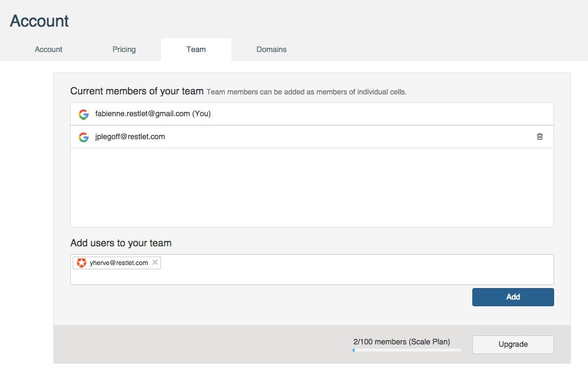
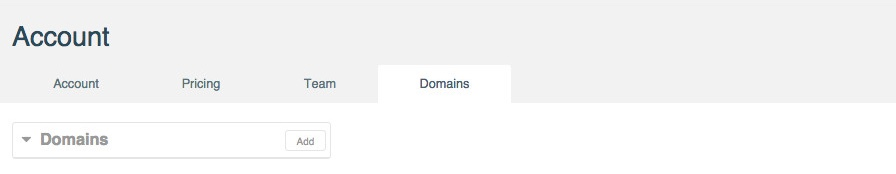

All your Restlet account details are available on the **Account** page, from any of the three modules (Cloud, Client or Studio).

To navigate to your **Account** page, make sure you are signed in, then click on your username on top right of your screen and select **Account**.

The **Account** page is composed of 4 tabs: **Account**, **Pricing**, **Team** and **Domains**.

# Account tab

## User information

This section provides information about your profile and the social network account you use to connect to Restlet Cloud.

* **Display name**: name that will display on top right of your screen.  
* **Email**: the email address associated with the account
- logo of the social provider you used to sign in (or Auht0 logo if you signed in with your email address directly),
- your email address,
- a green tick if you confirmed your email address in the email that was sent automatically to your mailbox or a **Not verified** link if you did not,
* your profile picture.

## Tokens

The **Tokens** section lists the tokens linked to your account.
You will not need to use these tokens for now. You can simply sign in to Restlet Cloud with your social provider account.  

## Plan

You can downgrade or upgrade plan directly from your **Account** page.  

 * **My plan**:
- name of plan / price per month,
- **Change plan** link.
- Capacity linked to the plan you subscribed to

Click on the **Change plan** link.  
From the **Pricing** page, click on the appropriate **Downgrade** or **Upgrade** button and follow the confirmation messages.

## Billing information

You can change or delete your credit card details if necessary.

* **Card**:
- partially hidden credit card number and type of card,
- **Delete card** link.
* **Expiration date**: credit card expiration date in month/year format

If you need to change the credit card you saved in your billing details, click on the **Delete card** link and enter your new credit card details.

# Pricing tab

From this tab, you can select the plan that best suits you. You may upgrade or downgrade your plan according to your needs.

# Team tab

Restlet Cloud allows you to share your APIs with members of your team (if you subscribed to a Team or Scale plan).

>**Note:** At the bottom of the window, you can see the number of members you added to your team and the number of members you are allowed according to the plan you subscribed to e.g. 2/5. If you need to add more members, click **Upgrade**.

# Domains tab

You can create several domains on your account.

For more information, jump to the [custom domains](/documentation/cloud/guide/create/edit/endpoints "custom domains") section of our online documentation.
