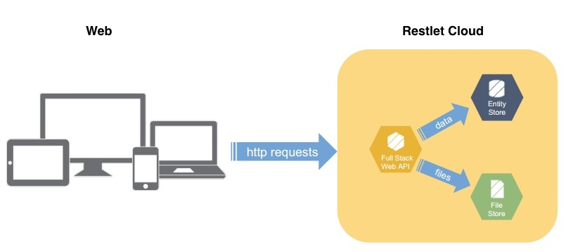

# Cell concept
Restlet Cloud relies on the concept of cells. A cell is a basic software package that can interact with other imported cells.

# Cell types
From Restlet Cloud, you can create two types of cells: Data Stores (Entity Stores or Files Stores) and web APIs.

Web APIs import Data Stores and can be invoked by users.

## Web APIs  
An *API* (Application Programming Interface) is an available web business once deployed via HTTP and exposing data.

You can create a *web API* cell, which will be hosted on Restlet Cloud. In order to bring additional features to your existing web API hosted outside of Restlet Cloud, you can create a *Connector* cell.

## Data Stores  
Two types of Data Stores can be created. *Entity Stores* for structured data (equivalent to a database) and *File Stores* for static files (text documents, images, videos or style sheets).

# Cell characteristics

Each cell created is given a unique identifier on Restlet Cloud prefixed by its category (APIs or stores), and followed by its version number. Here is the identifier structure:  
`/<category>/<cell identifier>/versions/<version number>/`  
e.g. `https://cloud.restlet.com/apis/3373/versions/1/`  
This identifier will be requested by the Restlet support team when assisting you.

> **Note:** You cannot directly invoke a DataStore, you need to first expose it through a web API which imports this store. A web API can invoke several stores.
