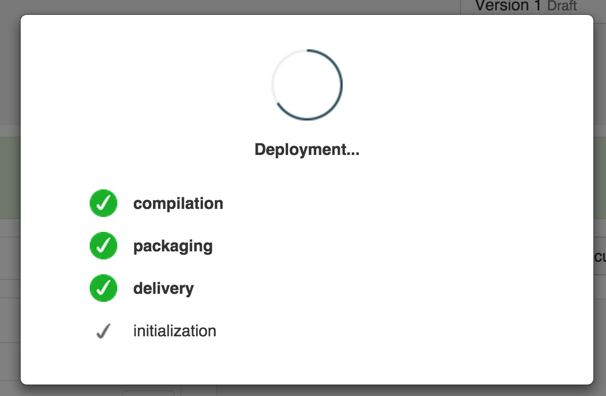

Every Restlet Cloud cell is present in two different environments.

The *Restlet Cloud web console* is the development environment in which you design and maintain your cells.

When you deploy a cell, Restlet Cloud generates a program that will be deployed in the cloud and executed in the *Restlet Cloud runtime environment*.

Thus, your Data Stores and web APIs are only available to store data or receive HTTP requests after having been deployed.

When you create a cell, a message reminds you that you need to deploy it before being able to call it. This message displays from the cell **Overview** page on top of the screen.

It also displays from the Dashboard at the bottom of the cell card.

Cells can be deployed from the draft, published and deprecated states, and can be re-deployed at any time.

The deployment process is composed of several steps, which are displayed in the deployment information window.

Each step of the deployment process is also documented by a message in the **Messages** tab. The events are listed in the **Traces** section.

