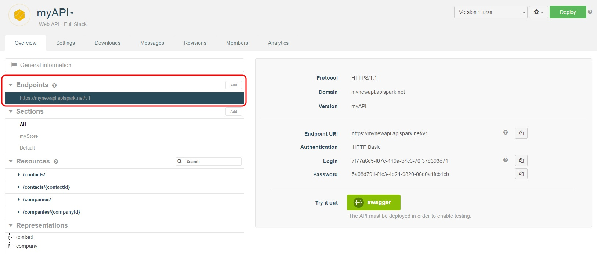
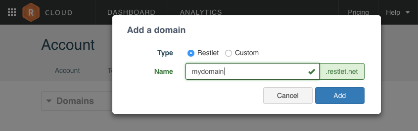
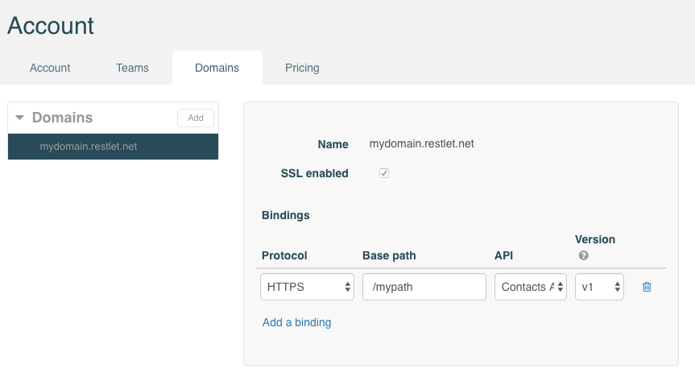
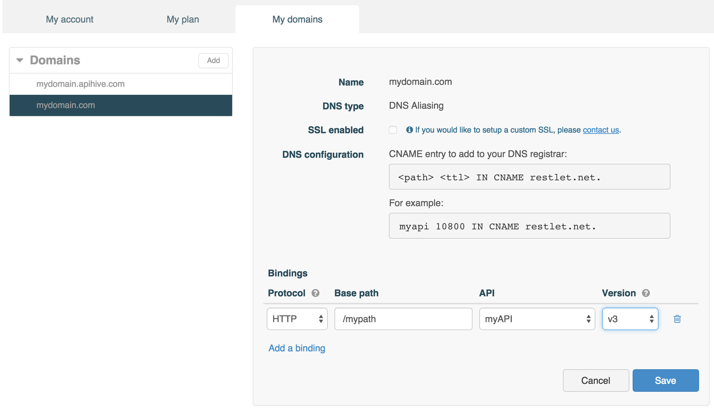

# Endpoint basics

An **Endpoint** is the entry point for accessing a web API, to which all the API's resources are attached.

An **Endpoint** has a **URI** (Uniform Resource Identifier), a **Protocol**, a **Domain**, a **Version**, and **Authentication** credentials.

A single API can have multiple endpoints, for example to respect different naming conventions or to support different protocols such as HTTP or HTTPS.

To edit a web API's endpoints in Restlet Cloud, navigate to the web API's **Overview**. The API's endpoints are listed in the **Endpoints** section in the left panel.

To add new endpoints, click on the **Add** button of the **Endpoints** section.

You will be prompted to select a **Domain** and a **Protocol** for you new **Endpoint**.

# Custom domains

By default, your web API responds to traffic sent to its default "restlet.net" endpoint.

Custom domains can also be used as a basis for you API endpoints.

## Add a custom domain

To add a custom domain endpoint, you first have to register your custom domain, in the **Domains** tab of the **Account** page.

**Add** a domain, choose a [DNS configuration type](#dns-configuration) and enter a name for your domain.

Then, you need to bind your domain to one or several APIs. Click **Add a binding**.

>**Note:** If you want to apply the binding to all API versions, select "\*" in the **Version** drop-down menu.

**Save** your changes and **Deploy** the API you bound to make them go live.

>**Note:** **My domains** tab allows you to create new endpoints for your web API, with a base URI taken either from the default restlet.net domain or from your custom domain.

## DNS configuration types

Restlet Cloud proposes 2 types of DNS configuration for your custom domains. You can pick the configuration type when adding a custom domain.

### DNS aliasing

Use the **DNS aliasing** configuration if you opt for adding a CNAME entry with your DNS registrar, that points to restlet.net.

Here is an example configuration to setup with your domain registrar, for myapi.customdomain.com:

<pre class="language-bash"><code class="language-bash">myapi 10800 IN CNAME restlet.net.
</code></pre>
**PATH** - Name of the node to which this record pertains e.g. *myapi*  
**TTL** - Number of seconds during which the Resource Record stays valid e.g. *10800*  
**CLASS** - Class code e.g. *IN*, for Internet  
**TYPE** - Type of Resource Record e.g. *CNAME*  
**VALUE** - Value of the Canonical Name or CNAME e.g. *restlet.net.*

### DNS delegation

Use the **DNS delegation** configuration if you opt to let Restlet Cloud serve as your DNS.

Please contact us in order to setup DNS delegation.
