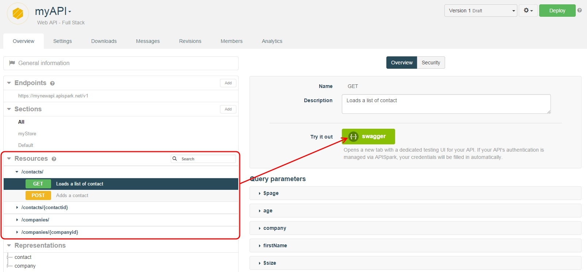
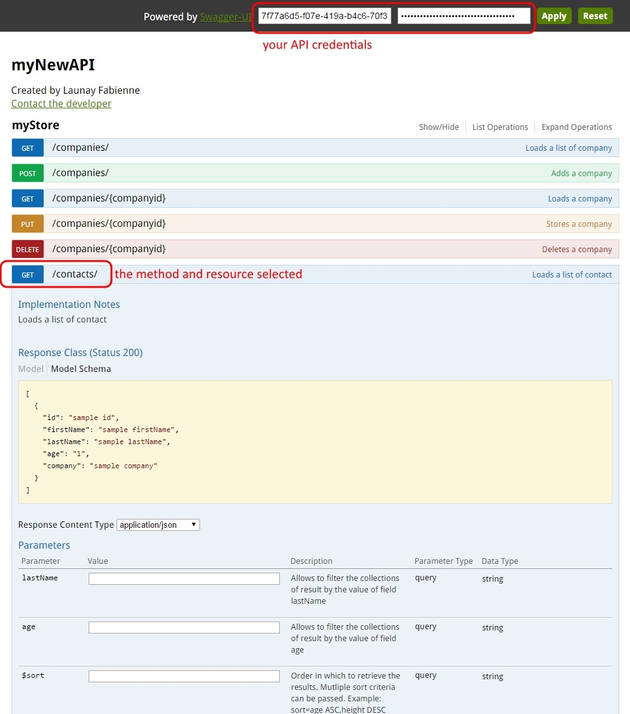
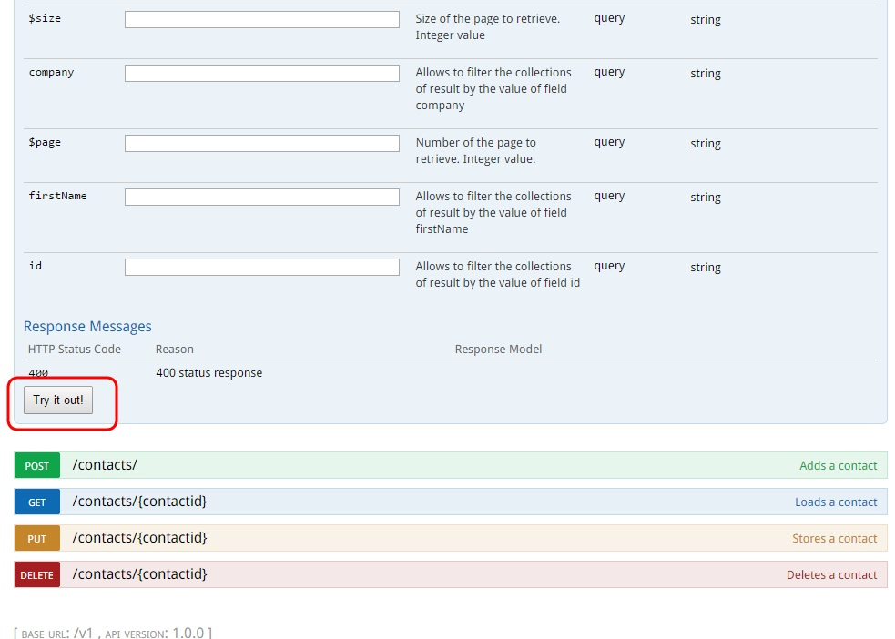
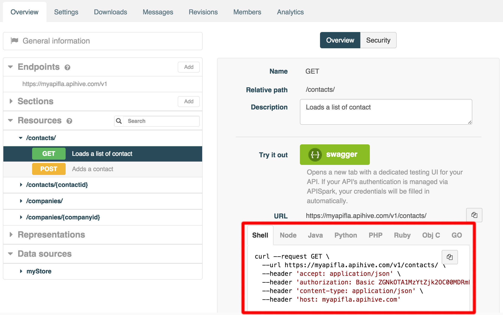
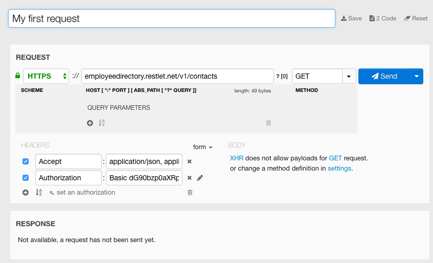
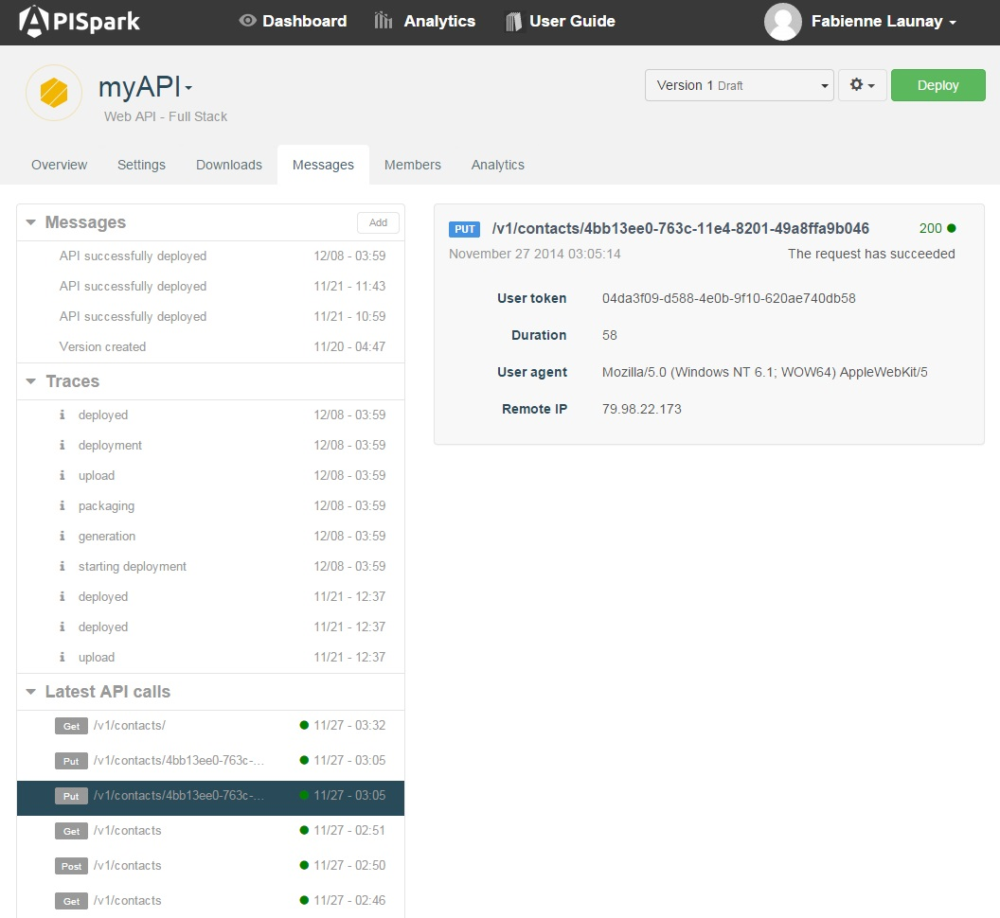

# Requirements

In order to test and debug a web API, a certain number of requirements must be met.

The API must be deployed. Please visit the [Cell deployment](/documentation/cloud/guide/explore/cell-deployment "Cell deployment") page if you do not know how to deploy an API.  
You need access credentials if the API is not open to *Anyone*. Please visit the [Invocation](/documentation/cloud/guide/publish/publish/invocation "Invocation") page if you do not know how to obtain and view your API access credentials.

# Invoke your web API

Using a web API does not impose any particular programming language. It can even be done from a web browser. However, to test your API we recommend the use of tools such as the Swagger UI (which you can launch directly from Restlet Cloud) or Restlet Client (the chrome extension) that provide a graphical user interface to perform HTTP calls.

## Invoke your web API from Restlet Cloud with the Swagger UI

Restlet Cloud embeds the Swagger UI to allow you to call out the various resources and methods of your API directly from the platform.

From the **Overview** tab of your API, select the appropriate Endpoint.  
From the left panel, click on the Resource and the Method chosen and click on the **swagger** button.

The Swagger UI opens in a new tab.  
Your credentials are pre-filled in the two fields on top of the screen.

You can select the list of resources and methods available from your API, along with sample data that you will need i.e. to send to a PUT or POST method.  
You can also specify the query parameters that you want to pass to the call.  
Scroll down to the bottom of the page and click on the **Try it out!** button to invoke your API.

## Test your web API with code snippets

Code snippets let you quickly get an idea of how to invoke your API from a number of different programming languages. Snippets come preconfigured with authentication and sample data extracted from your API's definition.

Navigate to your API's **Overview**.  
From the **Resources** section, select a method e.g. GET.

>**Note:** Snippets are available for Full Stack web APIs and Connectors.

## Invoke your web API with Restlet Client

When using Restlet Client, click on the **set an authorization** button under the list of headers, fill in the **Username** and **Password** fields with the information copied from your Restlet Cloud **Endpoints**.  
Fill in the request path with the API's endpoint URL and the path for a resource e.g. `/contacts/ `at the end of it. (E.g. `https://employeedirectory.restlet.net/v1/contacts`).  
To retrieve the list of contacts in JSON, make sure the **Accept** header is listed with the value at **application/json**.  
Click on the **Send** button.

# Check your messages

The web API's **Messages** tab displays messages pertaining to different aspects of your API's life.

This is a great place to go to when testing your API.

## Messages

The **Messages** section in the left panel contains general messages pertaining to Restlet Cloud internal process such as version creation, and deployment.

## Traces

The **Traces** section contains detailed log messages pertaining to processes such as deployment.

If one such process were to result in an error, the **Traces** section can provide useful information as to why the process failed.

## Latest API calls

The **Latest API calls** section lists the latest HTTP calls made to a deployed web API.
