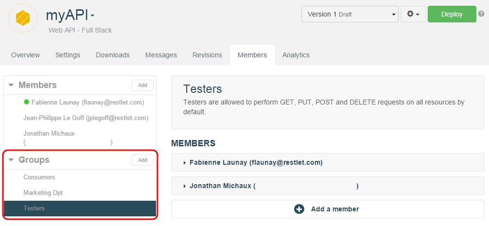
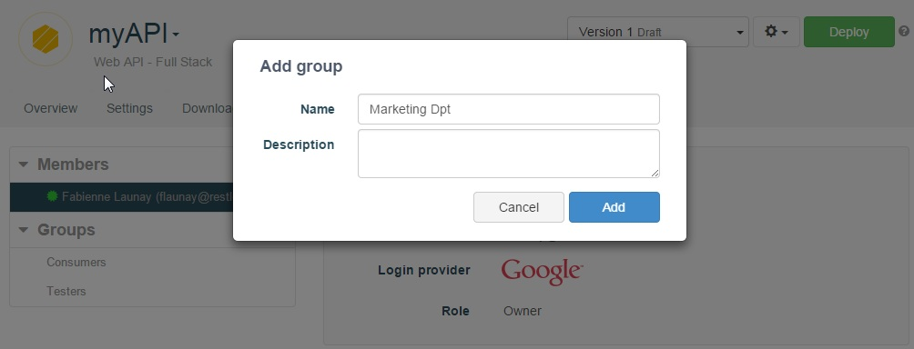
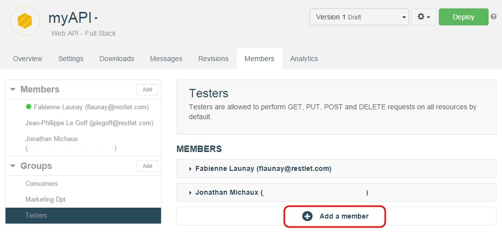
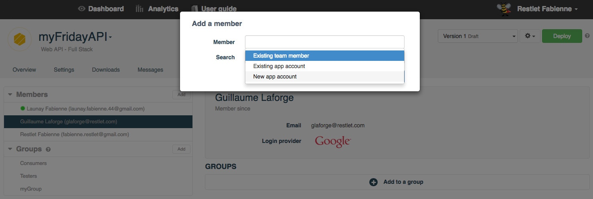
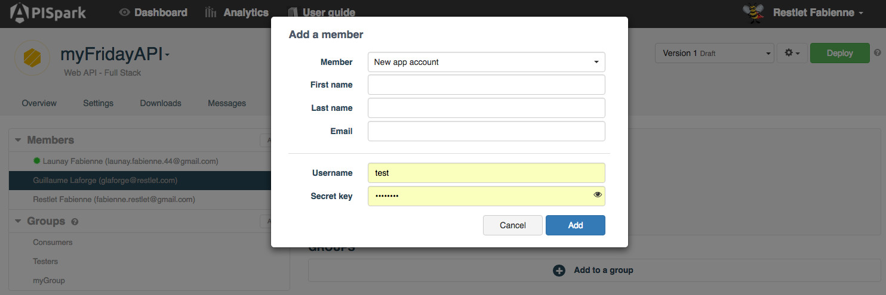

# Introduction

Restlet Cloud provides a highly flexible system for controlling runtime access to your APIs.

Runtime access means controlling which of your API's methods can be invoked by which of the API's consumers. You can decide to put in place very simple rules, for example by giving all your API's consumers the same access rights, or you can fine tune access to your APIs for different groups that you can define. You can also configure your API methods to be open to anyone without authentication.

Runtime access permissions to Restlet Cloud APIs are defined by assigning method access rights to member groups.

You have the choice to build the member groups that correspond to your needs.

For example, you might create groups for specific categories of users, depending for example on the rate limitation you wish to apply (see the [Firewall settings](/documentation/cloud/guide/publish/secure/firewall-settings "Firewall settings") page on how to configure rate limitations).

When you create a new web API, two default groups will be created: *Testers* and *Consumers*. As the API creator, you will automatically be added to the *Testers* group so that you can invoke and test your API. The *Consumers* group is designed for the consumers of your API.

Of course, you can freely edit your API's member groups and delete the default ones if you wish.

# Managing web API groups

From your API **Overview** page, click on the **Members** tab.
In the **Groups** section, click on the **Add** button.

In the **Add group** window, enter the name and description for your group. The new group displays in the **Groups** section.

# Managing group members

You can manage a group's members by selecting the group from the left panel of the **Members** tab.

Add members to a group by clicking on the **+ Add a member** button of the selected group.

> Note: you can only add a member to a group if s/he has already been added as a member of your API. The process of adding member to any cell is described in the [Add team members](/documentation/cloud/guide/share/add-members "Add team members") page.

# Creating App accounts

App accounts make it easy for end-users without an Restlet Cloud account to connect to protected Restlet Cloud APIs.

As the manager of an Restlet Cloud Full Stack API (or Connector), you can manually create App accounts and share their credentials directly with your end-users who can then authenticate themselves.

To create a new App member on a Full Stack API (or Connector):

From the web API **Overview** page, click on the **Members** tab.  
In the **Members** section, click on the **Add** button.  
In the window that displays, select **New app account** from the **Member** drop-down menu.

Enter the App account details: **First name**, **Last name**, **Email**, **Username** and **Secret key** (all fields are required except **Email**).

The new account will automatically be added as a member of the API.  
You can now also add this account as a member of other APIs by searching for an existing member.

>**Note:** The **Username** must be a unique identifier across all of Restlet Cloud (a message will inform you in case the **Username** you chose is already taken). This **Username** may only contain alphanumeric characters, hyphens and underscores, and cannot begin with an hyphen or underscore.  
The **Secret key** entered must contain at least 8 characters.
