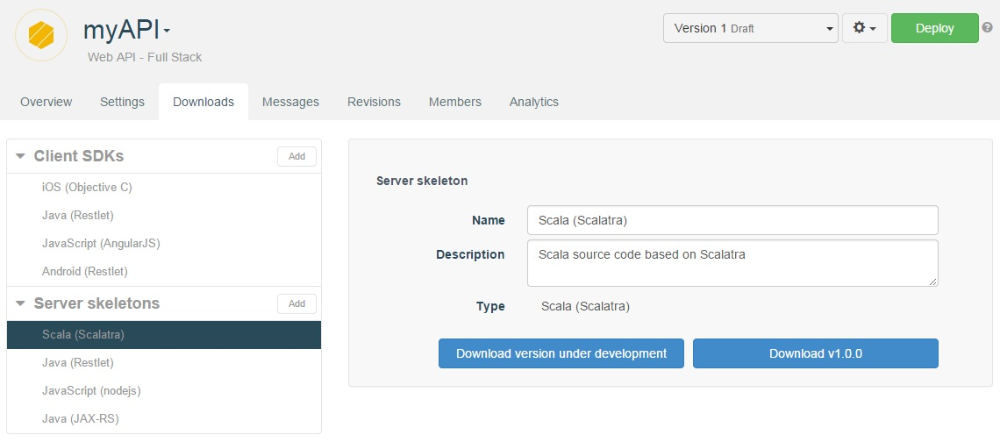

# Introduction

The beauty of a RESTful API is that it can easily be invoked by a host of different devices and applications.

To facilitate this, APISpark can generate server skeletons for your web APIs for a number of different environments:

| Server skeletons |
| ------------- |
| Java (Restlet Framework or JAX-RS)
| Scala (Scalatra)
| JavaScript (Node.js)

You can **Add** or **Delete** server skeletons from the **Server skeletons** section of the **Downloads** tab.

# Download server skeletons

You can download server skeletons just as you do with client SDKs:

Open the appropriate API.  
Click on the **Downloads** tab.  
Select the language you need (Scala, Java - Restlet Framework or JAX-RS - or JavaScript) in the **Server skeletons** section.  
Click on the **Download ...** button from the central panel.  

Server skeletons follow the same version creation process described in the [client SDKs section](/technical-resources/apispark/guide/publish/client-sdk "client SDKs section").
