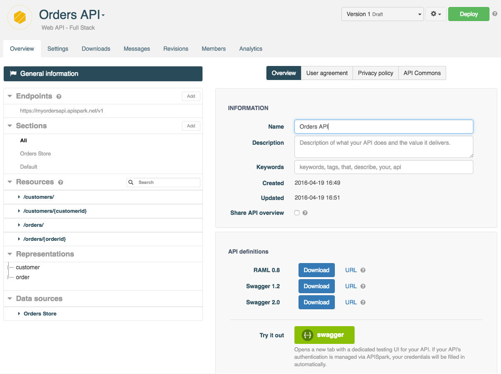
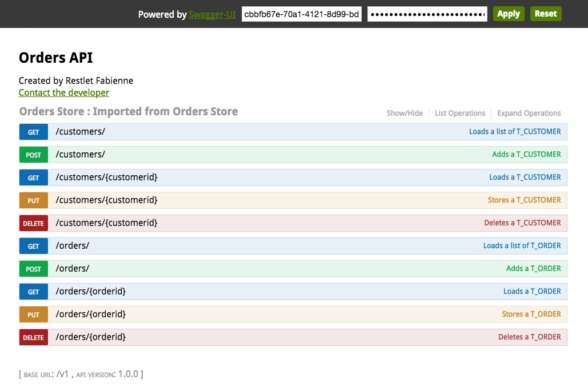
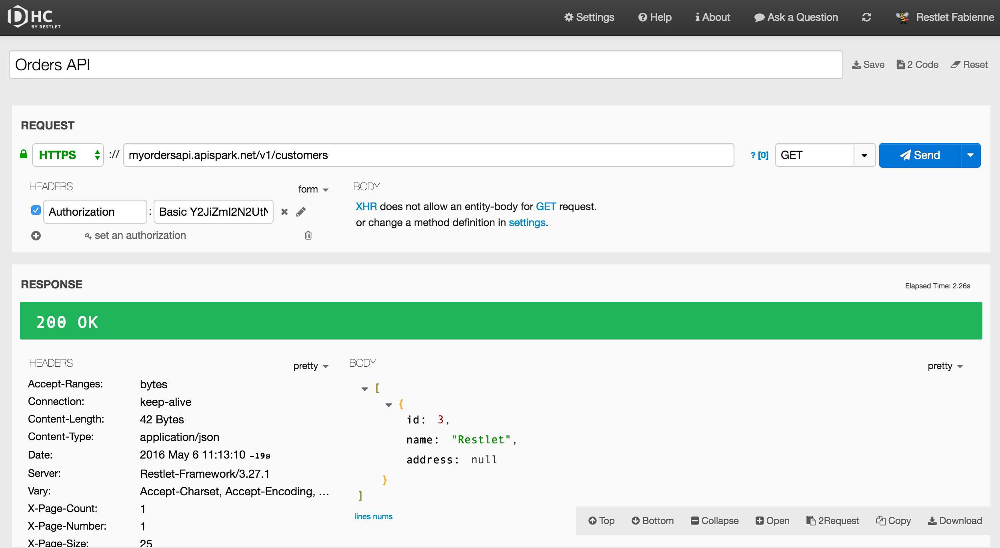

In the API ecosystem, there are several formats that allow you to describe an API.

The RAML and Swagger formats are more likely to be used to get the definition of an API.

With APISpark you can export your web API (or your [Descriptor](/technical-resources/apispark/guide/document/overview "Descriptor") or [Connector](/technical-resources/apispark/guide/manage/connectors "Connector") cells) to those *standard* API definition languages.

# Export to a standard API definition language

Open your API's **Overview** page and click **General information** button from the left panel.

From this page, you can export your API to the following format:

* RAML 0.8
* Swagger 1.2
* Swagger 2.0

## Download your API definition

From the **API definitions** section, click on the appropriate **Download** button.

For **RAML 0.8** definitions, you will get a .yml file.  
For **Swagger 1.2** definitions, you will get a .zip file with .json files in it.  
For **Swagger 2.0** definitions, you will get a .json file.

## Get your API definition via a URL

From the **API definitions** section, click on the appropriate URL to open the corresponding definition.

If you have selected the **Share API overview** checkbox, you will not need to enter credentials.

If you did select the **Share API overview** checkbox, you will have to enter credentials.  To get those credentials, click on your username on top right of the screen and select **My account**. You will find your credentials in the **Tokens** section.

## Swagger 1.2 definition example

The **Swagger 1.2** definition for the Contacts API looks like this:

<pre class="language-json"><code class="language-json">{  
   "apis":[  
      {  
         "path":"/contacts"
      }
   ],
   "apiVersion":"1.1.0",
   "info":{  
      "contact":"jmichaux@restlet.com",
      "description":"My Contacts API.",
      "title":"Contacts API"
   },
   "swaggerVersion":"1.2"
}
</code></pre>

# Integrate with third party applications

What's great with these formats is that there are more and more tools which understand them.

## Swagger UI

**Swagger** is an API description language that comes with a number of tools including Swagger UI and Swagger Code Generator. Swagger UI provides a nice HTML presentation of your API’s contract and allows you to test your API by calling it. The Swagger Code Generator generates client kits for your API in several languages.

APISpark provides you with a **swagger** UI "Try it out" button that allows you to  launch requests to your API in a new tab in Swagger UI. If you have activated authentication, your credentials are automatically prefilled.

## Restlet Client

Restlet also provides an API testing tool called Restlet Client. You can either launch <a href="https://client.restlet.com/" target="_blank">Restlet Client online service</a> or <a href="https://chrome.google.com/webstore/detail/dhc-rest-client/aejoelaoggembcahagimdiliamlcdmfm" target="_blank">install Restlet Client Chrome application</a>.

Pick up your endpoint URI and your credentials from the **Endpoints** section of APISpark and launch your request in Restlet Client.

