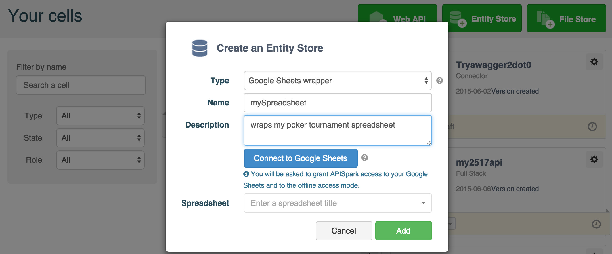

# Introduction

Restlet Cloud Data Stores can wrap external data sources so that you can leverage the data they contain by means of the Restlet Cloud platform.

These special Data Stores are called **Wrappers**.

Restlet Cloud supports a number of external data sources for both Entity Stores (structured data) and File Stores (static files).

To create a **Wrapper** Entity Store, go to your **Dashboard** and click on the **+ Entity Store** button.

Select the type of external data source you would like to wrap from the **Type** drop-down menu.

Each wrapper has its own simple configuration procedure.

For details on how to setup each wrapper, please navigate to the appropriate subsection below.

# Supported wrappers

## Google Sheets Wrapper

<a href="https://docs.google.com/spreadsheets/" target="_blank">Google Sheets</a> is a collaborative data editing tool that belongs to the Google Docs suite.

The **Google Sheets Wrapper** Entity Store lets you wrap your spreadsheets to Restlet Cloud in the form of structured entities. You are then free to expose these entities via web APIs.

For more information jump to our [Expose data from Google Sheets as an API](/tutorials/turn-spreadsheet-to-api "Expose data from Google Sheets as an API") tutorial or go to the  [Google Sheets Wrapper page](/documentation/cloud/guide/store/wrappers/google-sheets "Google Sheets Wrapper page").

## SQL database Wrapper

SQL is a language for defining and manipulating data structures stored in relation databases.

The **SQL Wrapper** Entity Store lets you wrap an SQL database (MySQL only) to Restlet Cloud in the form of structured entities. You are then free to expose these entities via web APIs.

For more information jump to our [Expose data from an SQL database as an API](/tutorials/expose-sql-via-api "Expose data from an SQL database as an API") tutorial.

## Amazon Wrapper

<a href="http://aws.amazon.com/fr/s3/" target="_blank">AWS S3</a> is a file storage service provided by Amazon.

The **S3** File Store lets you wrap AWS S3 buckets to a Restlet Cloud File Store. You are then free to expose these files via web APIs.

For more information jump to our [AWS S3](/tutorials/awss3-bucket-to-api "AWS S3 tutorial") tutorial.

## GitHub Wrapper

<a href="https://github.com/" target="_blank">GitHub</a> is a web-based Git repository hosting service.

The **GitHub** File Store lets you wrap GitHub repositories to a Restlet Cloud File Store. You are then free to expose these files via web APIs.

For more information jump to our [Expose files from a GitHub repository as an API](/tutorials/github "Expose files from a GitHub repository as an API") tutorial.
