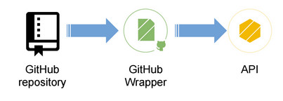

# Introduction

Restlet Cloud features a Wrapper File Store for GitHub repositories. The GitHub Wrapper lets you expose files stored in a GitHub repository through a web API.

# Create a GitHub Wrapper

To know how to create a GitHub wrapper step by step, jump to our [GitHub tutorial](/tutorials/github "GitHub tutorial").

# Use GitHub Personal Access Tokens

To avoid using your personal GitHub credentials, you can create <a href="https://help.github.com/articles/creating-an-access-token-for-command-line-use/" target="_blank">Personal access tokens</a> that will give access to a restricted part of your repositories and that can be revoked at any time.

You can create *Personal access tokens* from your GitHub *Personal settings*, in the <a href="https://github.com/settings/tokens" target="_blank">Personal access tokens section</a>.  
We advise you to select *repo* or *public_repo* from the scopes list suggested by GitHub which means this token will only grant access to the public or private repository but not to others giving access to i.e. account management, etc.

