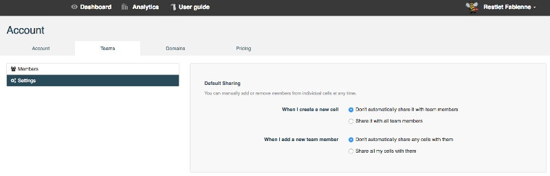

Restlet Cloud allows you to adjust your Sharing settings. You may want all your cells to be shared automatically with your team or you may rather want to authorize only a selection of your members to share your cells. This can be defined from the Settings page.

# Use the default Sharing settings

By default, your new cells will not be shared with your team members. You will need to share them from each specific cell.

By default, you will also need to add new members to the specific cells you want to share with them.

These settings can be modified from the Settings page as described below.

# Change your Sharing settings

To navigate to your **Teams** page, make sure you are signed in, then click on your username on top right of your screen and select **Teams**.  
Click on the **Settings** menu from the left panel.

## New cell creation settings

To automatically share your new cells with your existing team members, select **Share it with all team members**.

## New member addition settings

To automatically share your existing cells with your new team members, select **Share all my cells with them**.
