<h1 class="iconed" id="toc_0"><i class="fa fa-hand-o-right"></i>Introduction</h1>

Restlet Cloud provides a tool to manage an existing web API hosted outside of Restlet Cloud. To get a full overview of the management features available, take a look at the [related documentation](/documentation/cloud/guide/manage/connectors).

In this scenario, we will add authenticated access to an existing web API via Restlet Cloud. If you do not have a running web API, you can use our sample API hosted on Restlet Cloud.

You have two options:  
- [hosted agent](/tutorials/manage-api#hosted)  
You can either create a connector with an agent hosted directly on Restlet Cloud or;  
- [standalone agent](/tutorials/manage-api#standalone)  
You can install the agent on your own infrastructure to avoid possible lag issues.

# Create a connector with an agent hosted on Restlet Cloud

<h1 class="numbered" id="toc_1"><i>1</i>Create a web API Connector</h1>

If you have not already done so, sign in to your Restlet account and open your **Dashboard**.

Create a new Connector. Click on **+ Web API**, select the "Connector" **Type** and enter the **Name** "myConnector".

>**Note:** The **Domain** must be unique, you may need to modify it if it is not available.

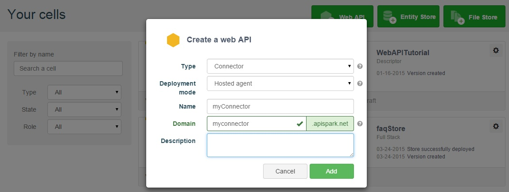

Click on the **Add** button to create the new web API Connector. You will be taken to the new web API Connector's **Overview** page.

<h1 class="numbered" id="toc_2"><i>2</i>Configure the Connector
</h1>

## Define a target endpoint

Click on the **Settings** tab.
In the **Connector** section, select **Agent details**.
Enter a **Target endpoint** (here: https://rsreferenceapi.restlet.net/v1) and click **Save**.

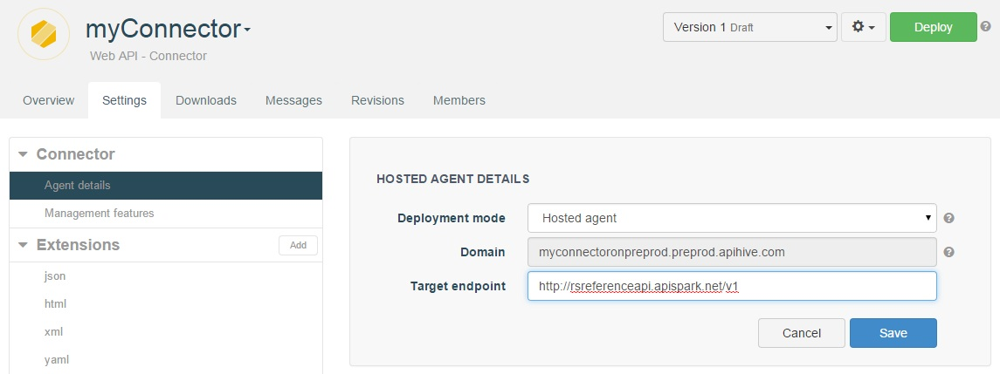

## Enable the authentication feature

Still in the **Connector** section, select **Management features**.  
Select the **Authentication** checkbox in the central panel and click **Save**.

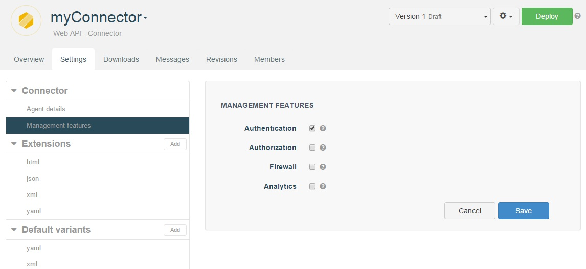

## Add members to your web API

To add new consumers to your API, create new members from the **Members** tab.

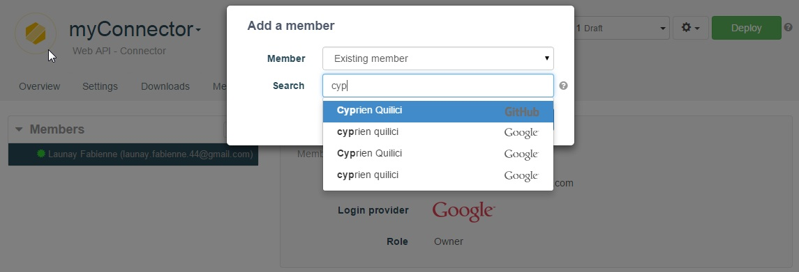

Members of your web API Connector will be able to consume it once it has been deployed. A set of credentials will be auto-generated for each of them.

Each member of the Connector can use his/her credentials to consume the API. To get yours, go to the **Overview** page of the Connector and open the Endpoint you want to invoke.

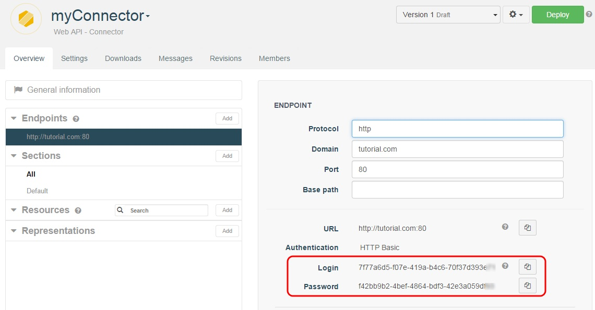

<h1 class="numbered" id="toc_3"><i>3</i>Import your web API definition</h1>

Restlet Cloud needs your web API contract to be able to access it.

Click on the cog button on top right of your screen and select Import definition.

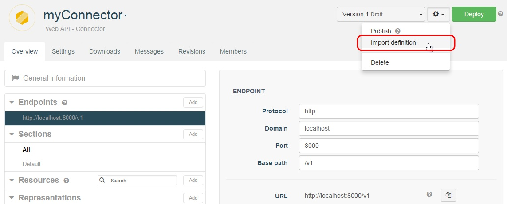

In the **Import definition** wizard, select "Swagger 2.0" as a **Type** and  "URL" as a **Source**.  
Enter your API definition in the **URL** field (for this tutorial, enter the following address: https://cloud.restlet.com/api/apis/5100/versions/1/swagger) and click the **Import** button.

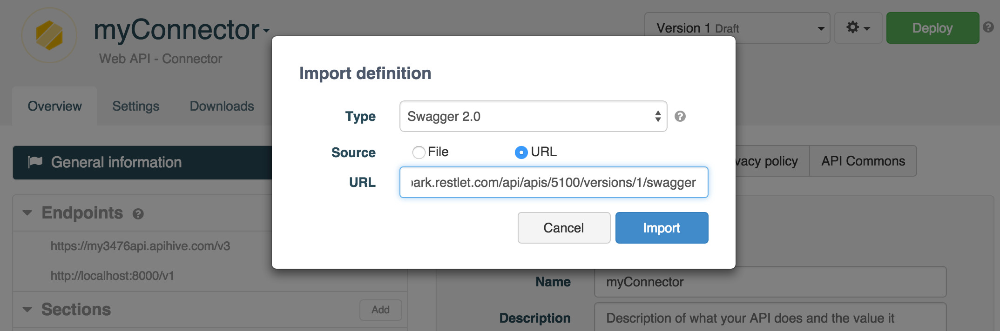

You can see the content of your API in the **Resources** and **Representations** sections.

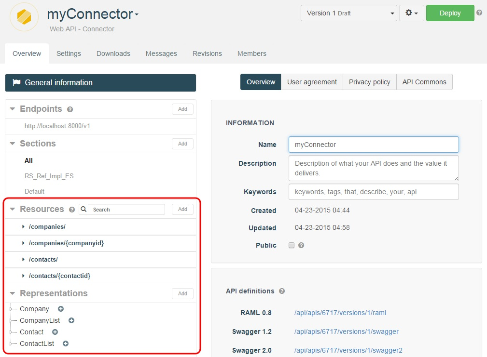

You can now **Deploy** your web API Connector.

<h1 class="numbered" id="toc_4"><i>4</i>Invoke the Web API</h1>

Now that your environment is all set, you can call your API with Swagger UI for example.

From the **Overview** tab, select your Endpoint from the left panel and click the **swagger** button.

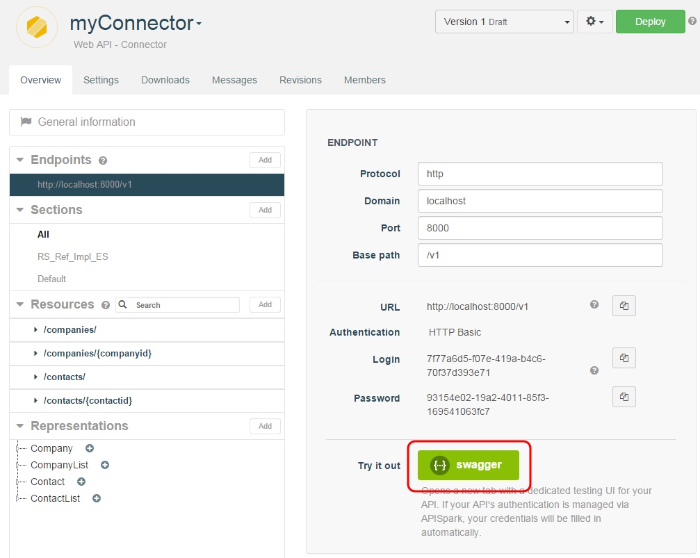

A new tab opens with a test interface. Note that your credentials are filled in automatically.

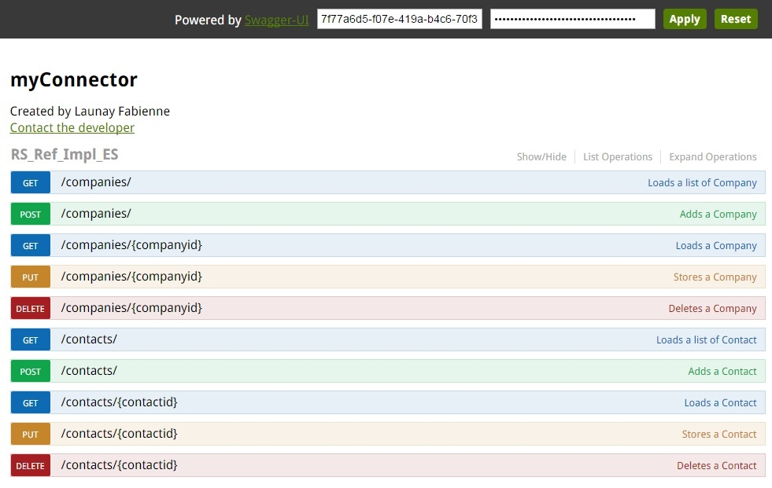

Your API is now protected with authentication.

Congratulations on completing this tutorial! If you have questions or suggestions, feel free to contact the <a href="http://support.restlet.com/" target="_blank">Help Desk</a>.

# Create a connector with a standalone agent

<h1 class="numbered" id="toc_1"><i>1</i>Create a web API Connector</h1>

If you have not already done so, sign in to your Restlet account and open your **Dashboard**.

Create a new Connector. Click on **+ Web API**, select the "Connector" **Type**, select the "Standalone agent" **Deployment mode** and enter the **Name** "myConnector".

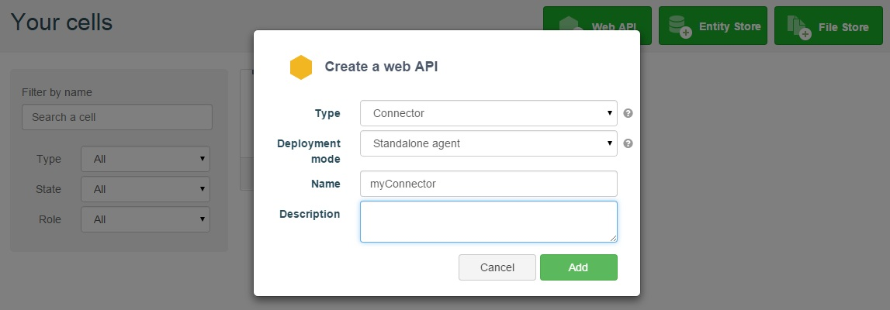

Click on the **Add** button to create the new web API Connector. You will be taken to the new web API Connector's **Overview** page.

In the **Endpoints** section, click on the **Add** button to add an Endpoint to your Connector.

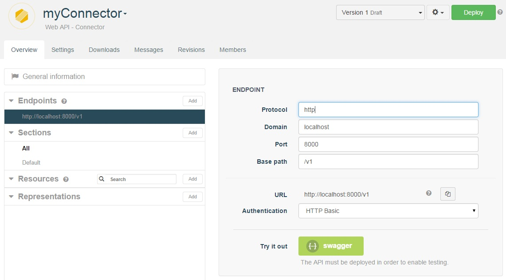

<h1 class="numbered" id="toc_2"><i>2</i>Configure the authentication feature</h1>

## Enable the authentication feature

First of all, you will want to enable the authentication feature of the Connector you just created.  
To do so, click on the **Settings** tab.  
In the **Connector** section, select **Management features**.  
Select the **Authentication** checkbox in the central panel and click **Save**.

## Add members to your web API

To add new consumers to your API, create new members from the **Members** tab.

Members of your web API Connector will be able to consume it once it has been deployed. A set of credentials will be auto-generated for each of them.

Each member of the Connector can use his/her credentials to consume the API. To get yours, go to the **Overview** page of the Connector and open the Endpoint you want to invoke.

>**Note:** Your credentials will only be accessible after your Connector first Deployment.

<h1 class="numbered" id="toc_3"><i>3</i>Import your web API definition</h1>

Restlet Cloud needs your web API contract to be able to access it.

Click on the cog button on top right of your screen and select Import definition.

In the **Import definition** wizard, select "Swagger 2.0" as a **Type** and  "URL" as a **Source**.  
Enter your API definition in the **URL** field (for this tutorial, enter the following address: https://cloud.restlet.com/api/apis/5100/versions/1/swagger) and click the **Import** button.

You can see the content of your API in the **Resources** and **Representations** sections.

You can now **Deploy** your web API Connector.

<h1 class="numbered" id="toc_4"><i>4</i>Plug the agent to the web API</h1>

## Launch your web API

If you have a web API running, make sure it is running. Otherwise just make GET calls on this sample web API:

[https://rsreferenceapi.restlet.net/v1/contacts/](https://rsreferenceapi.restlet.net/v1/contacts/)

## Launch the agent

The agent is available for download from the **Agent details** page: click on the **Settings** tab and select **Agent details** from the **Connector** section.

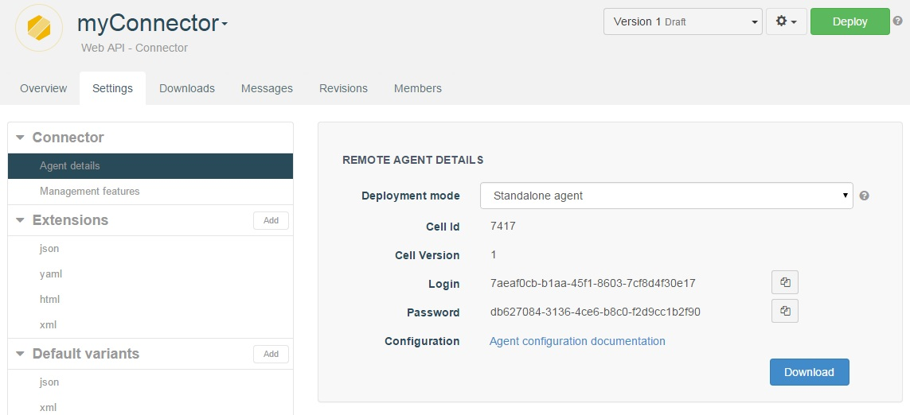

You will download a zip file containing the jar and an empty configuration file. To learn how to configure the agent, please take a look at this [specific documentation](https://restlet.com/documentation/cloud/guide/manage/remote-agent) in the section **Configure the Agent**.

Once your agent is configured, launch it with the following command line:

<pre class="language-bash"><code class="language-bash">java -jar -DcloudServiceConfig=/path/to/your/agent.properties cloud-agent.jar
</code></pre>

<h1 class="numbered" id="toc_5"><i>5</i>Invoke the Web API</h1>

Now that your environment is all set, you can call your API with Swagger UI for example.

From the **Overview** tab, select your Endpoint from the left panel and click the **swagger** button.

A new tab opens with a test interface. Note that your credentials are filled in automatically.

Your API is now protected with authentication.

Congratulations on completing this tutorial! If you have questions or suggestions, feel free to contact the <a href="http://support.restlet.com/" target="_blank">Help Desk</a>.
