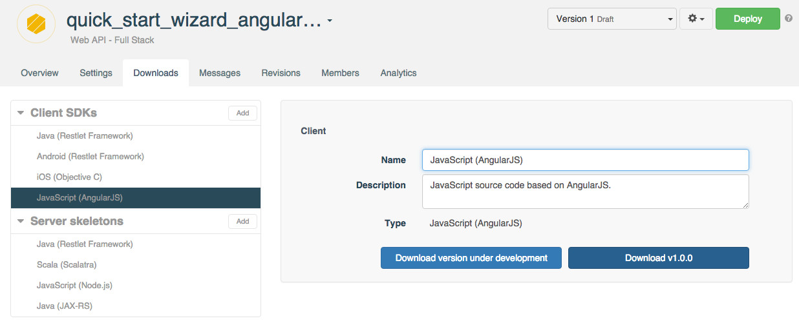

<h1 class="iconed" id="toc_0"><i class="fa fa-hand-o-right"></i>Introduction</h1>

As an example, we want to create a sample app using AngularJS and Restlet Cloud.

For this purpose, create an API using Restlet Cloud Quickstart wizard.

For this example, we call our API *quick_start_wizard_angularjs_sdk*. As it is based on the quickstart wizard, the resources associated are:  
* Company  
* Contact  

Download the AngularJS SDK from the **Downloads** tab.

# Archive structure

The downloaded archive has the following folder structure:

* `Quick_start_wizard_angularjs_sdkModule.js` contains the SDK generated by Restlet Cloud and does not require any modification.
* `app.js` is a skeleton generated by Restlet Cloud. This is the file where the custom code can be written.
* `index.html` is the entry point of the application. It automatically imports the two previous files.

# Usage

An HTTP server is required to be able to use the provided code. It can be served from any server.

If the OS has python installed, a `SimpleHTTPServer` inside the folder will do the trick:

<pre class="language-bash"><code class="language-bash">cd /path/to/your/unzipped/sdk
python -mSimpleHTTPServer 1234
</code></pre>

Then go to `http://localhost:1234/`.

Or use node [http-server](https://www.npmjs.com/package/http-server) with the following command line:

<pre class="language-bash"><code class="language-bash">npm install -g http-server
http-server /path/to/your/unzipped/sdk
</code></pre>

Open `http://localhost:8080/`.

The developed application is now available.

# Developing an app

## SDK methods

By default the SDK module is named after the name of the API. In our example for an API named *quick_start_wizard_angularjs_sdk* the SDK is named *Quick_start_wizard_angularjs_sdkClientResource*. The name of the API is capitalized and appended with *ClientResource*.

The SDK exposes all the methods required to interact with the hosted API. For each resource there is one method per HTTP verb available.

As the Quickstart wizard generates a `/companies` resource accessible through `GET` (fetch all the companies) and `POST` (create a new company), the SDK will generate the following methods:  

* getCompanyList  
* postCompanyList  

>**Note:** When the resource is a plural then the SDK replaces the plural form by a singular one appended with List.

With the same convention the quickstart wizard generates a `/companies/{companyId}` resource accessible through `GET` (get the company information), `PUT` (update a company record) and `DELETE` (remove the specified company), so the methods generated are:  

* getCompany  
* putCompany  
* deleteCompany  

For any method generated the parameters are provided as a JS object provided as first parameter of the method. For instance to access the company of id *1*:

<pre class="language-javascript"><code class="language-javascript">quick_start_wizard_angularjs_sdkClientResource.getCompany({
  companyid: 1
});
</code></pre>

## Security

By default all the resources hosted on Restlet Cloud are secured and hence require authentication. The standard configuration is based on [basic authentication](http://tools.ietf.org/html/rfc2617#section-2).

The `app.js` file can be filled to use authentication with the API's credentials.

>**Warning:** Make sure you do not leave your credentials when the application goes live since anyone using the application could access them.

The resources' security should be adapted to fit the need. For instance, getting the list of companies might be authorized to Anyone.

## Query for companies

Knowing this, getting the companies is pretty straight-forward and is made by calling the `getCompanyList` method and hooking onto the returned promise.

A special attention has to be dedicated to the `.then` part in the following snippets for any JS developer not familiar with promises. Since Angular is based on the [Promise theory](https://developer.mozilla.org/en-US/docs/Web/JavaScript/Reference/Global_Objects/Promise) and the [Q specification](https://github.com/kriskowal/uncommonjs/blob/master/promises/specification.md), it is recommended to have a good understanding of that and how it works. The AngularJS related documentation can be found [there](https://docs.angularjs.org/api/ng/service/$q).

<pre class="language-javascript"><code class="language-javascript">quick_start_wizard_angularjs_sdkClientResource.getCompanyList()
  .then(function(companies) {
    $scope.companies = companies;
  });
</code></pre>

>**Note:** The promises returned by the SDK are resolved directly with the body of the HTTP response.

## Query for one specific company

To get a given company, the `companyid` must be provided as shown below:

<pre class="language-javascript"><code class="language-javascript">quick_start_wizard_angularjs_sdkClientResource.getCompany({
  companyid: 1
})
  .then(function(company) {
      $scope.company = company;
  });
</code></pre>

## Update an existing company

An update is a call to `putCompany` with:  
* the `companyid` which is the id of the company to update  
* the `body` which is the new company as JSON  

The promise is then resolved with the updated company.

<pre class="language-javascript"><code class="language-javascript">quick_start_wizard_angularjs_sdkClientResource.putCompany({
  companyid: company.id,
  body: company
})
  .then(function(company) {
    console.log(company);
    alert('Company updated successfully');
  });
</code></pre>

## Add a new company

Adding a new company is made through the use of the post on the resource list. In our example: `postCompanyList`.

The only parameter to provide is the `body` (the JSON representation of the company).

<pre class="language-javascript"><code class="language-javascript">quick_start_wizard_angularjs_sdkClientResource.postCompanyList({
  body: {
    "tags": [],
    "name": "Testing company",
    "address": {
      "street":"321312 somewhere in the street",
      "zipcode": 44000,
      "city":"Babylone"
    }
  }
}).then(function(newCompany) {
  $scope.company = newCompany;
});
</code></pre>

## Delete an existing company

Deleting a company is very similar to getting an existing company and only requires  the `companyid` to detect which record should be deleted.

<pre class="language-javascript"><code class="language-javascript">quick_start_wizard_angularjs_sdkClientResource.deleteCompany({
  companyid: 1
})
  .then(function(company) {
      $scope.company = company;
  });
</code></pre>

# Put it all together

Now let's create a sample application which is going to get the companies and let us update their name and address.

The first part is to create a simple HTML template, so let's open the provided
`index.html` and replace the content of `
 ... 
` with
the following:

<pre class="language-markup"><code class="language-markup">&lt;h2&gt;Companies&lt;/h2&gt;
&lt;div class=&quot;row&quot;&gt;
  &lt;div class=&quot;col-md-6&quot;&gt;
    &lt;table class=&quot;table table-striped col-md-6&quot;&gt;
      &lt;tr&gt;
        &lt;th&gt;Name&lt;/th&gt;
      &lt;/tr&gt;
      &lt;tr ng-repeat=&quot;company in companies&quot; ng-click=&quot;selectCompany(company.id)&quot;&gt;
        &lt;td&gt;
          {{company.name}}
        &lt;/td&gt;
      &lt;/tr&gt;
    &lt;/table&gt;
  &lt;/div&gt;

  &lt;div class=&quot;col-md-6&quot; ng-if=&quot;company&quot;&gt;
    &lt;form&gt;
      &lt;div class=&quot;form-group&quot;&gt;
        &lt;label for=&quot;name&quot;&gt;Name&lt;/label&gt;
        &lt;input type=&quot;text&quot; class=&quot;form-control&quot; id=&quot;name&quot; placeholder=&quot;Name&quot; ng-model=&quot;company.name&quot;&gt;
      &lt;/div&gt;
      &lt;div class=&quot;form-group&quot;&gt;
        &lt;label for=&quot;street&quot;&gt;Street&lt;/label&gt;
        &lt;input type=&quot;text&quot; class=&quot;form-control&quot; id=&quot;street&quot; placeholder=&quot;Street&quot; ng-model=&quot;company.address.street&quot;&gt;
      &lt;/div&gt;
      &lt;div class=&quot;form-group&quot;&gt;
        &lt;label for=&quot;zipcode&quot;&gt;ZIP code&lt;/label&gt;
        &lt;input type=&quot;text&quot; class=&quot;form-control&quot; id=&quot;zipcode&quot; placeholder=&quot;Zip code&quot; ng-model=&quot;company.address.zipcode&quot;&gt;
      &lt;/div&gt;
      &lt;div class=&quot;form-group&quot;&gt;
        &lt;label for=&quot;city&quot;&gt;City&lt;/label&gt;
        &lt;input type=&quot;text&quot; class=&quot;form-control&quot; id=&quot;city&quot; placeholder=&quot;City&quot; ng-model=&quot;company.address.city&quot;&gt;
      &lt;/div&gt;
      &lt;button type=&quot;submit&quot; class=&quot;btn btn-default&quot; ng-click=&quot;save(company)&quot;&gt;Save&lt;/button&gt;
    &lt;/form&gt;
  &lt;/div&gt;
&lt;/div&gt;
</code></pre>

So let's break it apart to clarify it.

## The company array

<pre class="language-markup"><code class="language-markup">&lt;div class=&quot;col-md-6&quot;&gt;
  &lt;table class=&quot;table table-striped col-md-6&quot;&gt;
    &lt;tr&gt;
      &lt;th&gt;Name&lt;/th&gt;
    &lt;/tr&gt;
    &lt;tr ng-repeat=&quot;company in companies&quot; ng-click=&quot;selectCompany(company.id)&quot;&gt;
      &lt;td&gt;
        {{company.name}}
      &lt;/td&gt;
    &lt;/tr&gt;
  &lt;/table&gt;
&lt;/div&gt;
</code></pre>

In this part, a table is created with a row per company. To do so Angular iterates over the companies' array stored in the scope using the `ng-repeat="company in companies"`.

It can also be noticed that a click on any `tr` is going to `selectCompany` which leads us to the company detail.

## Company detail

The company detail is a standard form displayed if and only if a company has been selected.

It also contains various bindings to handle update of:
* The name of the company
* The address of the company divided into street, zip code and city

Finally the save button triggers an update of the company with the last values changed by the user.

<pre class="language-markup"><code class="language-markup">&lt;div class=&quot;col-md-6&quot; ng-if=&quot;company&quot;&gt;
  &lt;form&gt;
    &lt;div class=&quot;form-group&quot;&gt;
      &lt;label for=&quot;name&quot;&gt;Name&lt;/label&gt;
      &lt;input type=&quot;text&quot; class=&quot;form-control&quot; id=&quot;name&quot; placeholder=&quot;Name&quot; ng-model=&quot;company.name&quot;&gt;
    &lt;/div&gt;
    &lt;div class=&quot;form-group&quot;&gt;
      &lt;label for=&quot;street&quot;&gt;Street&lt;/label&gt;
      &lt;input type=&quot;text&quot; class=&quot;form-control&quot; id=&quot;street&quot; placeholder=&quot;Street&quot; ng-model=&quot;company.address.street&quot;&gt;
    &lt;/div&gt;
    &lt;div class=&quot;form-group&quot;&gt;
      &lt;label for=&quot;zipcode&quot;&gt;ZIP code&lt;/label&gt;
      &lt;input type=&quot;text&quot; class=&quot;form-control&quot; id=&quot;zipcode&quot; placeholder=&quot;Zip code&quot; ng-model=&quot;company.address.zipcode&quot;&gt;
    &lt;/div&gt;
    &lt;div class=&quot;form-group&quot;&gt;
      &lt;label for=&quot;city&quot;&gt;City&lt;/label&gt;
      &lt;input type=&quot;text&quot; class=&quot;form-control&quot; id=&quot;city&quot; placeholder=&quot;City&quot; ng-model=&quot;company.address.city&quot;&gt;
    &lt;/div&gt;
    &lt;button type=&quot;submit&quot; class=&quot;btn btn-default&quot; ng-click=&quot;save(company)&quot;&gt;Save&lt;/button&gt;
  &lt;/form&gt;
&lt;/div&gt;
</code></pre>

At that point, the structure of the controller starts to appear. Many properties have to be set onto the `$scope`:
* `companies` the list of companies
* `company` the currently selected company
* `selectCompany` a method which selects and recovers the company of a given id from the server
* `save` saves a company

## JavaScript part

### Authentication

First let's add the credentials into the [run block](https://docs.angularjs.org/documentation/cloud/guide/module#module-loading-dependencies) which are required to be able to access the API if the default security has not been changed.

<pre class="language-javascript"><code class="language-javascript">.run(function ($http) {

	// Adds HTTP basic authentication to all your calls to the API
  var encoded = btoa('9ac12010-68fd-4a68-b114-127672bdd2cd:4f8bd084-6644-45f2-b4b8-b8980782093d');
  $http.defaults.headers.common.Authorization = 'Basic ' + encoded;

})
</code></pre>

### Controller

Now the last task is to add the logic into the controller which means to:
* recover the companies (`getCompanies`)
* select a company (`selectCompany`)
* update a company (`save`)

<pre class="language-javascript"><code class="language-javascript">.controller('MainCtrl', function ($scope, $http, $q, $location, $timeout, $window, Quick_start_wizard_angularjs_sdkClientResource) {

  var quick_start_wizard_angularjs_sdkClientResource = new Quick_start_wizard_angularjs_sdkClientResource();

  // Let's get the company
  getCompanies();

  /**
   * Recovers the information about a specific company and set it to the `company`
   * property of the scope.
   * @param {String} companyId the id of the company to load from Restlet Cloud
   * @returns {undefined}
   */
  $scope.selectCompany = function(companyId) {
    quick_start_wizard_angularjs_sdkClientResource.getCompany({
      companyid: companyId
    }).then(function(company) {
      $scope.company = company;
    });
  };

  /**
   * Updates the provided company with the new value provided.
   * The company to update is determined based on the id of the provided company.
   * @param {Object} company the new company state
   * @returns {undefined}
   */
  $scope.save = function(company) {
    quick_start_wizard_angularjs_sdkClientResource.putCompany({
      companyid: company.id,
      body: company
    }).then(function(company) {
      $scope.company = company;
      getCompanies();
    });
  };

  function getCompanies() {
    quick_start_wizard_angularjs_sdkClientResource.getCompanyList().then(function(companies) {
      $scope.companies = companies;
    });
  }

});
</code></pre>

Congratulations on completing this tutorial! If you have questions or suggestions, feel free to contact the <a href="http://support.restlet.com/" target="_blank">Help Desk</a>.
