# Introduction

DHC allows you to interact with REST services. It brings many different features that make your user experience better, save you precious time when debugging REST calls or sharing your requests with others.

# Install DHC by Restlet

DHC by Restlet can be used as an online service from <a href="https://dhc.restlet.com/" target="_blank">dhc.restlet.com</a> or installed within Chrome from the <a href="https://chrome.google.com/webstore/detail/dhc-resthttp-api-client/aejoelaoggembcahagimdiliamlcdmfm" target="_blank">Chrome Web Store</a>.

## DHC by Restlet online service

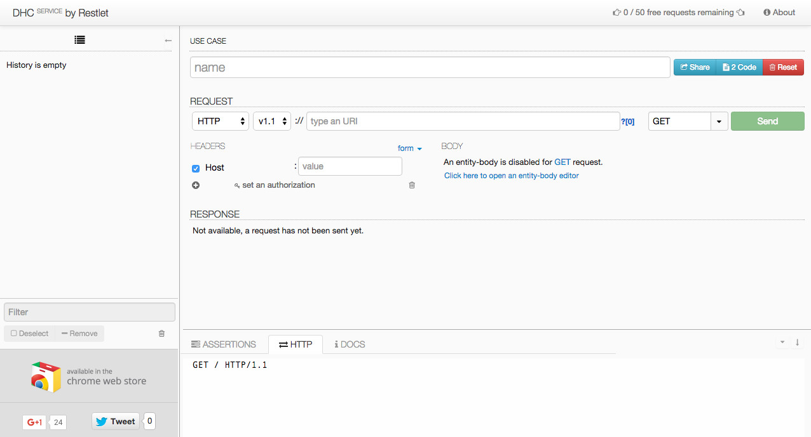

## DHC by Restlet Chrome application

The tool is then available in your Chrome applications through chrome://apps.

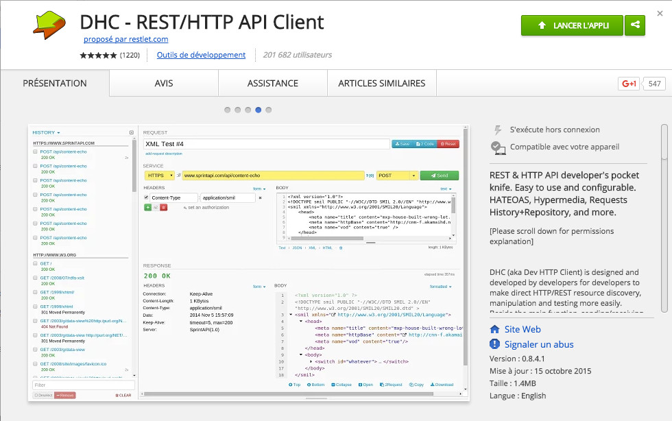

# Execute a request

As a REST client, DHC by Restlet allows you to build a request and display its response.

## Build a request

DHC provides a dedicated area to configure your request.

### Request structure

This area maps the different request elements. The latter is summarized in the following diagram as a reminder.

#### Method

The **method** corresponds to the HTTP verb used. It identifies the action to execute on the resource.

#### Protocol

The **protocol** used to interact with a server e.g. HTTP or HTTPS.

#### Host, Port & Path

**Host** and **port** identify the target to contact to send the request. Once connected to the server, the **path** is used to select the resource to handle the request.

#### Query parameters

**Query parameters** are used to build the query string of the request. They contain data that does not fit conveniently into a hierarchical path structure.

#### Headers

HTTP **Headers** define the operating parameters of an HTTP transaction. They correspond to a list of key-value pairs.

#### Payload

Request **payload** corresponds to the data sent when supported. This applies to methods POST, PUT and PATCH.

DHC by Restlet defines four distinct sub areas:

- the request URL and method;  
- the query parameters;  
- the headers and  
- the request payload.

### GET method

The following screenshot describes the case of a GET method where no payload is used. You can distinguish the different parameters displayed.

#### The protocol

#### The host, port and path

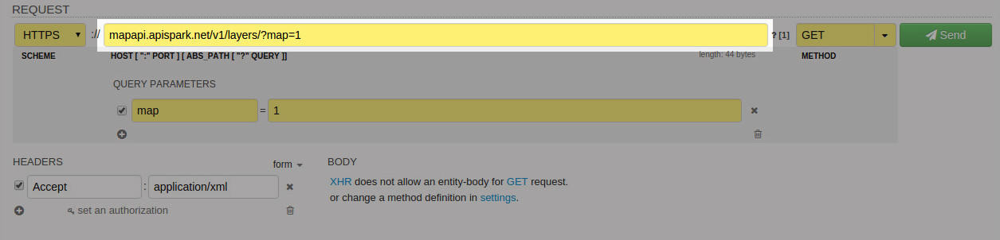

#### The method (GET)

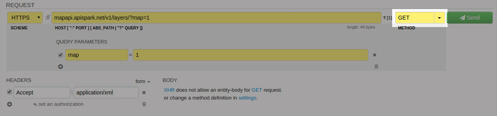

#### The query parameters

By default, the query parameter area is hidden and can be displayed by clicking the “?” character right after the address field. You can either directly leverage the URL to add them or use the form. The main difference is, when using the form, parameter values are automatically URL encoded.

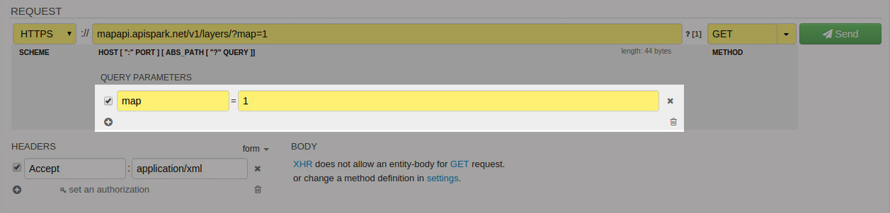

#### The headers

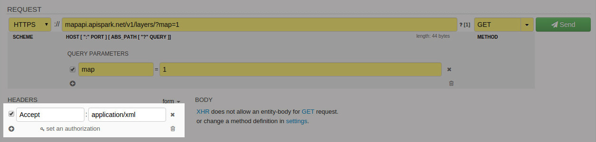

### POST method

A POST method follows the same approach but in addition a request payload can be added. Several modes are supported for payload content. The switch is done using the combobox on the top right hand corner of the body area.

#### Text content (text value)

For formats like raw text, JSON, XML or YAML, with syntax highlighting. In this case a text area can be used. DHC by Restlet provides a set of types right below the text area to directly set the corresponding content type value.

This screenshot shows you a JSON payload for which the **application/json** *Content-Type* header is automatically created:

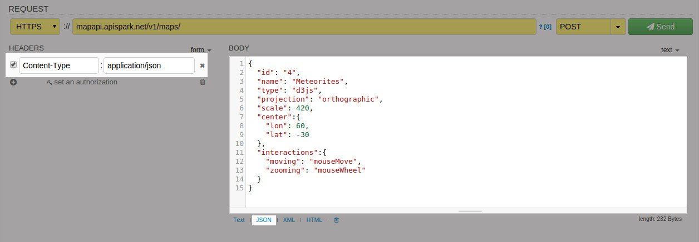

#### Content from file (file value)

In this case, DHC by Restlet provides an area to drag’n drop the file or select it explicitly. The tool automatically gets the associated mime type. When clicking on it, the Content-Type header is automatically created.

This screenshot shows you a File payload for which the **image/png** *Content-Type* header is automatically created:

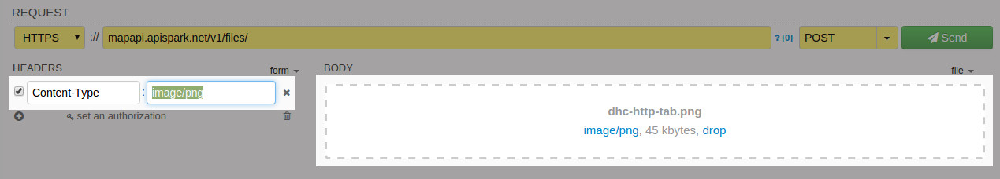

#### Forms (form value)

DHC by Restlet supports both simple forms and multipart ones.

##### Simple forms

Only text form elements can be defined and the content type is set to **application/x-www-form-urlencoded**.

This screenshot shows you a simple form payload for which the **application/x-www-form-urlencoded** *Content-Type* header is automatically created:

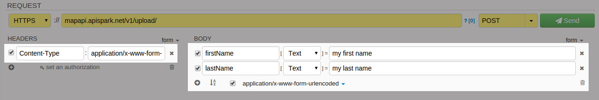

##### Multipart forms

You can mix file elements with text ones. In this case, the content type is **multipart/form-data**.

This screenshot shows you a multipart form payload for which the **multipart/form-data** *Content-Type* header is automatically created:

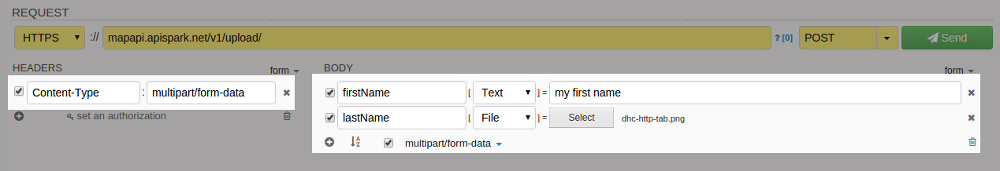

### Disable query parameters or headers

DHC by Restlet also allows you to disable some elements in lists (query parameters and headers) without having to remove them. This is particularly useful when building your request to tweak it and reach the expected behavior.

This screenshot shows you a request for which the header is disabled (checkbox deselected):

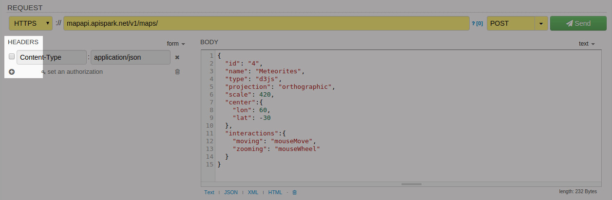

### Switch mode

You can also switch mode to edit and display things. This is very useful e.g. when you have access to the raw content or when managing it using a form view.

## Display a response

DHC provides a dedicated area to display the response. This area maps the different response elements. The latter is summarized in the following diagram as a reminder.

### Response structure

#### Status code and message

The **status code** and **message** correspond to the status of the response. The status code is a normalized number. HTTP defines different families at this level: 2xx for success, 3xx for redirection, 4xx for client errors and 5xx for server errors.

#### Headers

HTTP **Headers** define the operating parameters of an HTTP transaction. They correspond to a list of key-value pairs.

#### Payload

Response **payload** corresponds to the data received when supported. This applies to all methods except HEAD, DELETE and OPTIONS.

DHC defines three distinct sub areas: the response status, the headers, and the response payload.

### Response with payload

The following screenshots describe the case where some payload is received in the response. In the case of structured text payload, the formatted mode is selected by default to display data using a tree. Raw mode is also available to content as text.

#### Response headers

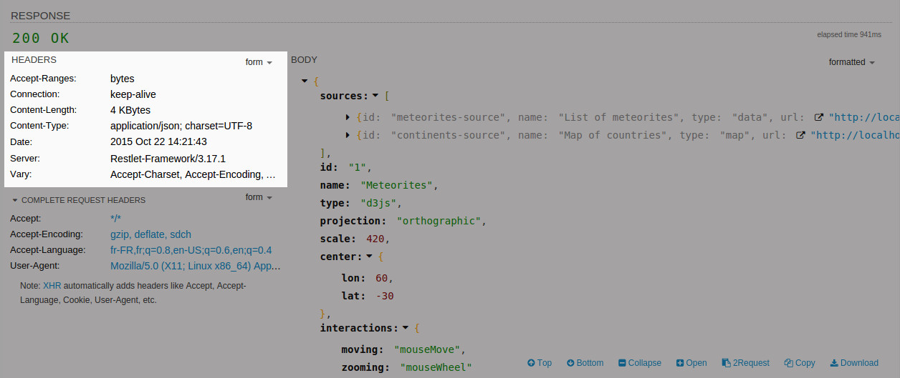

#### Complete request headers

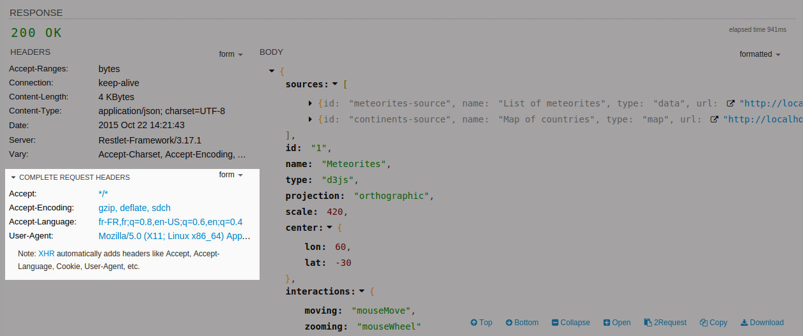

#### JSON payload

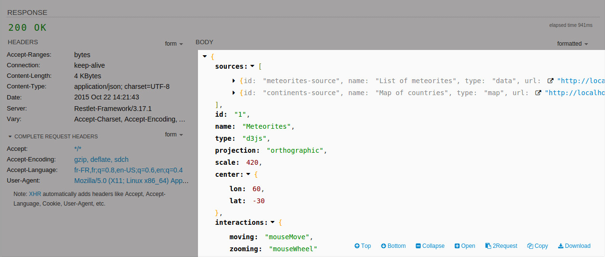

#### Payload display mode

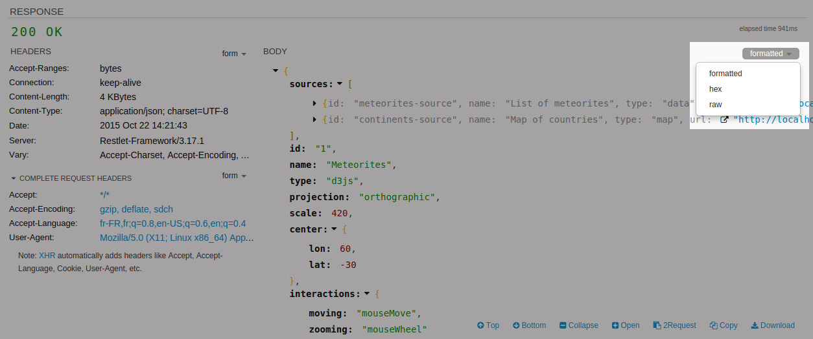

### Response with no payload

If no payload is received in the response, the body area remains empty.

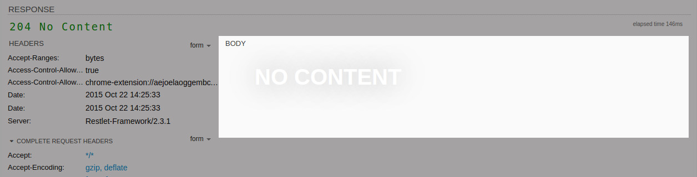

### Response with binary content

In the case of binary content, several modes are available to preview the content (for examples, see images below) and display it as hexadecimal or raw.

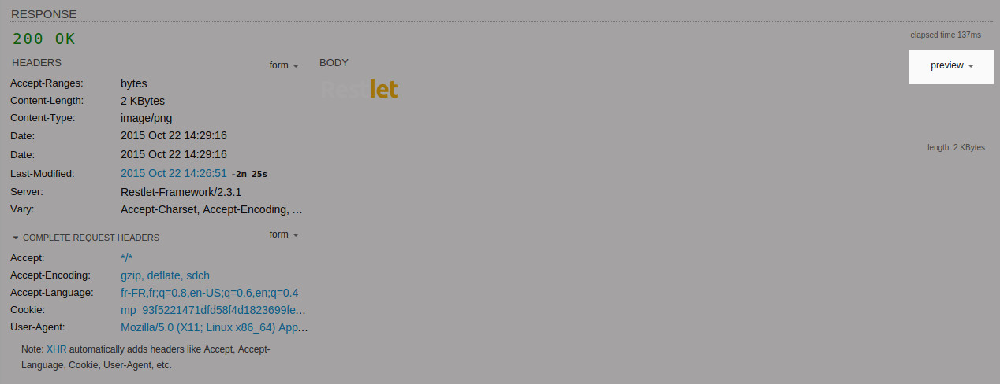

#### Hexadecimal content

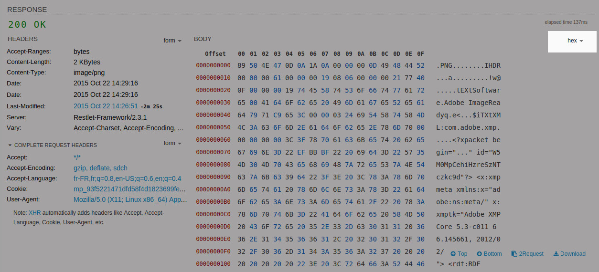

#### Raw content

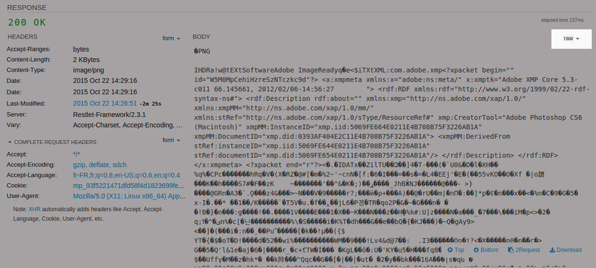

### Requests created from hypermedia links

DHC by Restlet provides support of hypermedia links within response contents by making them clickable. This way you can follow links to execute other requests very simply. When clicking on a link, a new request is automatically created.

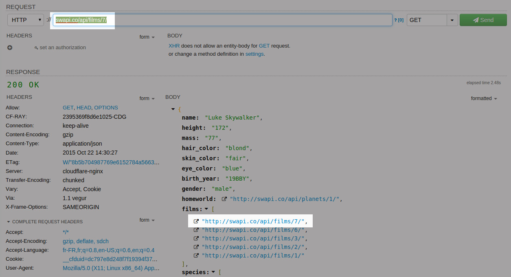

### Response toolbar

DHC by Restlet provides a very helpful toolbar at the response level. This allows you to leverage the response content for different use cases: re-use the response content within a new request with the **2Request** button, **Copy** or **Download** the response content.

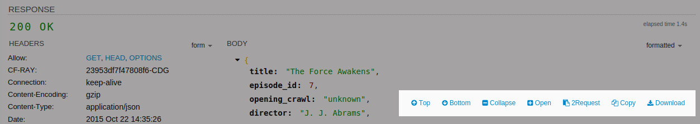

## Raw-level exchanges

The **HTTP** tab at the bottom of the page displays what is actually exchanged with the server in a synthetic way. At a glance, you can see the different elements.

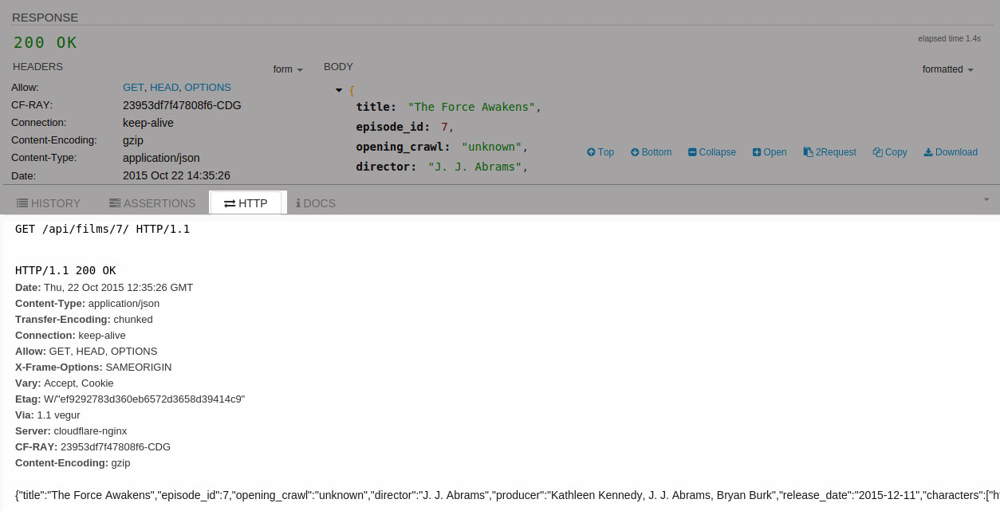

# Export a request

DHC by Restlet provides the ability to export the request as code in curl language. This is very convenient for developers who like command-line approach. They do not need to build it with different options: working command is directly provided.

Click on the **2 Code** button right around the request name to get the corresponding curl code.

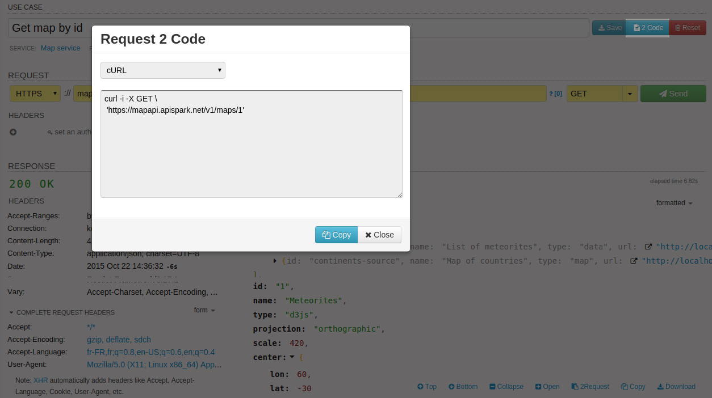

# Organize requests

Of course you can define one-shot requests, but another interesting approach consists of reusing and even sharing them. DHC by Restlet offers an interesting feature to do this.

## Leverage projects and services

Once a request is created and named, DHC by Restlet lets you save it. The tool provides the following structure to organize your requests: the first level consists of projects which provide a high-level container. They can contain a set of services that in turn contain requests.

Such elements are created when you import requests or when you save requests. DHC gives you the ability to create your own projects and services if none match.

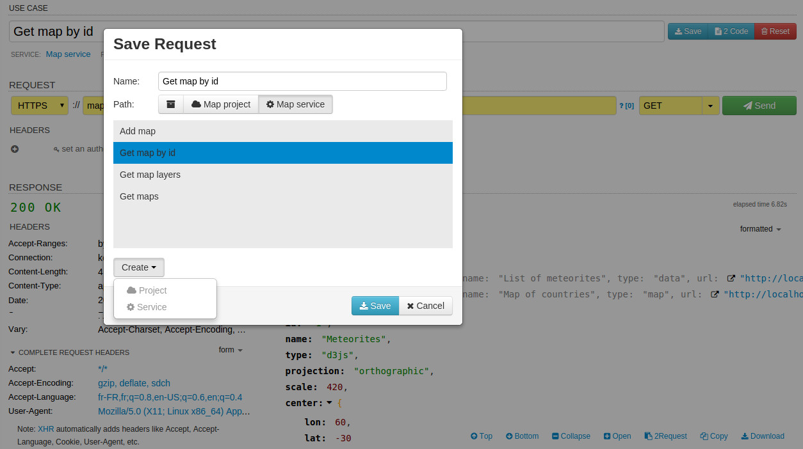

## Document projects, services and requests

At each level (project and service), you can add documentation. When clicking on the overview element in the left menu, related hints are displayed in the right panel. Navigation is supported at this level making it possible to walk through the project.

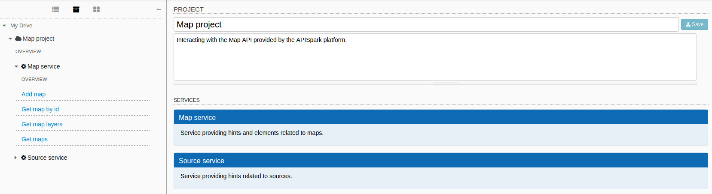

>**Note:** For request, there is no **Description** field but the name should be self descriptive in order to tell what the request actually does.

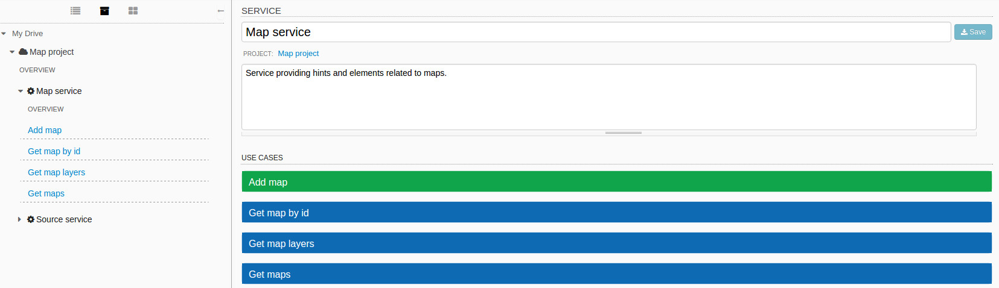

# Leverage context attributes

If you use a REST client in the context of application development, you probably have different environments like development, staging, and production. The need to rewrite requests according to these environments can be very time consuming.

DHC provides an interesting and powerful feature to use variables in requests. This corresponds to context attributes. In the left panel, you can use the contexts tab to define context and the attributes they contain. Attributes correspond to a list of key / value elements.

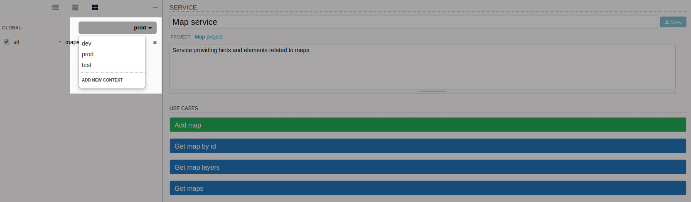

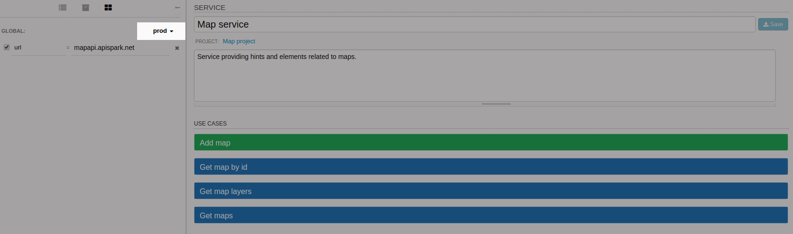

A toolbar is available in the bottom to manage the contexts:

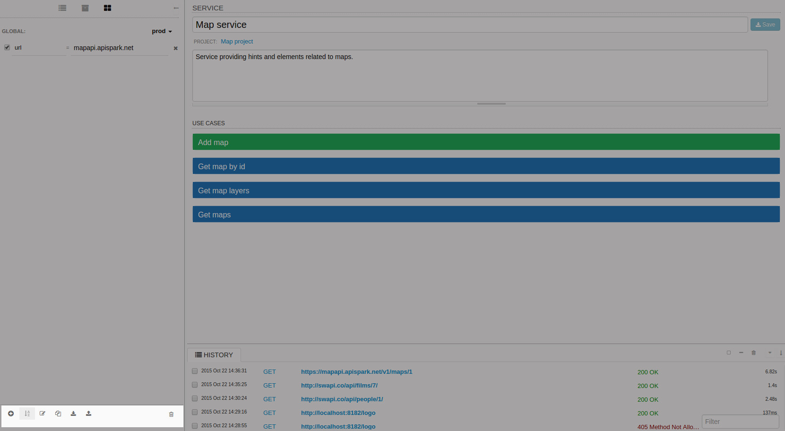

Context attributes can be then used at any place in the request like address, headers, query parameters and text / form payloads.

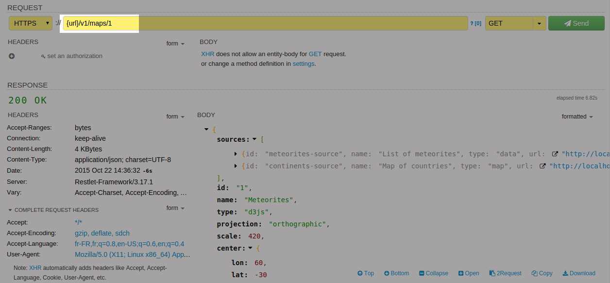

The set of attributes used is from the selected context. You can then see in the history tab that the context attribute is taken into account when executing the request.

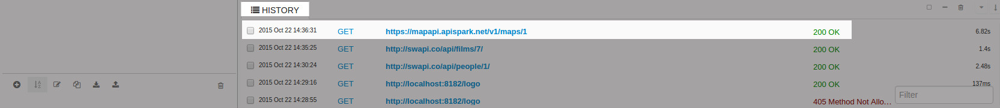

# Import and export requests

The import / export feature of DHC by Restlet can be accessed via the **Repository** tab. A check icon displays as the mouse is over the **My Drive** entry, as shown below:

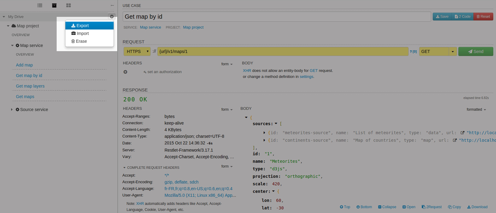

## Import requests

When importing a file in DHC by Restlet, you can select which parts (projects and services) will be taken into account. This allows you to import only a subset of data.

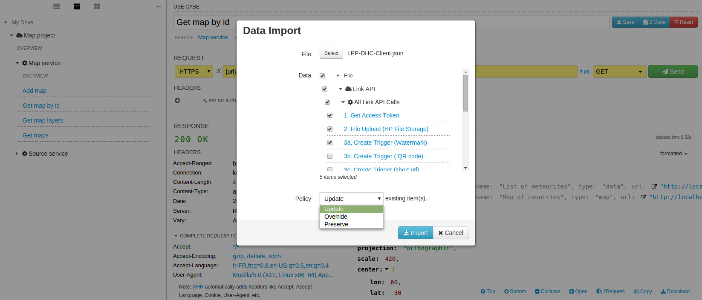

## Export requests

The same approach is possible when exporting a set of requests, as shown below:

## Import/Export Policy

**Update** - imports new requests and updates existing requests only if the import contains  newer version.  

**Override** - imports new requests and overrides all existing requests.  

**Preserve** - imports new requests and never touches existing requests.
