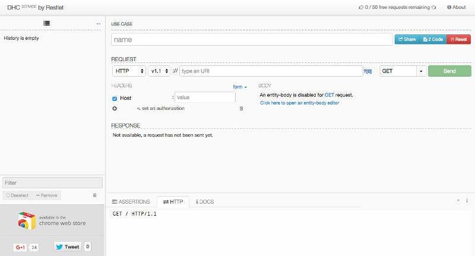
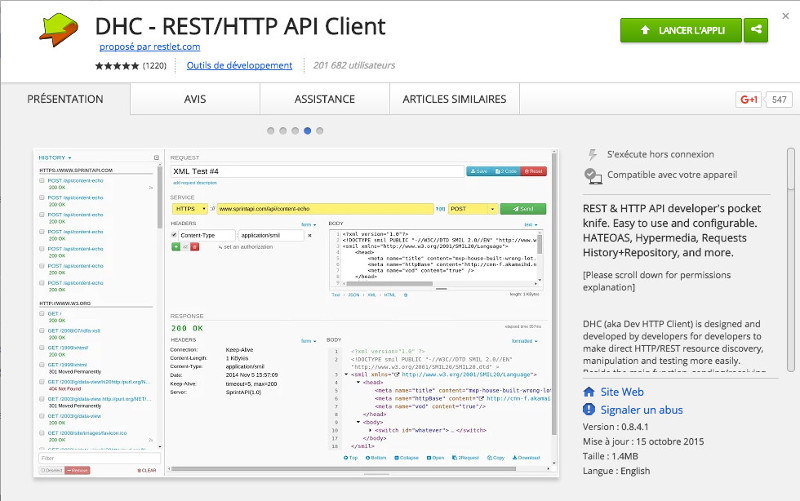

# Introduction

DHC allows you to interact with REST services. It brings many different features that make your user experience better, save you precious time when debugging REST calls or sharing your requests with others.

# Install DHC by Restlet

DHC by Restlet can be used as an online service from <a href="https://dhc.restlet.com/" target="_blank">dhc.restlet.com</a> or installed within Chrome from the <a href="https://chrome.google.com/webstore/detail/dhc-resthttp-api-client/aejoelaoggembcahagimdiliamlcdmfm" target="_blank">Chrome Web Store</a>.

## DHC by Restlet online service

## DHC by Restlet Chrome application

The tool is also available in your Chrome applications through chrome://apps.

>**Note:** When installing DHC Chrome app, a confirmation message displays informing you that DHC requires permissions to "Read and change all your data on the websites you visit" and to "Communicate with cooperating websites".
- Permission to "**Read and change all your data on the websites you visit**"  
Chrome applications which need access to internet resources must declare it in their manifest. It can be a list of URLs or URL mask e.g. http://*/* allowing access to any URL. Allowing access to any URL is a primary feature of DHC, and the URL mask with wildcards is interpreted by Chrome Store as: This app "can read and change all your data on the websites you visit". Which is true, but in fact DHC does not collect your data.
- Permission to "**Communicate with cooperating websites**"  
DHC is available also as a service. This permission allows data exchange between DHC Service and DHC Chrome. This feature is disabled by default.

# Launch DHC from your website

DHC allows you to insert a button in your website that will launch your request directly in DHC.

>**Note:** This process might change due to Google legacy packaged apps policy.

<!--
Note: Process might change due to Google legacy packaged apps policy. Packaged apps are not allowed to inject javascript into third-party pages (that’s what we are doing today with current legacy packaged app) and Google might force us to move to packaged app format.
-->

## Instruct DHC with a meta tag

Create an html page that contains a **meta tag** that will load DHC script.

<pre class="language-markup"><code class="language-markup">&lt;meta
name=&quot;dhc-aware-page&quot;
data-indicator-element-id=&quot;&lt;id_element&gt;&quot;
data-console-debug=&quot;true&quot;
&gt;
</code></pre>

- **name** - required parameter, value should always be *dhc-aware-page*.
- **data-indicator-element-id** - optional, specifies the id of element DHC will create to let the page know the availability of DHC API. Default value is *dhcInfo*.
- **data-console-debug** - optional parameter, if contains true, will print debug information into browser javascript console. Default value is *false*.

## Call window.postMessage script

To instruct DHC to open a new request, your webpage must call the **window.postMessage** script with the following message object (all properties are required):

<pre class="language-javascript"><code class="language-javascript">{
      target : &quot;aejoelaoggembcahagimdiliamlcdmfm&quot;,
      type : &quot;openRequest&quot;,
      targetTab: &quot;&lt;name_of_target_tab&gt;&quot;,
      payloadType: &quot;&lt;type_of_payload&gt;&quot;,
      payload : &quot;&lt;payload&gt;&quot;
}
</code></pre>

- **target**:String - id of DHC extension. Can be obtained from DHC indicator element. E.g.
JSON.parse(document.getElementById(<id of  indicator element>).textContent).extensionId;
- **targetTab**:String (optional) - the name of the tab where request should be opened. If not specified, new tab with DHC will be opened for each *openRequest* message. If specified, DHC will try to use previously opened tab with the same  name and will create it if such tab does not exist.
- **payloadType**:String - the type of payload to load in DHC. Possible values: *dhc* or *systinet*. Jump to [DHC built-in documentation](../../get-started/subscribe "DHC built-in documentation") for more information.
- **payload**:Object - payload information, specific to each payload type.

Example:

<pre class="language-javascript"><code class="language-javascript">{
    "name": "Post example on HTTP Bin",
    "headers": [
        {
            "enabled": true,
            "name": "Content-Type",
            "value": "application/json"
        }
    ],
    "type": "Request",
    "method": {
        "requestBody": true,
        "link": "",
        "name": "POST"
    },
    "body": {
        "autoSetLength": true,
        "textBody": "{\n  \"lastname\": \"Eastwood\",\n  \"firstname\": \"Clint\"\n}",
        "bodyType": "Text"
    },
    "headersType": "Form",
    "uri": {
        "path": "httpbin.org/post",
        "query": {
            "delimiter": "&",
            "items": [
                {
                    "enabled": true,
                    "name": "details",
                    "value": "full"
                }
            ]
        },
        "scheme": {
            "secure": true,
            "name": "https",
            "version": "V11"
        }
    }
}
</code></pre>

## Use case

Create a webpage that contains an input area pre-filled with your payload and a button to launch your request with DHC in a new tab.

<pre class="language-javascript"><code class="language-javascript">&lt;!DOCTYPE html&gt;
&lt;html lang=&quot;en&quot;&gt;
&lt;head&gt;

    &lt;meta charset=&quot;UTF-8&quot;&gt;

    &lt;!--This tag instructs DHC to provide api to this page--&gt;
    &lt;meta name=&quot;dhc-aware-page&quot;
          data-console-debug=&quot;true&quot;
          data-indicator-element-id=&quot;testDhc&quot;&gt;

    &lt;title&gt;Dhc integration example&lt;/title&gt;
    &lt;style type=&quot;text/css&quot;&gt;
        input{
            width:200pt
        }
    &lt;/style&gt;
&lt;/head&gt;
&lt;script type=&quot;text/javascript&quot;&gt;

    //short hand function for sending messages to dhc
    function openRequestInDhc(dhcInfo,targetTab,payload){
        var message = {
            target:dhcInfo.extensionId, //required
            type:&quot;openRequest&quot;,//required
            payloadType:&quot;dhc&quot;,//required,
            targetTab:targetTab,
            payload:JSON.parse(payload)
        };
        window.postMessage(message, document.origin);
    }

    //wait until document loads so DHC has a chance to create info tag
    window.addEventListener(&quot;load&quot;,function(){
        var dhcTag = document.getElementById(&quot;testDhc&quot;); //lookup the tag using the id we&apos;ve provided in meta tag
        var dhcStatusDisplay = document.getElementById(&quot;status&quot;);

        if(!dhcTag){
            //no indicator tag - no dhc
            dhcStatusDisplay.textContent = &quot;DHC is not installed. Install DHC by going to the &quot; +
                    &quot;chrome://extensions click on &apos;Enable Developer Mode&apos; then load unpacked extension, go back here and refresh the page&quot;;
            return;
        }
        //parse dhc info into json
        var dhcInfo = JSON.parse(dhcTag.textContent);
        dhcStatusDisplay.textContent = &quot;DHC is installed, click button below to open request in DHC&quot;;

        //prepare ui

        var payload = document.createElement(&quot;textarea&quot;);
        payload.value = JSON.stringify({
            &quot;name&quot;: &quot;Post example on HTTP Bin&quot;,
            &quot;headers&quot;: [
                {
                    &quot;enabled&quot;: true,
                    &quot;name&quot;: &quot;Content-Type&quot;,
                    &quot;value&quot;: &quot;application/json&quot;
                }
            ],
            &quot;type&quot;: &quot;Request&quot;,
            &quot;method&quot;: {
                &quot;requestBody&quot;: true,
                &quot;link&quot;: &quot;&quot;,
                &quot;name&quot;: &quot;POST&quot;
            },
            &quot;body&quot;: {
                &quot;autoSetLength&quot;: true,
                &quot;textBody&quot;: &quot;{\n  \&quot;lastname\&quot;: \&quot;Eastwood\&quot;,\n  \&quot;firstname\&quot;: \&quot;Clint\&quot;\n}&quot;,
                &quot;bodyType&quot;: &quot;Text&quot;
            },
            &quot;headersType&quot;: &quot;Form&quot;,
            &quot;uri&quot;: {
                &quot;path&quot;: &quot;httpbin.org/post&quot;,
                &quot;query&quot;: {
                    &quot;delimiter&quot;: &quot;&&quot;,
                    &quot;items&quot;: [
                        {
                            &quot;enabled&quot;: true,
                            &quot;name&quot;: &quot;details&quot;,
                            &quot;value&quot;: &quot;full&quot;
                        }
                    ]
                },
                &quot;scheme&quot;: {
                    &quot;secure&quot;: true,
                    &quot;name&quot;: &quot;https&quot;,
                    &quot;version&quot;: &quot;V11&quot;
                }
            }
        },null,&quot;\t&quot;);
        var send = document.createElement(&quot;button&quot;);
        send.textContent = &quot;Open Request&quot;;

        document.body.appendChild(payload);
        document.body.appendChild(send);
        send.addEventListener(&quot;click&quot;,function(){
            openRequestInDhc(dhcInfo,null,payload.value);
        });

    });
&lt;/script&gt;
&lt;body&gt;

&lt;div id=&quot;status&quot;&gt;Checking Dhc Status&lt;/div&gt;

&lt;/body&gt;
&lt;/html&gt;
</code></pre>
