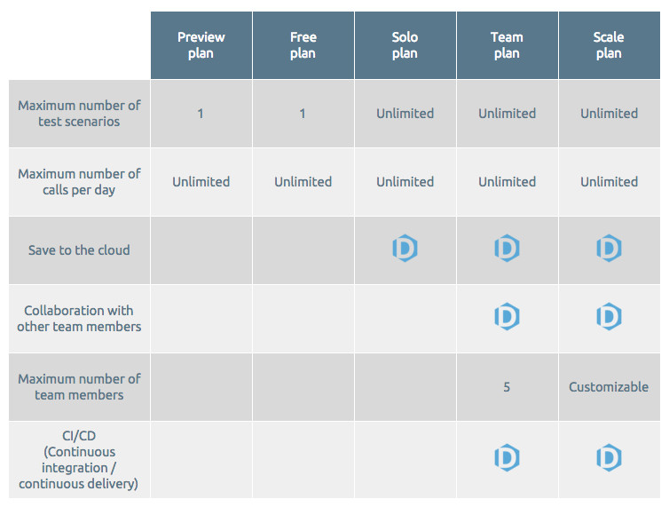
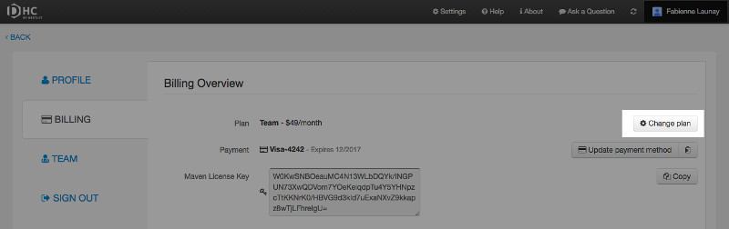
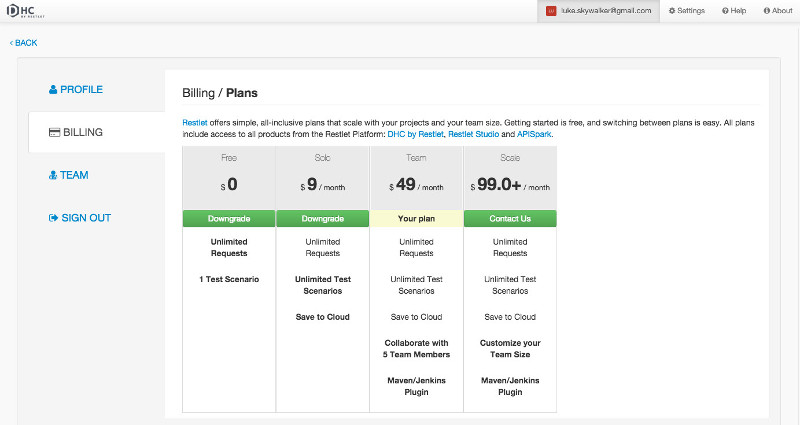

# DHC Base plans

## Plans overview

As you subscribe to DHC, you can choose between different base plan levels as defined in our <a href="http://restlet.com/products/apispark/pricing" target="_blank">Pricing page</a>. Each level includes a number of features associated to it. Of course you can switch to a higher or lower plan at any time.

Restlet offers simple, all-inclusive plans that scale with your projects and your team size.   Getting started is free, and switching between plans is easy.  
All plans include access to the whole Restlet platform: Restlet Studio, DHC by Restlet and APISpark.

## Select a plan

When you Sign In, you are automatically assigned a **Free** plan.

To switch base plan level, click on your name on top right of your screen and select the **Billing** tab.

From the **Billing** page, click on the **Change plan** button.

The **Plans** page gives you a snapshot of what each plan allows you to do for what price. Depending on the Plan you subscribed to, you can click on the corresponding **Downgrade** or **Upgrade** button.

You will then need to enter your credit card details unless you have done it already.  
You can also enter a new credit card by clicking **No, change card**.  
Click on **Purchase** to confirm. A message will give you a recap of what this new plan allows you to do.
