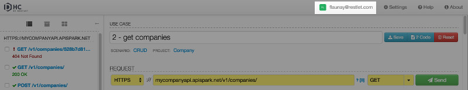
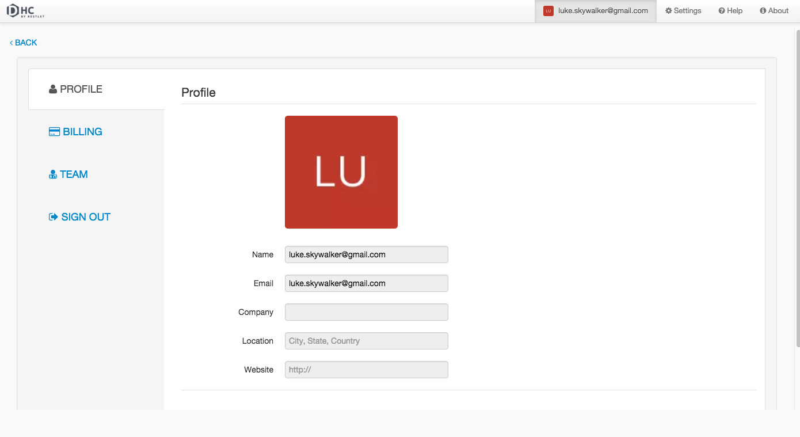
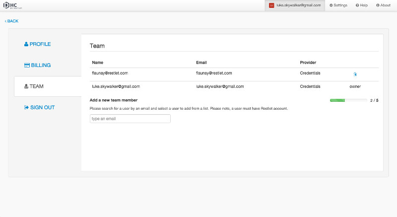

All your DHC account details are available on the account page.

To navigate to the account page, make sure you are signed in, then click on your username on top right of your screen.

Your account page is composed of four tabs: **Profile**, **Billing**, **Team** and **Sign out**.

# Profile

 The **Profile tab** gives you information about your profile including your email address and your profile picture.

# Billing

The **Billing tab** gives you information about the plan you subscribed to (type and price/month), your credit card details (type and expiration date) and your Maven license key.

From this tab, you can switch to another plan by clicking the **Change plan** button. You can also change the credit card you registered by clicking the **Update payment method** button or you can copy your **Maven license key**.

# Team

If you subscribed to a Team plan or a Scale plan, then you can add members to your Team.

The **Team** tab gives you a list of the different members of your team (with their email address and provider). You appear as the *owner* and your team members can be removed from the team.  

Provided your [plan](./subscribe "plans") allows it, you can add new members by entering their email address in the input field at the bottom of the page.
A progress bar indicates whether you can still add new members e.g. 2/5.

# Sign out

Click on the **Sign out** tab to sign out.
