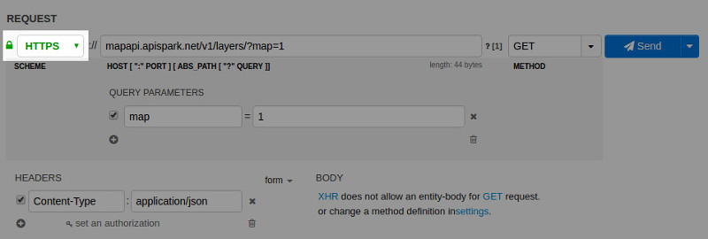
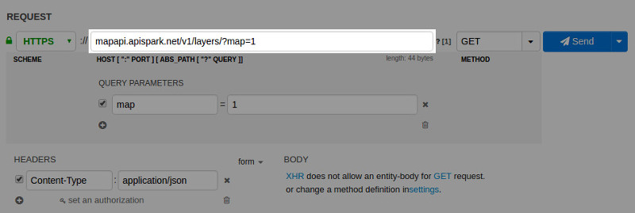
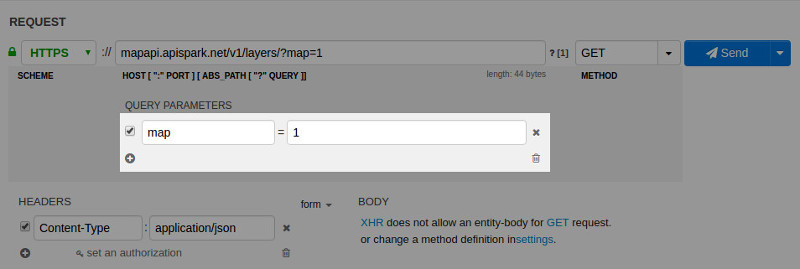
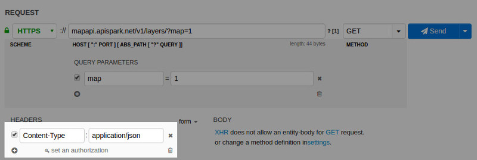
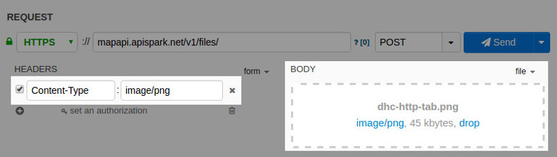
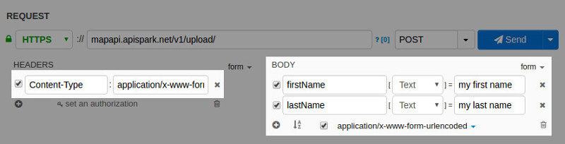
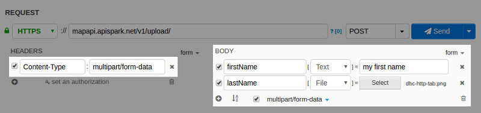
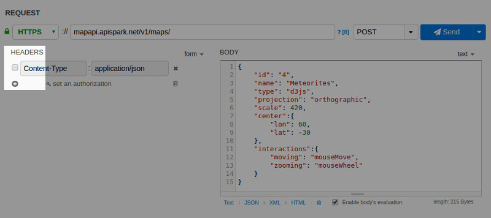

As a REST client, DHC by Restlet allows you to build a request and display its response.

# Build a request

DHC provides a dedicated area to configure your request.

## Request structure

This area maps the different request elements. The latter is summarized in the following diagram as a reminder.

### Method

The **method** corresponds to the HTTP verb used. It identifies the action to execute on the resource.

### Protocol

The **protocol** used to interact with a server e.g. HTTP or HTTPS.

### Host, Port & Path

**Host** and **port** identify the target to contact to send the request. Once connected to the server, the **path** is used to select the resource to handle the request.

### Query parameters

**Query parameters** are used to build the query string of the request. They contain data that does not fit conveniently into a hierarchical path structure.

### Headers

HTTP **Headers** define the operating parameters of an HTTP transaction. They correspond to a list of key-value pairs.

>**Note:** You can easily build assertions with the [expression builder](../expressions/overview "Expression builder").

### Payload

Request **payload** corresponds to the data sent when supported. This applies to methods POST, PUT and PATCH.

DHC by Restlet defines four distinct sub areas:

- the request URL and method;  
- the query parameters;  
- the headers and  
- the request payload.

## GET method

The following screenshot describes the case of a GET method where no payload is used. You can distinguish the different parameters displayed.

### The protocol

### The host, port and path

### The method (GET)

### The query parameters

By default, the query parameter area is hidden and can be displayed by clicking the “?” character right after the address field. You can either directly leverage the URL to add them or use the form. The main difference is, when using the form, parameter values are automatically URL encoded.

### The headers

## POST method

A POST method follows the same approach but in addition a request payload can be added. Several modes are supported for payload content. The switch is done using the combobox on the top right hand corner of the body area.

### Text content (text value)

For formats like raw text, JSON, XML or YAML, with syntax highlighting. In this case a text area can be used. DHC by Restlet provides a set of types right below the text area to directly set the corresponding content type value.

This screenshot shows you a JSON payload for which the **application/json** *Content-Type* header is automatically created:

### Content from file (file value)

In this case, DHC by Restlet provides an area to drag’n drop the file or select it explicitly. The tool automatically gets the associated mime type. When clicking on it, the Content-Type header is automatically created.

This screenshot shows you a File payload for which the **image/png** *Content-Type* header is automatically created:

### Forms (form value)

DHC by Restlet supports both simple forms and multipart ones.

#### Simple forms

Only text form elements can be defined and the content type is set to **application/x-www-form-urlencoded**.

This screenshot shows you a simple form payload for which the **application/x-www-form-urlencoded** *Content-Type* header is automatically created:

#### Multipart forms

You can mix file elements with text ones. In this case, the content type is **multipart/form-data**.

This screenshot shows you a multipart form payload for which the **multipart/form-data** *Content-Type* header is automatically created:

## Disable query parameters or headers

DHC by Restlet also allows you to disable some elements in lists (query parameters and headers) without having to remove them. This is particularly useful when building your request to tweak it and reach the expected behavior.

This screenshot shows you a request for which the header is disabled (checkbox deselected):

