## Display a response

Restlet Client provides a dedicated area to display the response. This area maps the different response elements. The latter is summarized in the following diagram as a reminder.

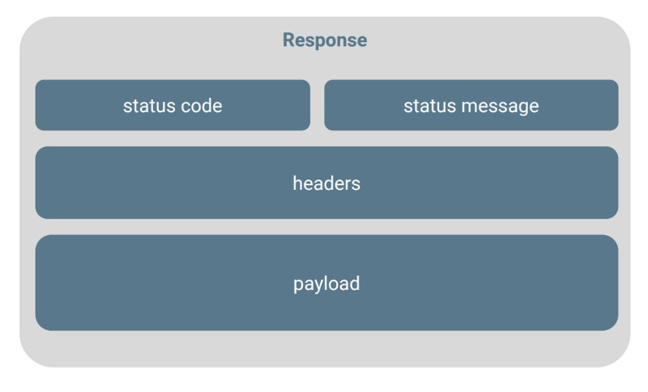

### Response structure

#### Status code and message

The **status code** and **message** correspond to the status of the response. The status code is a normalized number. HTTP defines different families at this level: 2xx for success, 3xx for redirection, 4xx for client errors and 5xx for server errors.

#### Headers

HTTP **Headers** define the operating parameters of an HTTP transaction. They correspond to a list of key-value pairs.

#### Payload

Response **payload** corresponds to the data received when supported. This applies to all methods except HEAD, DELETE and OPTIONS.

Restlet Client defines three distinct sub areas: the response status, the headers, and the response payload.

### Response with payload

The following screenshots describe the case where some payload is received in the response. In the case of structured text payload, the formatted mode is selected by default to display data using a tree. Raw mode is also available to content as text.

#### Response headers

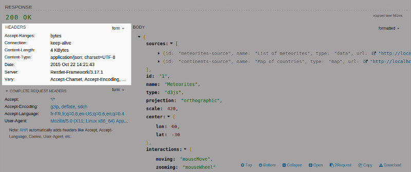

#### Complete request headers

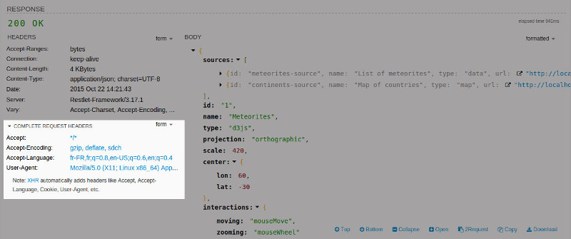

#### JSON payload

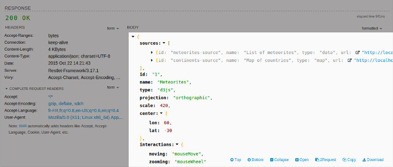

#### Payload display mode

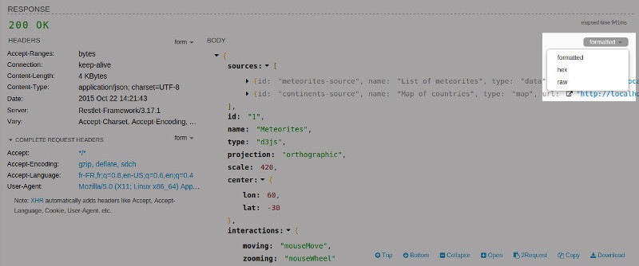

### Response with no payload

If no payload is received in the response, the body area remains empty.

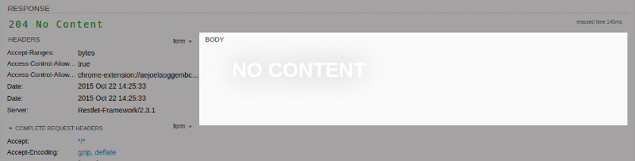

### Response with binary content

In the case of binary content, several modes are available to preview the content (for examples, see images below) and display it as hexadecimal or raw.

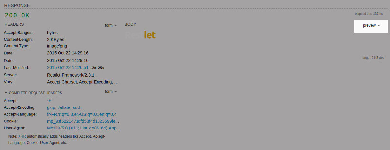

#### Hexadecimal content

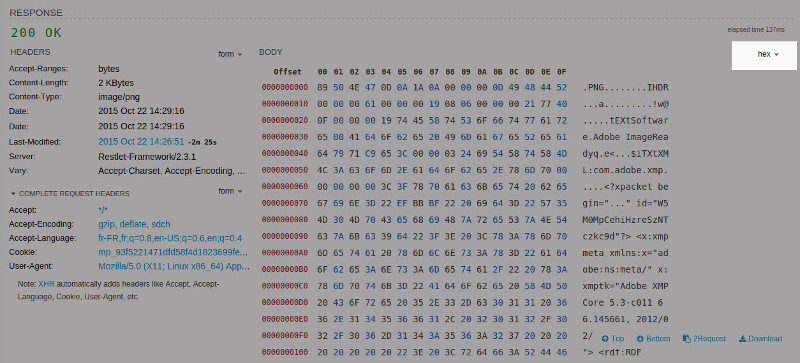

#### Raw content

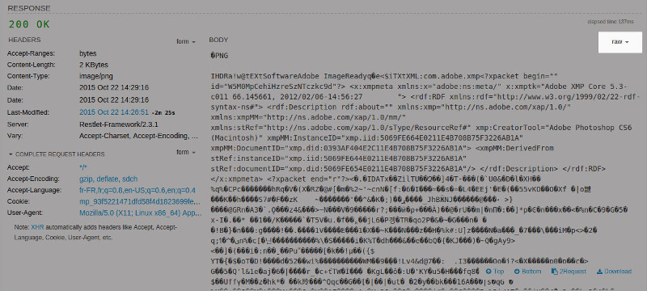

### Requests created from hypermedia links

Restlet Client by Restlet provides support of hypermedia links within response contents by making them clickable. This way you can follow links to execute other requests very simply. When clicking on a link, a new request is automatically created.

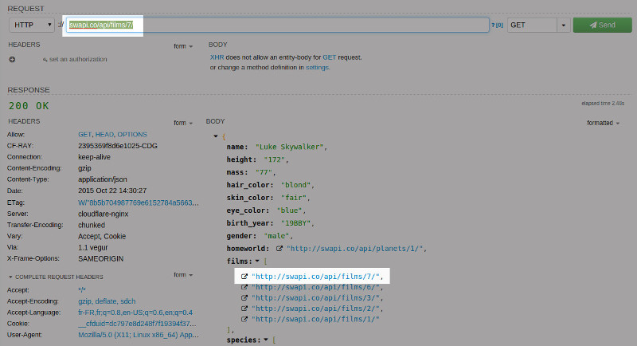

### Response toolbar

Restlet Client by Restlet provides a very helpful toolbar at the response level. This allows you to leverage the response content for different use cases: re-use the response content within a new request with the **2Request** button, **Copy** or **Download** the response content.

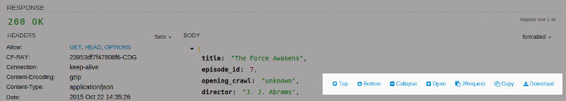

## Raw-level exchanges

The **HTTP** tab at the bottom of the page displays what is actually exchanged with the server in a synthetic way. At a glance, you can see the different elements.

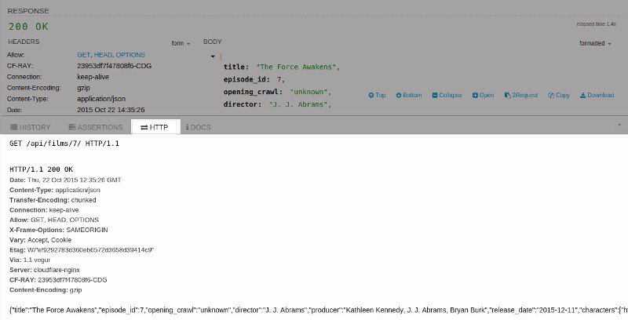
