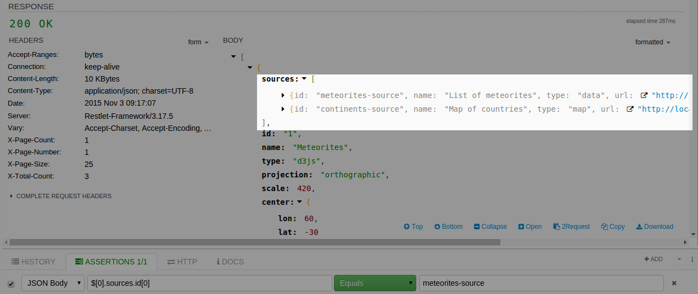
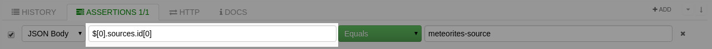
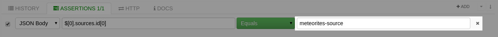
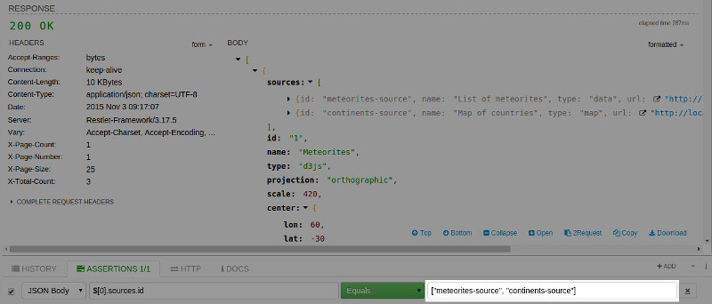

# Use JSON path for JSON payloads

When selecting JSON body, assertions can leverage JSON path expressions to use and check specific parts of the content. Stefan Goessner provides a great introduction in his article JSON Path – Xpath for JSON. This expression language is natural and enables you to browse data graph easily.

Here are the main elements:

- The starting point is the expression “$” that identifies the root object of the JSON content. Then you can iterate over attributes and sub attributes. The language natively supports arrays.

- The point allows you to get an attribute of an object. This can be done recursively according to the depth of the data graph.

- The square brackets target arrays and allow the selection of a particular element in them.

The following sample describes how to test the value of a list contained in arrays. The JSON body used contains a list of maps, each map has a **sources** field. This field corresponds to a list of sources and has an id attribute.

The expression **$[0].sources** corresponds to the sources of the first element. The expression **$[0].sources.id** goes further by getting all the id fields of sources. It is then possible to get just the first one.

This screenshot shows you JSON content with an array:

Here you can see a JSON path expression:

This is the value you want to check:

>**Note:**
The value to check can be valid JSON content. DHC automatically parses it and checks if it matches with the content corresponding to the expression.

The following sample describes how to check the content of an array:

# Use XPath for XML payloads

More information very soon.
