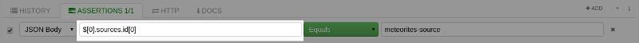
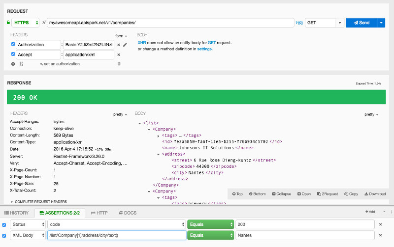

When selecting **JSON Body** or **XML Body**, assertions can leverage JSON path or XPath expressions to use and check specific parts of the content. This expression language is natural and enables you to browse data graph easily.

# Use JSON path for JSON payloads

Here are a few hints to help you use JSON payloads:

- The dollar sign ```$``` identifies the root object of the JSON content. Then you can iterate over attributes and sub attributes. The language natively supports arrays.

- The dot sign ```.``` allows you to get attributes of an object or to go deeper in the tree.

- The square brackets ```[]``` target arrays and allow the selection of a particular element in them.

The following sample describes how to test the value of a list contained in arrays. The JSON body used contains a list of maps, each map has a **sources** field. This field corresponds to a list of sources and has an id attribute.

The expression **$[0].sources** corresponds to the sources of the first element. The expression **$[0].sources.id** goes further by getting all the id fields of sources. It is then possible to get just the first one.


This screenshot shows you JSON content with an array:


Here you can see a JSON path expression:


This is the value you want to check:


>**Note:**
The value to check can be valid JSON content. DHC automatically parses it and checks if it matches with the content corresponding to the expression.

The following sample describes how to check the content of an array:


# <a class="anchor" name="xpath"></a>Use XPath for XML payloads

Note that XPath expressions have a directory-path-like syntax.

Here are a few tips to help you work with XML payloads:

- A single ```/``` selects from the root node.

- ```/list``` identifies the "list object" at the top level of the XML document. Then you can iterate over attributes and sub attributes. The language natively supports arrays.

- The slash sign ```/``` allows you to get attributes of an object or to go deeper in the tree.

- The square brackets ```[]``` enable to select a specific item in an array by its position. Please note that the index starts from 1.

- ```/text()``` allows you to get a node inner text.

- ```//``` selects nodes in the document from the current node that match the selection no matter where they are.

In the following example, the expression **/list/Company[1]/address/city/text()** corresponds to the name of the city contained in the address of the first Company.



For more information on the <a href="http://www.w3schools.com/xsl/xpath_syntax.asp" target="_blank">XPath syntax</a>, head over to the <a href="https://www.w3.org/TR/xpath/" target="_blank">official W3C specification</a>.
