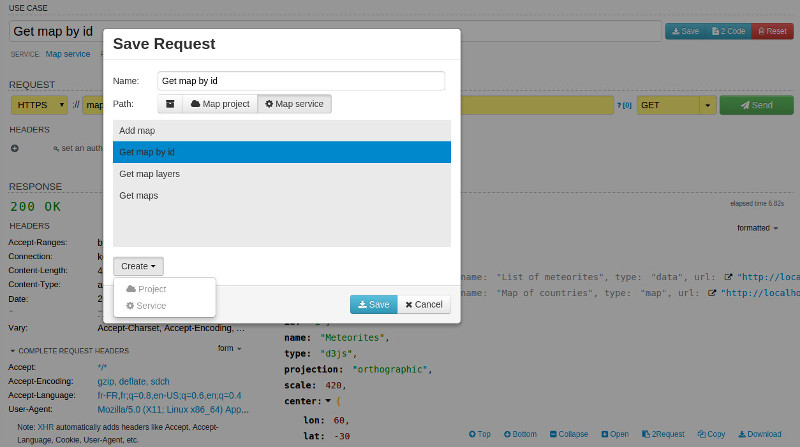
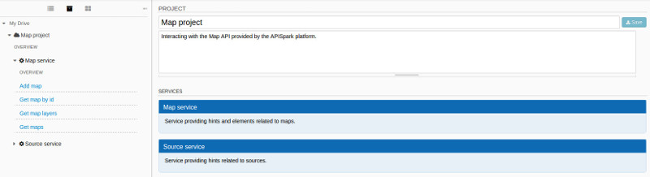
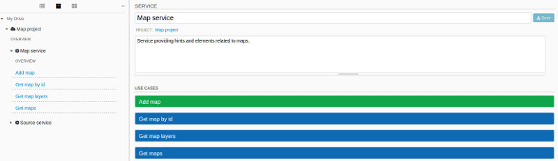
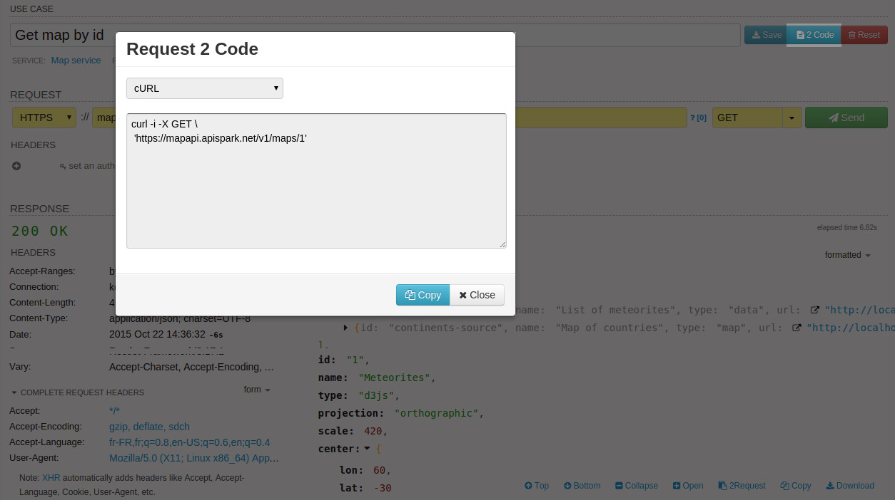

Of course you can define one-shot requests, but another interesting approach consists of reusing and even sharing them. DHC by Restlet offers an interesting feature to do this.

# Leverage projects and services

Once a request is created and named, DHC by Restlet lets you save it. The tool provides the following structure to organize your requests: the first level consists of projects which provide a high-level container. They can contain a set of services that in turn contain requests.

Such elements are created when you import requests or when you save requests. DHC gives you the ability to create your own projects and services if none match.

# Document projects, services and requests

At each level (project and service), you can add documentation. When clicking on the overview element in the left menu, related hints are displayed in the right panel. Navigation is supported at this level making it possible to walk through the project.

>**Note:** For request, there is no **Description** field but the name should be self descriptive in order to tell what the request actually does.

# Export requests as code

DHC by Restlet provides the ability to export the request as code in curl language. This is very convenient for developers who like command-line approach. They do not need to build it with different options: working command is directly provided.

Click on the **2 Code** button right around the request name to get the corresponding curl code.

