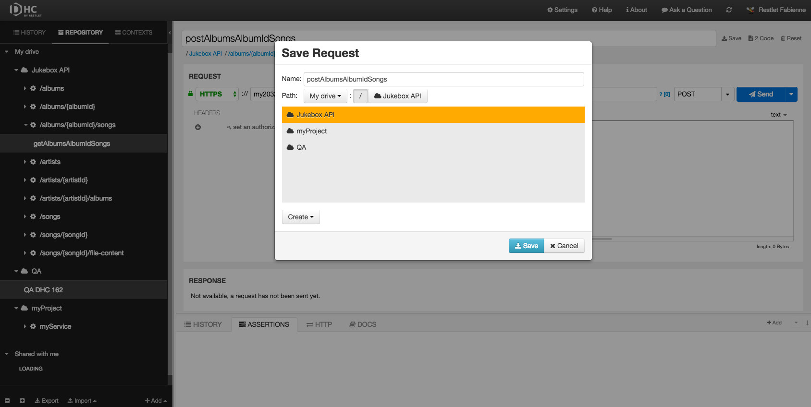
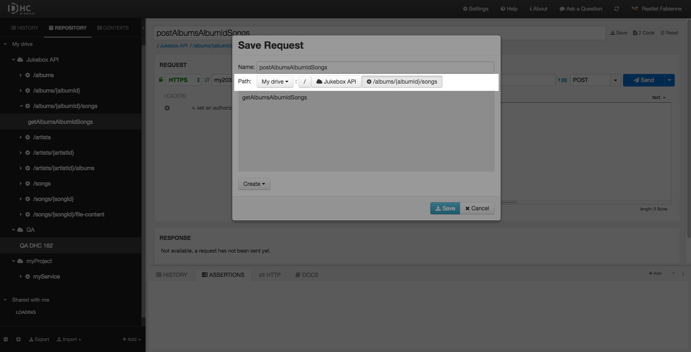
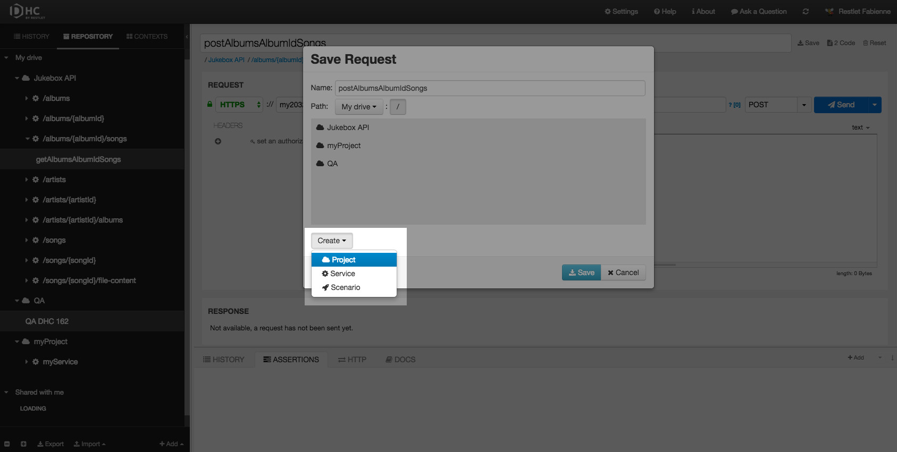
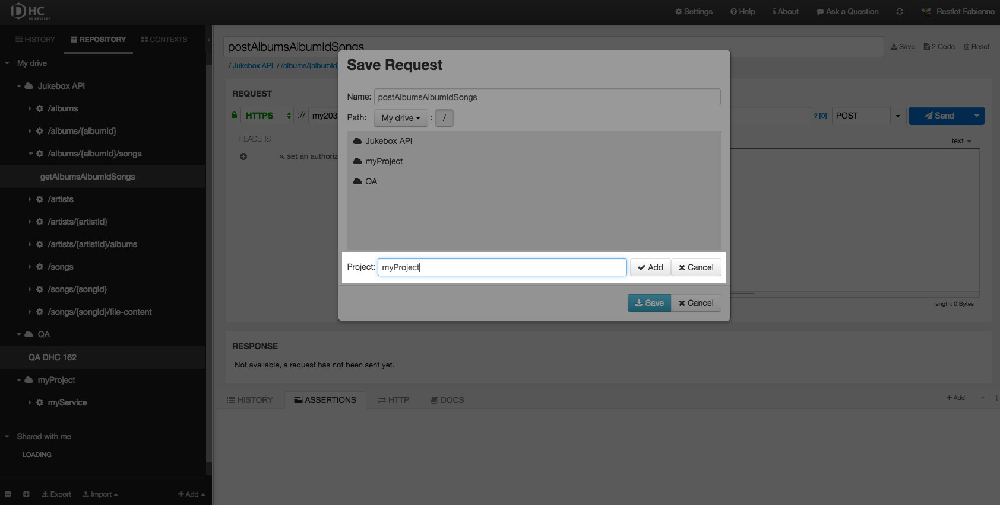
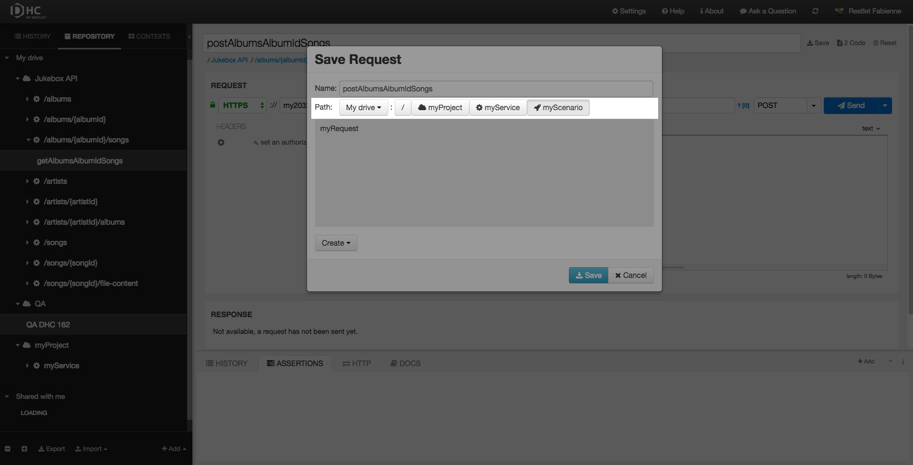

Of course you can define one-shot requests, but another interesting approach consists of reusing and even sharing them.

# Description

DHC allows you to build projects inside your drive.
The different items you can save in your drive follow this pattern:

<i class="fa fa-cloud"></i>project  
    <i class="fa fa-cog"></i>service  
        <i class="fa fa-rocket"></i>scenario  
            <i class="fa fa-paper-plane"></i>request

>**Note:** Each item can be created at the root of your drive. A [scenario](/technical-resources/dhc/guide/run-tests/run-tests "scenario") can only contain requests.

# Save your requests inside projects

Once a request is created and named, DHC by Restlet lets you save it.  
You can save it at the root of your drive or you can classify your requests inside structured projects (folders) and services (subfolders).

To save your request inside a project:

Create your request.  
Enter a name in the input field on top of the screen.  
Click **Save** on the right of this field.  

## Save your request in an existing project

Select **My drive** in the **Path** drop-down menu.
Select the appropriate project (and possibly the service) in which you want to save your request and click **Save**.

>**Note:** The **Path** displays as you browse through your drive and it is clickable.

## Save your request in a new project

Select **My drive** in the **Path** drop-down menu.
Click **Create** and select **Project**.

Enter a name for your **Project** and click **Add**.

>**Note:** You can then just as well add a Service and a Scenario inside that project.

Click **Save** to add the request in your new project.

# Export requests as code

DHC allows you to export the request as code in curl language. This can be very handy if you like to work in command-line.

Click on the **2 Code** button on top right of the screen to get the corresponding curl code.

