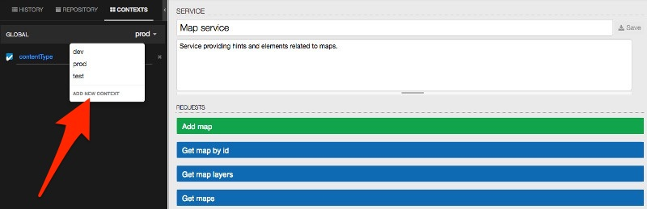
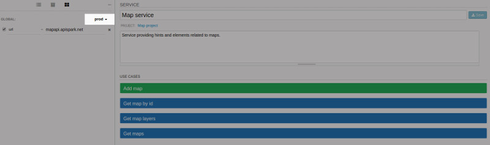
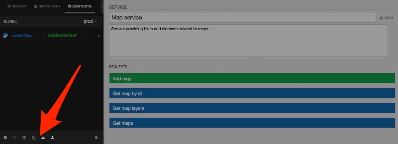

If you use a REST client in the context of application development, you probably have different environments like development, staging, and production. The need to rewrite requests according to these environments can be very time consuming.

DHC provides an interesting and powerful feature to use variables in requests. This corresponds to context attributes. In the left panel, you can use the contexts tab to define context and the attributes they contain. Attributes correspond to a list of key / value elements.

A toolbar is available in the bottom to manage the contexts:

Context attributes can be then used at any place in the request like address, headers, query parameters and text / form payloads.

The set of attributes used is from the selected context. You can then see in the history tab that the context attribute is taken into account when executing the request.

