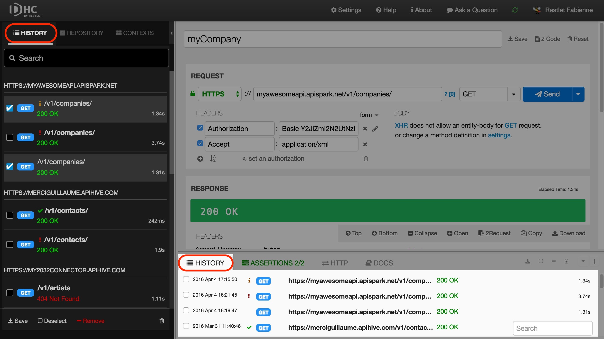
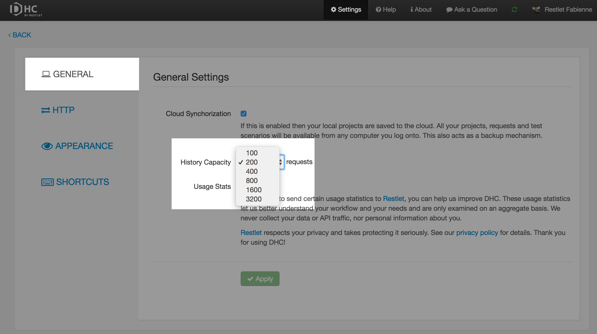
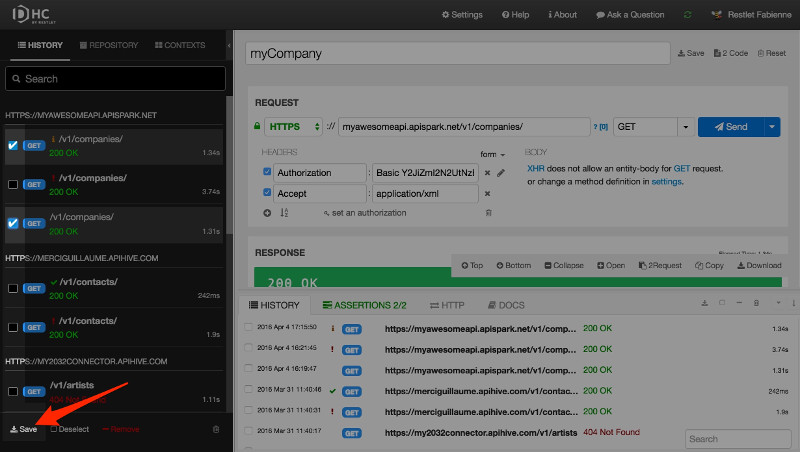

# Description

The History of the requests you launched is accessible from the left & the bottom panels.  
The left panel organizes requests per API.  
The bottom panel displays the date and time of the request.  
Both panels display the operation type (GET, POST, etc.), the request URI, the response status code and its duration.  
They also provide a **Search** field that will allow you to search requests you have made earlier.

# Configure History capacity

You can configure your History capacity. By default its capacity is set to the last 200 requests.

To configure your History capacity, click on **Settings** on the top menu bar and select the **History capacity** you need from the **General** tab. You can choose a history capacity that ranges from the 100 to the 3200 last requests.

# Save selected requests

Select several requests from the History panel and click the **Save** button.

You can then save the selected requests in a new or an existing item (project, service or scenario). For more information on how to create a new item, head over to the [Organize requests in projects](../drive/organize-requests "Organize requests in projects") section of the user guide.
