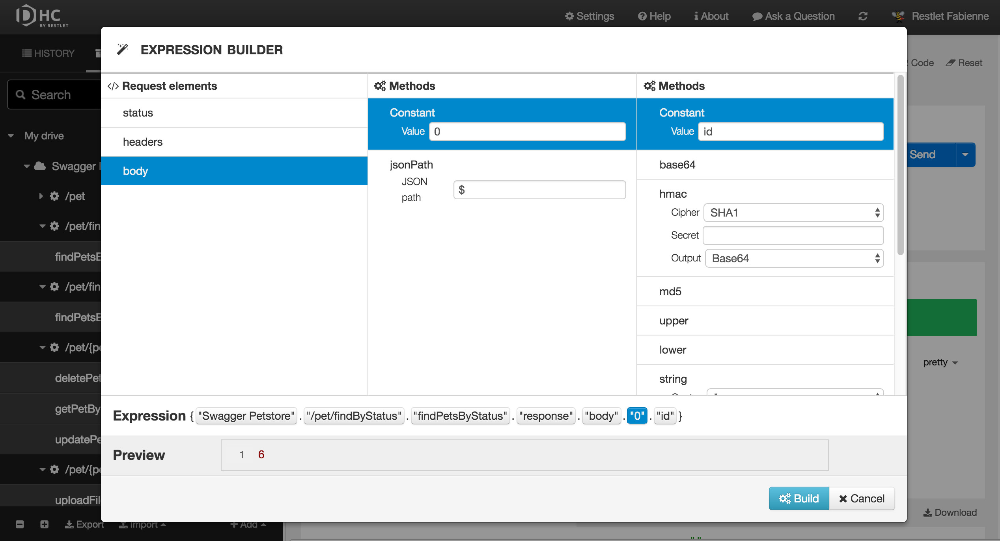

# Introduction

Expressions allow you to get and transform existing data from:  
- a context,  
- requests stored in a repository,  
- the last response on/to the stored requests (if a response exists).

>**Note:** Your request must have been sent in order to insert an expression inside.

You can put expressions in:  
- URL,  
- header names,  
- header values,  
- text body,  
- form items values,  
- assertions values.

There is no limit on how many expressions you can use in one declaration.  
Expressions can be freely mixed with a plain text.

# Use the expression builder

DHC helps you build expressions with its expression builder. Whenever you can build an expression, a magic wand icon <i class="fa fa-magic"></i> displays on the right of the field to launch the expression builder.

From the expression builder, you can select:  
- Elements from your repository (projects, services, scenarios, etc.),  
- Context variables,  
- [Methods](./build-in-methods "Methods") (DHC displays only the relevant methods according to the context).


>**Note:** The expression will be added where you placed your cursor before clicking the magic wand icon <i class="fa fa-magic"></i>.

### Ex 1: Build an expression to retrieve the id of the first element of the previous request you have launched

#### Introduction
In this example, we are using a so called "petstore" API that references pets and users. Each pet has a status (pending, available or sold). What we want here is to find the first pet that is in *pending* status.

#### Process
Launch a GET request to retrieve the pets with *pending* status.


Launch another request to get the first pet of the list of pending pets by retrieving the id from the result of your first request with ```/pets/{petId}``` pets in your previous request (pets with pending status).

```http://petstore.swagger.io/v2/pet/findByStatus?status=pending```

To do this, click at the end of the URL field and click the magic wand <i class="fa fa-magic"></i>.


You can now build your expression with the expression builder: select your API from the **Repository elements** and go as deep as necessary in your API.




Your expression displays in the URL field.

<pre class="language-bash"><code class="language-bash">{"Swagger Petstore"."/pet/findByStatus"."findPetsByStatus"."response"."body"."0"."id"}
</code></pre>

Click **Send**.


# Build expressions by hand

You can also build your expressions by hand in curly brackets.

### Ex 2: an expression declarations

<pre class="language-bash"><code class="language-bash">{host}

{host}{path}

{scheme}{host}{path}

text{random()}other text{random()}
</code></pre>

You can also use built-in methods to transform values.

### Ex 3: calculate MD5 hash from text or JSON response body

<pre class="language-bash"><code class="language-bash">{"Saved Request #1".body.md5()}
</code></pre>
