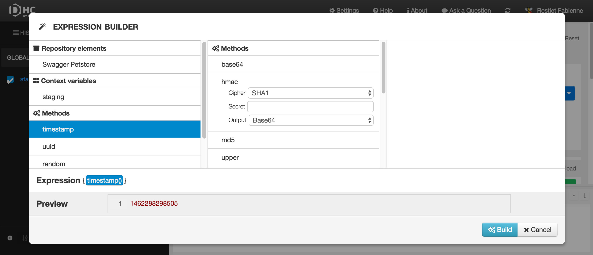
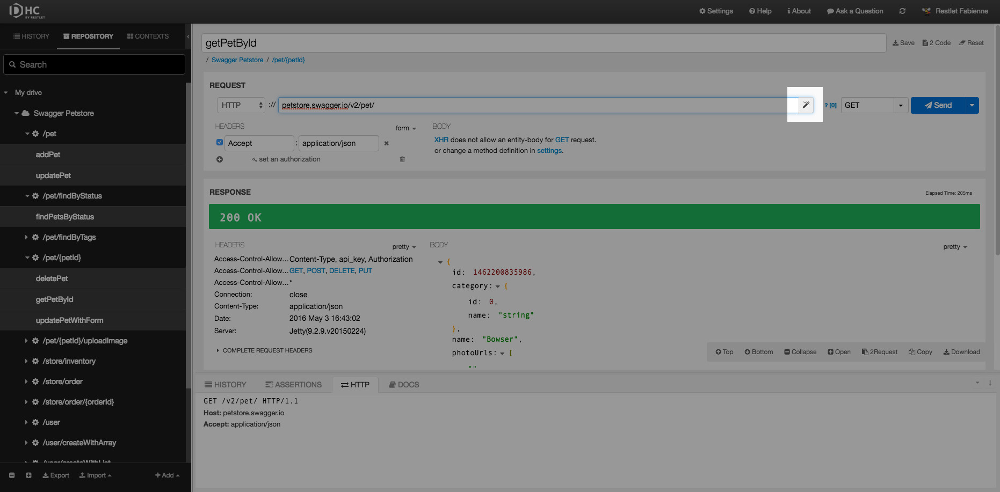
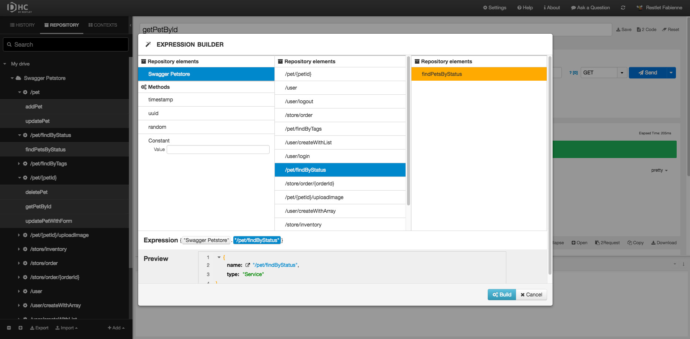
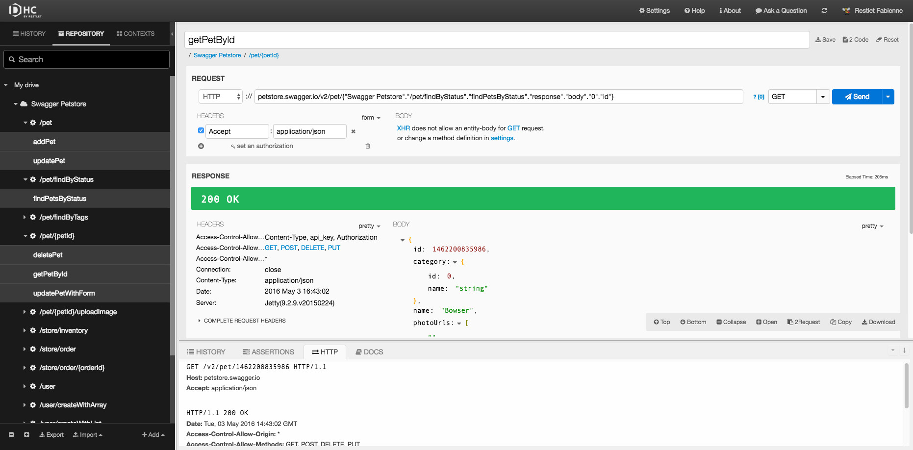

# Introduction

Expressions allow you to get and transform existing data from:  
- a context,  
- requests stored in a repository,  
- the last response on/to the stored requests (if a response exists).

You can put expressions in:  
- URL,  
- header names,  
- header values,  
- text body,  
- form items values,  
- assertions values.

There is no limit on how many expressions you can use in one declaration.  
Expressions can be freely mixed with a plain text.

# Use the visual expression builder

DHC helps you build expressions with its visual expression builder. Whenever you can build an expression, a magic wand icon <i class="fa fa-magic"></i> displays on the right of the field to launch the expression builder.

From the expression builder, you can select:
- Elements from your repository (projects, services, scenarios, etc.),  
- Context variables,  
- [Methods](./build-in-methods "Methods") (DHC displays only the relevant methods according to the context).

>**Note:** The expression will be added where you placed your cursor before clicking the magic wand icon <i class="fa fa-magic"></i>.

Ex 1: Build an expression to retrieve the id of the first element of the previous request you have launched

Launch a GET request to retrieve the pets with *pending* status.

Launch another request to retrieve the id of the first pet of the list of pets in your previous request (pets with pending status).

To do this, click at the end of the URL field and click the magic wand <i class="fa fa-magic"></i>.

You can now build your expression with the expression builder: select your API from the **Repository elements** and go as deep as necessary in your API.

Your expression displays in the URL field. Click **Send**.

# Build expressions by hand

You can also build your expressions by hand in curly brackets.

Ex 2: an expression declarations

<pre class="language-bash"><code class="language-bash">{host}

{host}{path}

{scheme}{host}{path}

text{random()}other text{random()}
</code></pre>

You can also use built-in methods to transform values.

Ex 3: calculate MD5 hash from text or JSON response body

<pre class="language-bash"><code class="language-bash">{"Saved Request #1".body.md5()}
</code></pre>
