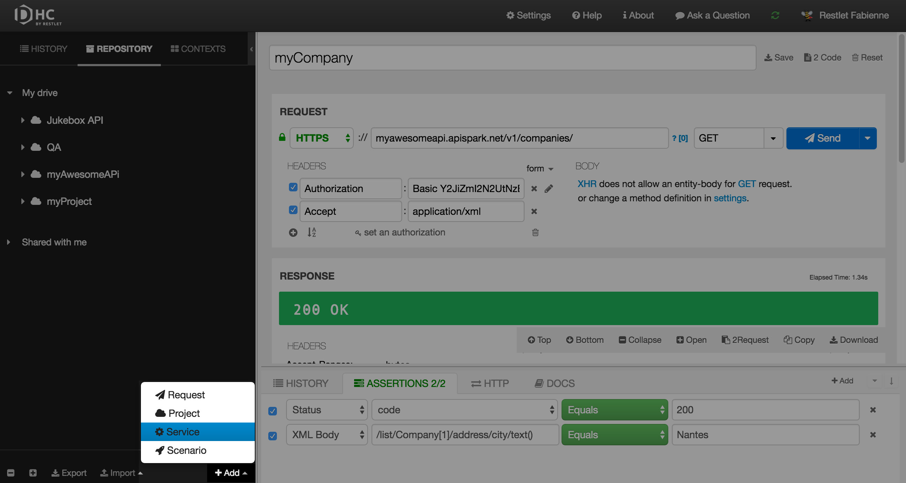
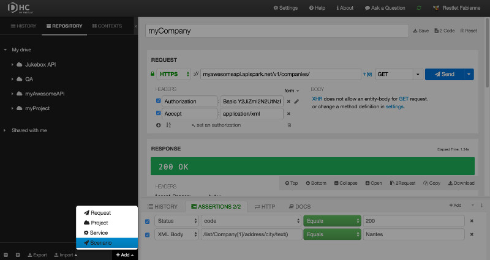
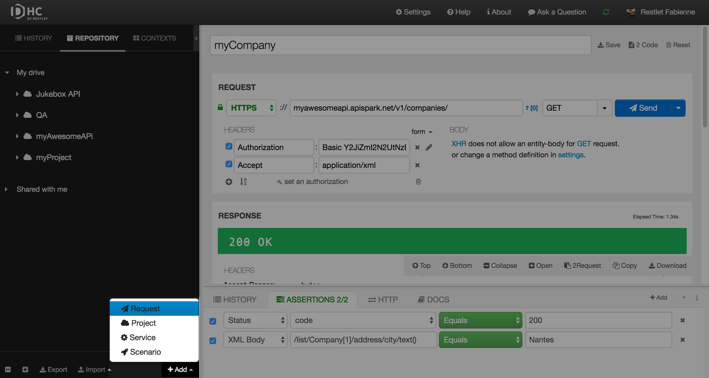

# Description

DHC allows you to build projects inside your drive.
The different items you can save in your drive follow this pattern:

<i class="fa fa-cloud"></i>&nbsp;&nbsp;project  
&nbsp;&nbsp;&nbsp;&nbsp;&nbsp;&nbsp;<i class="fa fa-cog"></i>&nbsp;&nbsp;service  
&nbsp;&nbsp;&nbsp;&nbsp;&nbsp;&nbsp;&nbsp;&nbsp;&nbsp;&nbsp;&nbsp;&nbsp;<i class="fa fa-rocket"></i>&nbsp;&nbsp;scenario  
&nbsp;&nbsp;&nbsp;&nbsp;&nbsp;&nbsp;&nbsp;&nbsp;&nbsp;&nbsp;&nbsp;&nbsp;&nbsp;&nbsp;&nbsp;&nbsp;&nbsp;&nbsp;<i class="fa fa-paper-plane"></i>&nbsp;&nbsp;request

>**Note:** Each item can be created at the root of your drive. A [scenario](/technical-resources/dhc/guide/run-tests/scenarios "scenario") can only contain requests.

# Create a new project

From the **Repository** tab, click on **+Add** at the bottom of the left panel and select <i class="fa fa-cloud"></i>&nbsp;**Project**.

Enter a **Name** for your project. It is created at the root of your Drive.

# Create a new service

From the **Repository** tab, click on **+Add** at the bottom of the left panel and select <i class="fa fa-cog"></i>&nbsp;**Service**.

Enter a **Name** for your service and browse through your Drive to choose where to save it (at the root or inside an existing project in your Drive).

# Create a new scenario

From the **Repository** tab, click on **+Add** at the bottom of the left panel and select <i class="fa fa-rocket"></i>&nbsp;**[Scenario](/technical-resources/dhc/guide/run-tests/scenarios "Scenario")**.

Enter a **Name** for your scenario and browse through your Drive to choose where to save it (at the root or inside an existing project or service in your Drive).

# Create a new request

From the **Repository** tab, click on **+Add** at the bottom of the left panel and select <i class="fa fa-paper-plane"></i>&nbsp;**Request**.

Enter a **Name** for your request and browse through your Drive to choose where to save it (at the root or inside an existing project, service or scenario in your Drive).
