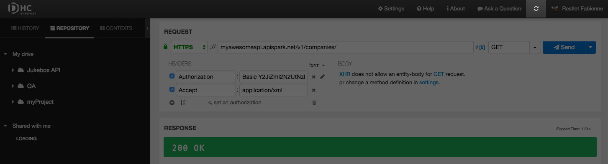
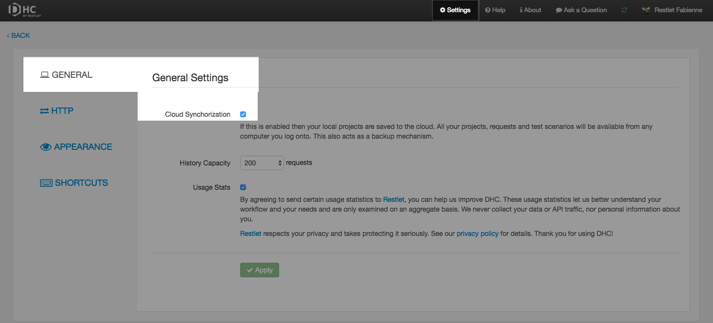

# Introduction

By default, your Drive (all the requests you saved) is saved locally. However you may want to save it to the cloud if you subscribed to a Solo, Team or Scale plan.

# Cloud synchronization

If you enable cloud synchronization, your local projects are saved to the cloud. All the projects, requests and test scenarios saved in *My drive* will be available from any computer you log onto. This also acts as a backup mechanism. Synchronization happens approximately every minute.

>**Note:** Currently contexts are not synchronized.

## Enable cloud synchronization

Click on the synchronization button on top right of your screen and click **Enable**.

## Disable cloud synchronization

To disable cloud synchronization, click on **Settings** on the top menu bar and select **Cloud synchronization** from the **General** tab.

>**Note:** Cloud synchronization is disabled automatically each time you sign out.
