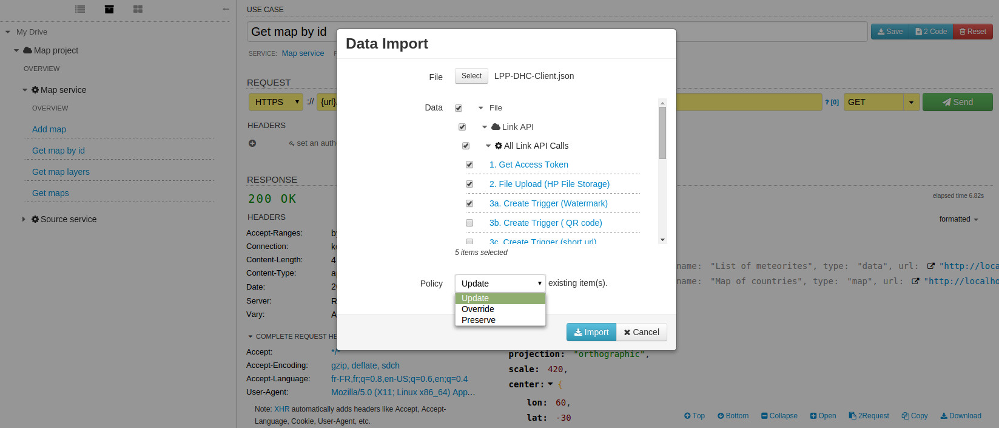

Coming soon

The import / export feature of DHC by Restlet can be accessed via the **Repository** tab. A check icon displays as the mouse is over the **My Drive** entry, as shown below:

# Import requests

When importing a file in DHC by Restlet, you can select which parts (projects and services) will be taken into account. This allows you to import only a subset of data.

## From HP Systinet URL

It is possible to integrate with Systinet: https://hpln.hp.com/group/systinet?utm_source=DHC

## Swagger 2.0 from JSON file & URL

## DHC repository from file
