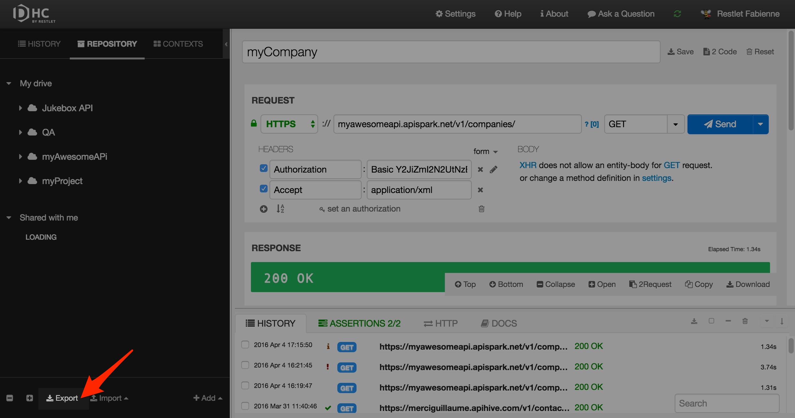
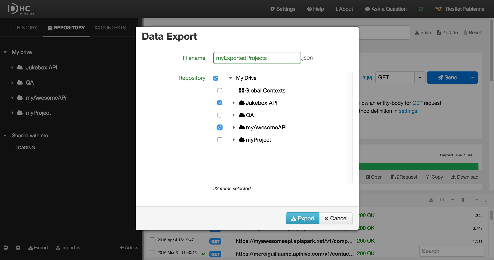

DHC allows you to export your projects/services/scenarios or even your whole drive.

The export feature is accessible from the **Repository** tab.  
Click **Export** at the bottom of the left panel.

Enter a **Filename** for the JSON file that will be exported.  
Select the items you want to export in that file.  
Click **Export**.

