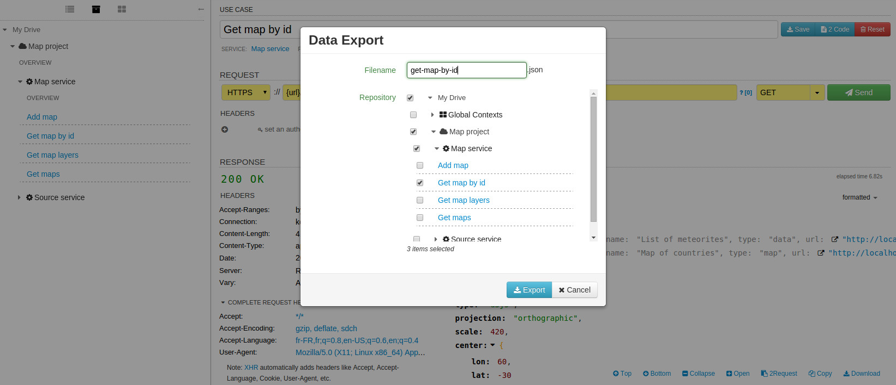

Coming soon

The import / export feature of DHC by Restlet can be accessed via the **Repository** tab. A check icon displays as the mouse is over the **My Drive** entry, as shown below:

# Export requests

The same approach is possible when exporting a set of requests, as shown below:

