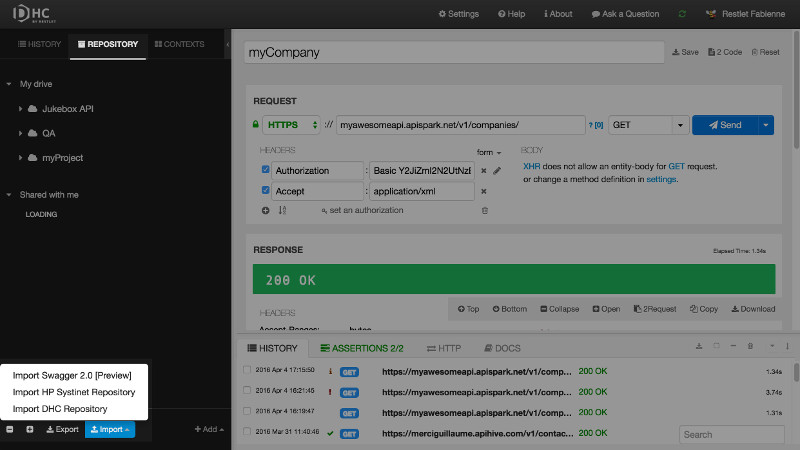
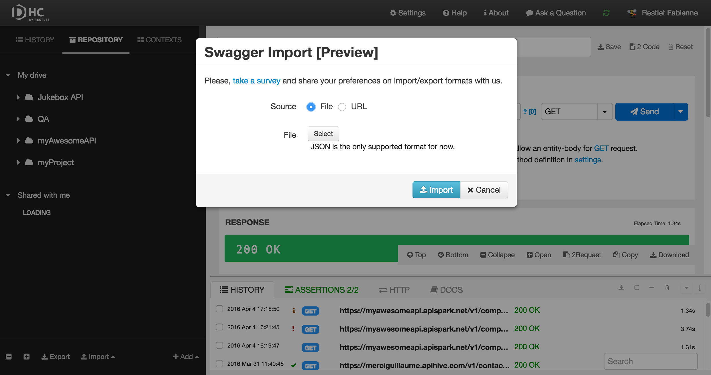
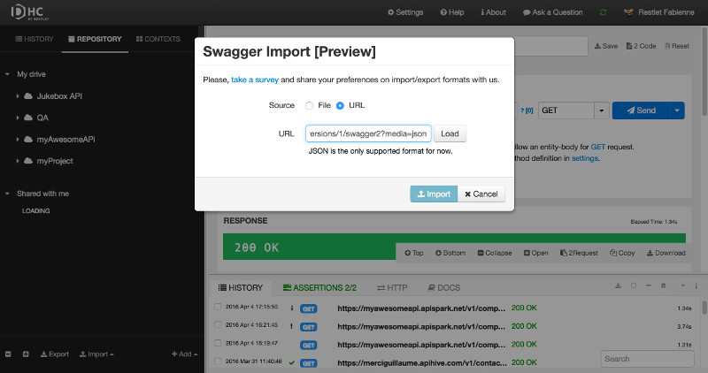
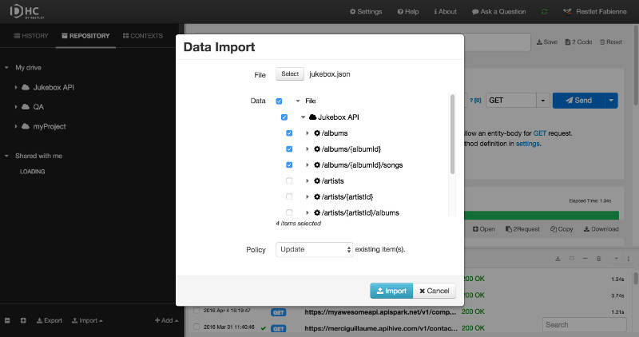

# Introduction

DHC allows you to import requests and API definitions.

The import feature is accessible from the **Repository** tab.  
Click **Import** and select the type of import you want to use.

# Import Swagger 2.0

You can import a Swagger 2.0 API definition from a JSON file or from a URL.

## from a JSON file

From the **Repository** tab, click **Import** and select **Import Swagger 2.0**.  
Select **File** as a Source (default).  
Click **Select** and pick up a JSON file that contains an API definition.  
Click **Import**.

>**Note:** This feature is currently in *Preview* mode as we only import version 2 of Swagger and only its JSON variant for the moment.   

## from a URL

From the **Repository** tab, click **Import** and select **Import Swagger 2.0**.  
Select **URL** as a Source.  
Enter the **URL** that contains your API definition and click **Load**.  
Click **Import**.

# Import HP Systinet Repository

DHC makes an <a href="https://hpln.hp.com/group/systinet?utm_source=DHC" target="_blank">HP Systinet</a> integration available.

From the **Repository** tab, click **Import** and select **Import HP Systinet Repository**.   
Enter the **URL** that contains your repository and click **Load**.  
Click **Add HP Systinet Repository**.

# Import DHC repository

You can also import a DHC repository.  
>**Note:** When importing a file in DHC, you can select which parts (projects and services) will be taken into account. This allows you to import only a subset of data.

From the **Repository** tab, click **Import** and select **Import DHC Repository**.  
Click **Select** to pick up the file that contains your DHC repository.  
Select the projects/services/scenarios you want to import.  
Select the [Import **Policy**](#import-policy) you want to choose.  
Click **Import**.

## Import policy

You can choose between three different policies:

- **Update**  
Imports new requests and updates existing requests only if the import contains a newer version.  

- **Override**  
Imports new requests and overrides all existing requests.  

- **Preserve**  
Imports new requests and never touches existing requests.
